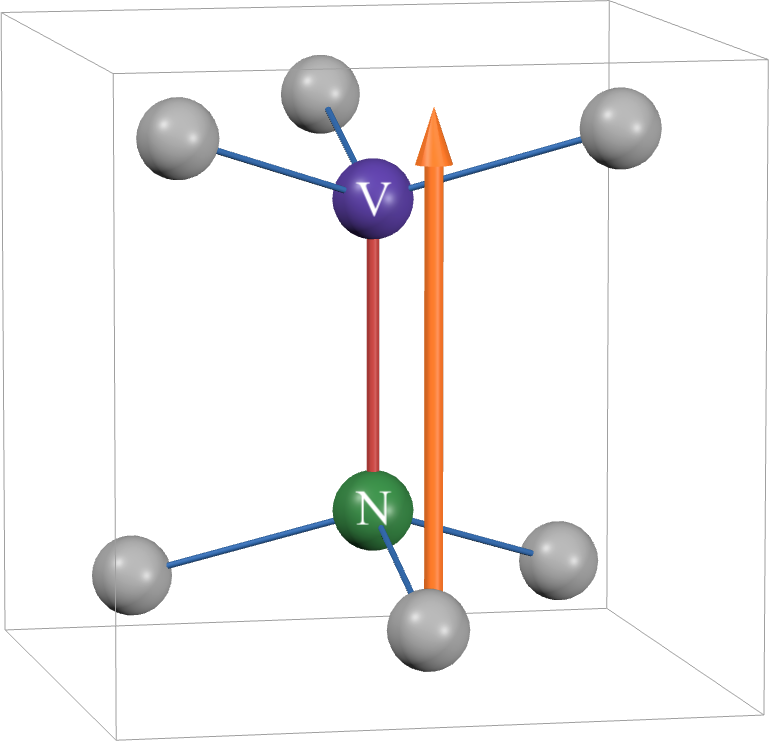
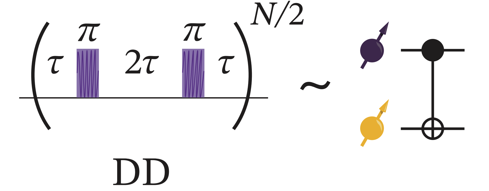
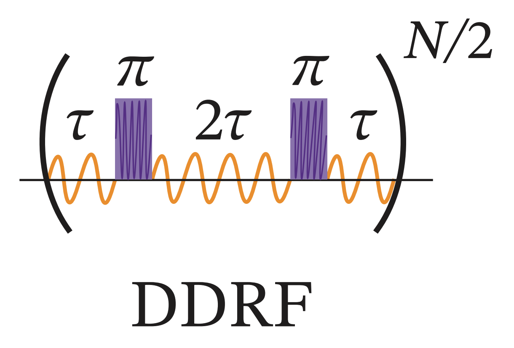

---

title       : Trial and Error with CPMG and DDrf
author      : Donghun Jung
# description : This is an example of how to use my themes.
# keywords    falserp, Slides, Themes.
marp        : true
paginate    : true
theme       : KIST


header-includes: 
- \usepackage{braket}
output:
  pdf_document:
    keep_tex: true
style: @import url('https://unpkg.com/tailwindcss@^2/dist/utilities.min.css');

---

<!-- _class: titlepage -->
<!-- backgroundColor: #000000 -->


<style>
.container{
   display: flex;
   align-items: center;
   width: 100%;
   height: 100%;
}
.col-left {
   flex: 0 0 65%;
   padding-right: 2rem;
   color: #e2a147;
}
.col-left .title{
   color: white;
}

.col-right{
   flex: 0 0 30%;
   display: flex;
   align-items: center;
   justify-content: center;
}
</style>

<div class="container">

<div class="col-left">

<div class="title">
Trial and Error with CPMG and DDrf
</div>
 
<div class="author">
Donghun Jung
</div>

<div class="date">
24 Oct 2025
</div>

<div class="organization">
Department of Physics, Sungkyunkwan University
<br>
Center for Quantum Technology QuiME Lab, Korea Institute of Science Technology
</div>

</div>

<div class="col-right">

</div>

</div>


---

<!-- backgroundColor: white -->


# Outline

- [Quick Recap] NV system
- Machine Learning Approach: Why it fails?
- Strategy
- Implementation of Runge-Kutta 7
    - Why Euler Method fails
    - Key features of RK7 implementation
- Dynamic Decoupling & DDrf explanation
- Examples & Simulations
- TODO

---

# NV Center System
<style>
.container{
   display: flex;
   align-items: center;
   width: 100%;
   height: 100%;
}
.col-left-content{
   flex: 0 0 55%;
   padding-right: 2rem;
   padding-bottom: 5rem;
   color: #000000;
}

.col-right-content{
   flex: 0 0 30%;
   display: flex;
   align-items: center;
   justify-content: center;
   padding-bottom: 5rem;
}


img[alt~="rightside"]{
   position: absolute;
   top: 6.5rem;
   right: 2.5rem;
   width: 12rem;
}

em {
   font-size: 0.7rem;
}

</style>

<div class="container">
<div class="col-left-content">

Spatially separated magnetic dipoles interact with each other via magnetic dipolar interaction (i.e., magnetic dipole-dipole interaction), which dominates the hyperfine coupling between the NV⁻ electron spin and surrounding ¹³C nuclear spins.

**Note:** The nuclear spin precession axes depend on the NV electron spin state.


</div>
<div class="col-right-content">


<br>
<br>
<br>
<em>
Figure 1. Diagram for NV center system. The orange-colored arrow denotes the applied external magnetic field. Drawn by Jiwon.
</em>

</div>
</div> 

---

# NV Center System
<style>
.container{
   display: flex;
   align-items: center;
   width: 100%;
   height: 100%;
}
.col-left-content{
   flex: 0 0 55%;
   padding-right: 2rem;
   padding-bottom: 5rem;
   color: #000000;
}

.col-right-content{
   flex: 0 0 30%;
   display: flex;
   align-items: center;
   justify-content: center;
   padding-bottom: 5rem;
}


img[alt~="rightside"]{
   position: absolute;
   top: 6.5rem;
   right: 2.5rem;
   width: 12rem;
}

em {
   font-size: 0.7rem;
}

</style>

<div class="container">
<div class="col-left-content">

## Hamiltonian for NV coupled with $N$ ¹³C nuclear spins
(Electron spin in rotating frame, others are in lab frame)
Note: We use two level space in NV electrons, $m_s =0$ state as $\ket{0}$ and $m_s = -1$ state as $\ket{1}$ state. $m_s =1$ state is not used. 

$$
\mathcal{H} = \sum_{i=1}^N \gamma_c B_z I_z^{i} + \underbrace{A_{||}^i S_z I_{z}^{i} + A_{\perp}^{i} S_z I_x }_{\text{Hyperfine Interaction Terms}}
$$


</div>
<div class="col-right-content">


<br>
<br>
<br>
<em>
Figure 1. Diagram for NV center system. The orange-colored arrow denotes the applied external magnetic field. Drawn by Jiwon.
</em>

</div>
</div> 


---

# NV Center System

## Available Control Sources

### Microwave for Electron Spin

The control of electron spin is performed by transverse AC magnetic field in microwave range. 

$$
\mathcal{H}_{\text{MW}} = \sqrt{2} \Omega_{\text{MW}}(t) \cos(\omega_{\text{MW}} t + \phi_{\text{MW}}(t)) S_x
$$
where $\Omega_{MW}$ is MW Rabi Amplitude which can be time-series value. $\omega_{\text{MW}}$ is set to resonance frequency of NV electron spin. Here, we implement $\pi$-pulse via MW operation. 

---

# NV Center System
## Available Control Sources


### RF for Nuclear Spin

It is possible to make a coherent drive between nuclear spin states in radio-frequency range of AC magnetic field.
$$
\mathcal{H}_{\text{RF}} = 2 \Omega_{\text{RF}}(t) \cos(\omega_{\text{RF}} t + \phi_{\text{RF}}(t)) I_x
$$
where $\Omega_{\text{RF}}$ is RF Rabi Amplitude which can be time series value. The driving field phase can also be changed during gate operation.

**Note:** RF pulses cannot perform selective nuclear spin control


---

# Machine Learning Approach

**Goal:** Obtain a GHZ state after time evolution by selecting optimal parameters

## Full Hamiltonian (with CPMG-based MW and RF)
(Electron spin in rotating frame, others are in lab frame)
$$
\mathcal{H} = \sum_{i=1}^{N} \underbrace{\gamma_c B_z I_z^i + A_{||}^i S_z I_z^i + A_{\perp} S_z I_x^i}_{\text{Drift Hamiltonian}} + \overbrace{\underbrace{\frac{1}{\sqrt{2}} \Omega_{\text{MW}}(t) S_x}_{\text{Operation on Electron Spin}} + \underbrace{\sum_{j=1}^{N} \left[ \Omega_{\text{RF}}^j (t) \cos(\omega_{\text{RF}}^{j} t + \phi_{\text{RF}}^{j}(t)) \right] I_x^i}_{\text{Operation on } {}^{13} \text{C spins}}}^{\text{time-dependent and controlable Hamiltonian}}
$$

## Cost Function

$$
f = |\bra{\text{GHZ}}U(t,t_{0})\ket{\psi_{0}}|^2 = |\bra{\text{GHZ}}\ket{\psi_{f}}|^2
$$
Cost function is the fidelity of the final state where $U(t,t_0) = \mathcal{T}\left[ \exp \left( -i \int_{t_0}^t dt^{\prime} \mathcal{H}(t^{\prime}) \right) \right]$.

---

# Why Machine Learning Approach Fails

## Issues:

**1. GRAPE algorithm unavailable:** 
DDrf sequences for implementing gates on microsecond to millisecond timescales, while the control interval for optimization is on the order of nanoseconds. This creates an enormous optimization space with an impractical number of parameters to optimize.

**2. Unknown optimal time:** Even when employing known DDrf pulse sequences, determining the optimal total evolution time remains unclear. Since the number of π-pulses must be discrete (one cannot apply a fractional number of pulses), the total evolution time must be selected explicitly.

**3. Gradient descent cannot consider realistic conditions:** Gradient descent methods are designed to exploit the cost function—finding parameters that minimize the objective without inherent awareness of physical constraints. 

---

# Issue 3: Realistic Constraints

## RF Amplitude ($\Omega_{\text{RF}}$) Constraints

- **Theoretical:** Large amplitude causes unwanted detuning to other nuclear spins
- **Experimental:** Large amplitude can burn the wire
- **Problem:** Enforcing this condition in learning is not straightforward

## Attempted Solutions
**Q:** Qutip's solver can be integrated with the scipy solver. What about adding bounds? Why not use a constrained (bounded) solver?
**A:** I tried the L-BFGS-B optimizer, but it failed, took too long, and ultimately did not converge.
**Q:** What about using a regularization method?
$$
f_r(\Omega_{\text{RF}}) = \Omega_{\text{RF}}^2, \quad f \rightarrow f + \lambda f_r
$$
**A:** `scipy.optimizer` failed to converge. Cannot debug the builtin optimizer.

---

# Strategy

## New Approach:

1. **Analytical analysis first** (Jiwon contributed significantly!)
   - Find good parameters beforehand
   - Use ML for fine-tuning only
2. **Better optimizer needed**
   - Use PyTorch with the Adam optimizer
   - Better convergence (personally experienced with GRAPE algorithm)
3. **New Schrödinger Equation Solver**
   - Implemented in PyTorch
   - Enables gradient-based optimization with better convergence

<!-- **Note:** BFGS is generally better for fine-tuning, but depends on the quality of analytical parameters -->

---

# Solving Differential Equations

## Time-Dependent Schrödinger Equation
$$
\frac{\partial}{\partial t} \ket{\psi} = -i \mathcal{H} (t) \ket{\psi}
$$
## Naive Approach (Euler Method)

Consider a very simple model:
$$
\mathcal{H} = \begin{pmatrix}
0 & 1 \\
1 & 0
\end{pmatrix}
$$
and initial state $\ket{\psi} = \ket{0}$. We can do something like this:
$$
\ket{\psi(t + dt)} = \ket{\psi(t)} -i dt \mathcal{H}\ket{\psi(t)} 
$$

(General idea of the Euler method)


---


# Why Euler Method Fails


## Norm Preserving Issue

Rightside figure: $dt = 10^{-2}$. Dotted result comes from Euler method.

Error proportional to $O(dt^2)$. 


<!-- Simple Simulation Plot -->

---

# Runge-Kutta Method

## RK4 Example (4th Order)


The Runge-Kutta method improves upon Euler by evaluating the derivative at multiple intermediate points:
$$
\begin{align}
k_1 &= f(t_n, y_n) \\
k_2 &= f(t_n + \frac{dt}{2}, y_n + \frac{dt}{2}k_1) \\
k_3 &= f(t_n + \frac{dt}{2}, y_n + \frac{dt}{2}k_2) \\
k_4 &= f(t_n + dt, y_n + dt k_3) \\
y_{n+1} &= y_n + \frac{dt}{6}(k_1 + 2k_2 + 2k_3 + k_4)
\end{align}
$$
For the Schrödinger equation $\frac{d}{dt}\ket{\psi} = -iH(t)\ket{\psi}$, we have $f(t, \psi) = -iH(t)\ket{\psi}$
Uses a $n$-th order method for higher accuracy with error $O(dt^n)$.

---

# (Explicit) Runge-Kutta Method

The generalization of explicit Runge--Kutta methods is given by
$$
y_{n+1} = y_n + dt \sum_{i=1}^{s} b_i k_i,
$$
where
$$
\begin{align*}
k_1 &= f(t_n, y_n), \\
k_2 &= f(t_n + c_2 dt, y_n + (a_{21} k_1)dt), \\
k_3 &= f(t_n + c_3 dt, y_n + (a_{31} k_1 + a_{32} k_2)dt), \\
&\vdots \\
k_s &= f(t_n + c_s dt, y_n + (a_{s1} k_1 + a_{s2} k_2 + \cdots + a_{s,s-1} k_{s-1})dt).
\end{align*}
$$
I ported code from `qutip/solver/integrator/qutip_integrator.py` . The details of the specific value of this method is shown [here](http://people.math.sfu.ca/~jverner/).

<!-- TODO: Explain RK7 method -->

---

# (Explicit) Runge-Kutta Method

I ran the same toy model simulation.


---

# Key Features of Implementation

<!-- TODO: English Polishment -->
<!-- TODO: English contents; reduce it for presentation material. -->
<!-- TODO: Code fix; show only neccesary part -->

## 1. Interpolation

Given $\pi$ pulse time, about few nano second, and its pulse shape(Gaussian), rapidly changing during $\pi$-pulse operation, time step must be much shorter than $\pi$-pulse duration. If we set `dt` in that way and save every vector or observable expectation value results, the amount of required memory would be large, considering potential larger simulation. So, to avoid this problem, I tried to take middle step during calculation between `dt`, larger compared to $\pi$-pulse time.

```python
def _interpolate_step(self, t: float) -> torch.Tensor:
   ...
   # Compute polynomial coefficients using Horner's method
   for i in range(self.rk_extra_step):
      for j in range(self.denseout_order - 1, -1, -1):
         self.b_factor[i] += self.bi[i, j] * tau
   # Interpolate: y = y_prev + dt * sum(b_factor[i] * k[i])
   ...
```
---

# Key Features of Implementation

<!-- TODO: English Polishment -->
<!-- TODO: English contents; reduce it for presentation material. -->
<!-- TODO: Code fix; show only neccesary part -->

## 2. Norm Preserving Check

To ensure the norm of state vector to stay at 1, I checked this every (interpolated) time step.

<!-- Details about norm preserving check -->

```python
def _error(self, dt: float) -> float:
   ...
      # Compute error vector: dt * sum(e[i] * k[i])
      self._y_temp.zero_()
      self._accumulate(self._y_temp, self.e, dt, self.rk_step)
      
      self._norm_front = torch.norm(self._y_front).item()
      error_norm = torch.norm(self._y_temp).item()
      tol = self.atol + max(self._norm_prev, self._norm_front) * self.rtol

      return error_norm / tol
```
If error is not tolerable, the solver will use smaller `dt`. 


---

# Key Features of Implementation

<!-- TODO: English Polishment -->
<!-- TODO: English contents; reduce it for presentation material. -->
<!-- TODO: Code fix; show only neccesary part -->

## 3. Adaptive Time Step (Under development and Testing)

Checking how rapidly the Hamiltonian changes, determine interpolated time step adaptively. RF amplitude changes relatively slower than MW amplitude. That is, during $\pi$-pulse time, the solver use smaller interpolation step, otherwise, relatively larger interpolation step is acceptable. 
<!-- Details about adaptive time step -->
```python
def _adaptive_dt_safe(self, t: float) -> float:
   ...
   # Apply bounds
   if self.max_step > 0:
      adaptive_step = min(self.max_step, adaptive_step)
   adaptive_step = max(self.min_step, adaptive_step)
   
   return adaptive_step
```

---

# Dynamic Decoupling

## Original Purpose: Extending Coherence Time
<div class="container">
<div class="col-left-content">

CPMG was used to increase coherence time, but can be used for many purposes, including implementing conditional gates.


## Hamiltonian

$$
\begin{aligned}
\mathcal{H} =& \underbrace{\gamma_c B_z I_z^i + A_{||}^i S_z I_z^i + A_{\perp} S_z I_x^i}_{\text{Drift Hamiltonian}} + \underbrace{\frac{1}{\sqrt{2}} \Omega_{\text{MW}} S_x}_{\pi \text{-pulse}}  \\
\rightarrow \mathcal{H} =& \ket{0}\bra{0} \otimes \omega_0 I_z + 
\ket{-1}\bra{-1} \otimes \left( \omega_L I_z -  A_{||}I_z - A_{\perp}I_x  \right) \\
\rightarrow \mathcal{H} =& \ket{0}\bra{0} \otimes H_0 + 
\ket{-1}\bra{-1} \otimes H_1 
\end{aligned} 
$$

That is, nuclear spin evolves by $e^{-i H_{0(1)} t}$ when electron spin lies on spin state $\ket{0}(\ket{1})$.


</div>
<div class="col-right-content">


<br>
<em>
Figure 1. Diagram for CPMG sequence/ CPMG is a repetition of $(\tau - \pi - 2\tau - \pi - \tau)$ for $\frac{N}{2}$ times. The figure is extracted from `Phys. Rev. X 15, 021011`.
</em>

</div>


---

# CPMG Sequence

<!-- Todo: Space for figure -->


## Unitary Operations

- Initial electron spin state 0(1): $e^{-i \phi \hat{I}\cdot\hat{\sigma^{i}}}$
   - if NV spin is 0-state: $e^{-i \phi \hat{I}\cdot\hat{\sigma^{0}}} = e^{-i H_{0} \tau}e^{-i H_{1} 2\tau}e^{-i H_{0} \tau}$
   - if NV spin is 1-state: $e^{-i \phi \hat{I}\cdot\hat{\sigma^{1}}} = e^{-i H_{1} \tau}e^{-i H_{0} 2\tau}e^{-i H_{1} \tau}$

- When vectors $\sigma^0$ and $\sigma^1$ are anti-parallel → conditional gate
- Directions are generally parallel, but at a specific $\tau$ they become anti-parallel

**Note**: $\phi$ is equal whatever initial state is 0 or 1 in CPMG train.

---

# Finding τ Analytically(?)

To enable conditional Gate via repeatation of CPMG train, we should choose $\tau$ such that $\hat{\sigma^{0}}\cdot\hat{\sigma^{1}} = -1$.
$\tau$ can be found analytically under strong magnetic field. [[Phys. Rev. Lett. 109, 137602]](https://journals.aps.org/prl/abstract/10.1103/PhysRevLett.109.137602)
$$
\tau \simeq \frac{(2k-1) \pi}{2\gamma_{c}B_{z} + A_{||}}
$$
Then, the number of repeatation number of CPMG train is chosen meticulously, to acheive $N\phi = \frac{\pi}{2}$.

---

# Conditional Operation

At a certain $\tau$, we observe a conditional operation. Red(Blue) arrow denotes rotating axis where initial eletron spin state was $\ket{0}(\ket{1})$.

<!-- GIF: Conditional operation visualization -->


---

# Multi-Qubit System

In a multi-qubit system, one nuclear spin responds to the CPMG sequence.
$$
\begin{align}
A_{||}     &=  [-0.130, -0.210, 0.045] & [\text{MHz}]\\
A_{\perp}  &=  [ 0.050,  0.003, 0.025] & [\text{MHz}]
\end{align}
$$


<!-- GIF: Multi-qubit CPMG visualization -->


---

# [TODO] DDrf: RF Pulse Control

<div class="container">
<div class="col-left-content">
RF pulses can be employed to add additional active operations on nuclear spins

## Conditional Operation (CRX Gate)

With meticulous RF phase updates, we can derive a conditional operation. Here, for DDRF gates, the interpulse delays do not need to follow the dynamics of the target nuclear spin: Direct spin-state selective radio-frequency driving with tailored phase updating enables a conditional rotation of the nuclear spin.
</div>
<div class="col-right-content">


<br>
<em>
</em>

</div>


---

# TODO

1. **Analytical study:** Find better parameters

2. **Polish code:**
   - Memory management
   - Find better hyperparameters for faster simulation
   - Reduce simulation time to ~1min (for learning purposes)

3. **Run learning** after obtaining good parameters

4. **(Later) Develop density matrix time-evo solver in PyTorch**
   - NV/nuclear spins are not fully initialized to pure states
   - Need to consider mixed states → density matrix approach

