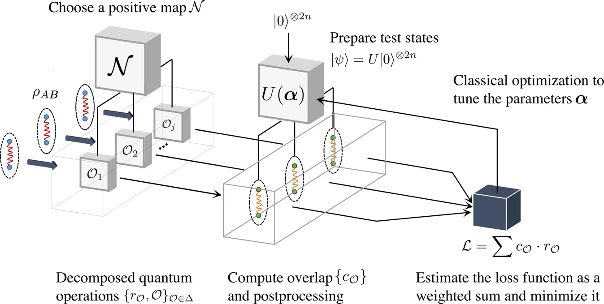

---

title       : Entanglement Detection and Quantification of Quantum Systems
author      : Donghun Jung
# description : Variational methods for entanglement detection and quantification
# keywords    : Quantum Entanglement, VED, Logarithmic Negativity
marp        : true
paginate    : true
theme       : KIST

header-includes:
- \usepackage{braket}
output:
  pdf_document:
    keep_tex: true
style: @import url('https://unpkg.com/tailwindcss@^2/dist/utilities.min.css');

---

<!-- _class: titlepage -->
<!-- backgroundColor: #000000 -->

Entanglement Detection and Quantification of Quantum Systems

Donghun Jung

18 Nov 2025

Department of Physics, Sungkyunkwan University
 
Center for Quantum Technology QuiME Lab, Korea Institute of Science Technology

---

<!-- backgroundColor: white -->

# Outline

- Motivation
- Problem Definition
  - Separability vs. Entanglement
  - Positive but Not Completely Positive (PNCP) Maps
  - Logarithmic Negativity
- Variational Entanglement Detection (VED)
- Examples of Positive Maps
- Variational Entanglement Quantification
- Outlook

---

# Motivation

**Challenge:** Quantum entanglement is vital for quantum computing, yet its detection and quantification remains challenging.

**Existing Methods:**
- Quantum State Tomography (QST) exponential scaling with system size
- Detection & quantification computationally expensive

**Suggested Approach:**
- Use **strategically sampled measurement bases** to avoid exponential cost
- Extract statistical correlations without complete state information
- **Hybrid variational method**: Quantum state preparation + Quantum Measurement + Classical optimization

---

# Separability and Entanglement

A bipartite state $\rho$ is **separable** if:
$$
\rho = \sum_{i} p_i \rho^{A}_{i} \otimes \rho^{B}_{i}
$$
where $\sum_i p_i = 1$ and $p_i > 0$.

Otherwise, the state is **entangled**.

**Problem:** Directly determining separability is **NP-hard**!

Instead of direct verification, use **positive but not completely positive (PNCP) maps** to detect entanglement through negative eigenvalues.

---

# Positive but Not Completely Positive Maps

**PNCP Map** $\mathcal{N}$ can produce negative eigenvalues when applied to entangled states:
$$
\mathcal{N} (\cdot) = \sum_{\mathcal{O}} r_{\mathcal{O}}\mathcal{O}(\cdot)
$$
where $\mathcal{O}$ are operator basis elements (e.g., Pauli operators) and some $r_{\mathcal{O}} < 0$.

---

# Example: Partial Transpose
Any bipartite system can be written as:
$$
\rho_{AB} = \sum_{ijkl} \alpha_{ijkl} \ket{i_{A}}\bra{j_{A}} \otimes \ket{k_{B}}\bra{l_{B}}
$$
Under partial transpose on subsystem B:
$$
\begin{align}
\rho_{AB}^{T_{B}} &= \sum_{ijkl} \alpha_{ijkl} \ket{i_{A}}\bra{j_{A}} \otimes (\ket{k_{B}}\bra{l_{B}})^{T} \\
&= \sum_{ijkl} \alpha_{ijkl} \ket{i_{A}}\bra{j_{A}} \otimes \ket{l_{B}}\bra{k_{B}}
\end{align}
$$
If subsystem is one-qubit system, this operation decomposes as:
$$
T(\rho) = \frac{1}{2}(\rho + X\rho X - Y \rho Y + Z \rho Z)
$$

---

# Separable vs. Entangled States

## Separable States
For **separable states**, the partial transpose preserves positivity:
$$
\begin{align}
\rho &= \sum_{i} p_i \rho^{A}_{i} \otimes \rho^{B}_{i} \\
&= \sum_{i} p_i
\left(\sum_a \lambda_i^a \ket{\lambda_i^a}\bra{\lambda_i^a}\right) \otimes
\left(\sum_b \mu_i^b \ket{\mu_i^b}\bra{\mu_i^b}\right) \\
&= \sum_{i,a,b} p_i \lambda_i^a \mu_i^b \ket{\lambda_i^a , \mu_i^b}\bra{\lambda_i^a , \mu_i^b}
\end{align}
$$
Since all coefficients $p_i \lambda_i^a \mu_i^b \geq 0$ and sum to unity, this represents a valid eigendecomposition. Under positive and trace-preserving operations, the eigenspectrum remains positive.

---

# Separable vs. Entangled States

## Entangled States
For **entangled states**, quasi-probability decomposition becomes necessary:
$$
\rho = \sum_i q_i \ket{a_i , b_i}\bra{a_i , b_i}
$$
where $\sum_i q_i = 1$ but some $q_i < 0$. 

The states $\{\ket{a_i ,b_i}\}$ form an overcomplete (non-orthonormal) basis. Under PNCP operations, while the quasi-probability coefficients remain unchanged, the transformation of the overcomplete basis induces negative eigenvalues.

---

# Example: Bell State Under Partial Transpose

**Density matrix of two-qubit Bell state $\ket{\Phi^+} = \frac{1}{\sqrt{2}} (\ket{00} + \ket{11})$:**
$$
\rho_{AB} = \frac{1}{2}
\begin{pmatrix}
1 & 0 & 0 & 1 \\
0 & 0 & 0 & 0 \\
0 & 0 & 0 & 0 \\
1 & 0 & 0 & 1
\end{pmatrix} 
= \frac{1}{2}\Big( \ket{0,0}\bra{0,0} +\ket{1,1}\bra{1,1} + \ket{+,+}\bra{+,+} +\ket{-,-}\bra{-,-} - \ket{i,i}\bra{i,i} - \ket{-i, -i}\bra{-i,-i} \Big)
$$

**After partial transpose:**
$$
\rho_{AB}^{T_B} = \frac{1}{2}
\begin{pmatrix}
1 & 0 & 0 & 0 \\
0 & 0 & 1 & 0 \\
0 & 1 & 0 & 0 \\
0 & 0 & 0 & 1
\end{pmatrix}
= \frac{1}{2}\Big( \ket{0,0}\bra{0,0} +\ket{1,1}\bra{1,1} + \ket{+,+}\bra{+,+} +\ket{-,-}\bra{-,-} - \ket{i,-i}\bra{i,-i} - \ket{-i, i}\bra{-i,i} \Big)
$$
The quasi-probability coefficients remain unchanged, but the transformation of the basis yields eigenvalues $\left\{\frac{1}{2},  \frac{1}{2},  \frac{1}{2},  -\frac{1}{2}\right\}$. The negative eigenvalue serves as a witness to entanglement.

---

# Important Remarks on Partial Transpose

1. **PPT Criterion:** Partial transpose detects entanglement for $2\times2$ and $2\times3$ systems (not all entangled states)

2. **Two-qubit systems:** At most **one** negative eigenvalue

3. **General $m\otimes n$ systems:** At most $(m-1)(n-1)$ negative eigenvalues

Finding $\lambda_{\min}$ of $\mathcal{N}(\rho)$ is crucial for entanglement detection

---

# Logarithmic Negativity

For pure states, von Neumann entropy is the standard measure. However, for mixed states, multiple measures exist (Rényi entropy, concurrence, logarithmic negativity), with no single universally accepted standard. This paper employs **logarithmic negativity**, defined as:
$$
E_N (\rho_{AB}) = \ln \left\| \rho_{AB}^{T_B} \right\|
$$
where trace norm: $\left\| A \right\| = \text{Tr} \sqrt{A^{\dagger}A}$ = sum of absolute eigenvalues.

**Properties:**
- Separable states: $\|\rho_{AB}^{T_B}\| = 1 \Rightarrow E_N = 0$
- Entangled states: $\|\rho_{AB}^{T_B}\| > 1 \Rightarrow E_N > 0$

---

# Example (Bell state)
For the Bell state with density matrix, the partial transpose yields:
$$
\rho_{AB}^{T_B} = \frac{1}{2}
\begin{pmatrix}
1 & 0 & 0 & 0 \\
0 & 0 & 1 & 0 \\
0 & 1 & 0 & 0 \\
0 & 0 & 0 & 1
\end{pmatrix}
$$
with eigenvalues $\{\frac{1}{2}, \frac{1}{2}, \frac{1}{2}, -\frac{1}{2}\}$. The trace norm is $\|\rho_{AB}^{T_B}\| = 2$, yielding logarithmic negativity $E_N = \ln 2$.

---

# Variational Entanglement Detection (VED)

**Goal:** Find minimum eigenvalue of $\mathcal{N}(\rho)$
$$
\lambda_{\min} = \min_{\ket{\psi}} \bra{\psi}\mathcal{N}(\rho)\ket{\psi} = \min_{\ket{\psi}} \sum_{\mathcal{O}} r_{\mathcal{O}} \bra{\psi}\mathcal{O}(\rho)\ket{\psi}
$$

This problem is analogous to the Variational Quantum Eigensolver (VQE):
- **VQE**: Find the minimum eigenvalue of a Hamiltonian
- **VED**: Find the minimum eigenvalue of a transformed state $\mathcal{N}(\rho)$

Following the VQE approach, we prepare parameterized test states and measure expectation values. The minimum eigenvalue satisfies:
$$
\lambda_{\min} = \arg\min_{\ket{\psi(\alpha)}} \sum_{\mathcal{O}} r_{\mathcal{O}} \bra{\psi(\alpha)} \mathcal{O}(\rho) \ket{\psi(\alpha)}
$$

---

# VED: Quantum Implementation

Each expectation value can be computed as:
$$
\begin{align}
\bra{\psi(\alpha)} \mathcal{O} (\rho_{AB}) \ket{\psi(\alpha)} &= \bra{0^{2n}} U^{\dagger}_\alpha\mathcal{O}(\rho_{AB})U_{\alpha}\ket{0^{2n}}\\
&= \text{Tr} \left[U^{\dagger}_{\alpha}\mathcal{O}(\rho_{AB})U_{\alpha}\ket{0^{2n}}\bra{0^{2n}} \right]
\end{align}
$$
This can be implemented on a quantum circuit. The number of required circuits equals the number of non-zero coefficients $r_{\mathcal{O}}$ in the map decomposition. The implementation of $U_{\alpha}^{\dagger}$ depends on the chosen circuit ansatz.

<!--  -->

 
<em>
</em>

 

---

# VED: Quantum Implementation

This simplified quantum circuit estimates the overlap $\bra{\psi}\mathcal{O}(\rho_{AB})\ket{\psi}$ for a given implementable operation $\mathcal{O}$, where $\ket{\psi} = U_{\alpha} \ket{0^{2N}}$ is the parameterized input state.

**Remark:** Since separable states always have positive eigenspectra under PNCP maps, there are no false positives—if the algorithm detects entanglement, the state is genuinely entangled.

<!--  -->

 
 
 
<em>

</em>

 

---

# VED Algorithm

1. **Input:** $2n$-qubit quantum state $\rho_{AB}$, decomposition $\mathcal{N} (\cdot) = \sum_{\mathcal{O}} r_{\mathcal{O}}\mathcal{O}(\cdot)$ of the PNCP map, parameterized quantum circuit $U_{\alpha}$ with initial parameters $\alpha$, and tolerance $\delta$. Initialize loss function $L(\alpha) = 0$
2. **for all** $\mathcal{O}$ with $r_{\mathcal{O}} \neq 0$ **do**
   - Apply $U(\alpha)$ to $\ket{0^{2n}}$ to obtain test state $\ket{\psi(\alpha)}$ and Input $\rho_{AB}$ and compute the overlap using the quantum circuit
   - Update the loss function: $L(\alpha) \leftarrow L(\alpha) + r_{\mathcal{O}} \bra{\psi(\alpha)}\mathcal{O}(\rho_{AB})\ket{\psi(\alpha)}$
3. **end for**
4. Perform classical optimization to minimize $L(\alpha)$; terminate when $L(\alpha) < -\delta$
5. **Output** "Entangled" if the optimized $L(\alpha) < -\delta$

---

# VED Algorithm

&nbsp;&nbsp;&nbsp;&nbsp;&nbsp;&nbsp;&nbsp;&nbsp;&nbsp;&nbsp;&nbsp;&nbsp;&nbsp;&nbsp;&nbsp;&nbsp;&nbsp;&nbsp;&nbsp;&nbsp;&nbsp;&nbsp;&nbsp;&nbsp;&nbsp;&nbsp;&nbsp;

**Complexity:** This algorithm requires at most $4^N$ circuit copies. The authors also propose Probabilistic VED, which uses probabilistic sampling of observables with a cutoff to reduce measurement overhead while maintaining estimation accuracy within $\delta$ and success probability above $1-\epsilon$.

---

# Examples of Positive Maps
### 1. Partial Transpose (PPT)
$$
T_{B} = \bigotimes_{i=1}^{n} T_{B_i}
$$
### 2. Reduction Map
$$
\rho_{AB} \rightarrow \sigma_{AB} = I_{A} \otimes \rho_B - \rho_{AB}
$$
### 3. Enhanced Reduction Map
$$
\rho_{B} \rightarrow R_{B} (\rho_{B}) - V T_{B}(\rho_{B}) V^{\dagger}
$$
where $V= X\otimes X\otimes \cdots \otimes X \otimes iY$

---

# Reduction Map: Pauli Decomposition

The reduction map is defined as:
$$
\rho_{AB} \rightarrow \sigma_{AB} =  I_{A} \otimes \rho_B - \rho_{AB}
$$
For separable states, this map preserves positivity:
$$
\begin{align}
\rho &= \sum_{i} p_i \rho^{A}_{i} \otimes \rho^{B}_{i} \\
\rightarrow\sigma_{AB} &= \sum_{i} p_i (I - \rho^{A}_{i}) \otimes \rho^{B}_{i} \\
&= \sum_{i} p_i
\left(\sum_a (1-\lambda_i^a) \ket{\lambda_i^a}\bra{\lambda_i^a}\right) \otimes
\left(\sum_b \mu_i^b \ket{\mu_i^b}\bra{\mu_i^b}\right)
\end{align}
$$
Since $0 \leq \lambda_i^a \leq 1$, we have $1-\lambda_i^a \geq 0$, ensuring positivity.

---

# Reduction Map: Pauli Decomposition

The reduction map decomposes in the Pauli basis as:
$$
\begin{align}
R_{B} (\rho_{B}) &= \text{Tr}(\rho_{B}) I_{B} - \rho_{B} \\
&= \frac{1}{2^N} \sum_{P} P \rho_{B} P^{\dagger} I_B - \rho_{B} \\
&= \frac{1-2^N}{2^N}\rho_{B} + \frac{1}{2^N}\sum_{P\neq I^{\otimes N}} P \rho_{B} P^{\dagger}
\end{align}
$$
For a single qubit ($N=1$):
$$
\rho \rightarrow \frac{-\rho + X\rho X + Y \rho Y + Z\rho Z }{2}
$$

---

# Variational Entanglement Quantification

We can measure logarithmic negativity using ancillary qubit

$$
\begin{align}
\left\| \rho_{AB}^{T_{B}} \right\| &= 2\max_{U} \text{Tr}\left[ \ket{0}\bra{0}_{R} Q_R\right] - \text{Tr}(\rho_{AB}^{T_{B}}) \\
&= 2\max_{U} \text{Tr}\left[ \ket{0}\bra{0}_{R} Q_R\right] - 1
\end{align}
$$
where:
- $Q_R = \text{Tr}_{AB}[Q_{ABR}]$
- $Q_{ABR} = U (\rho_{AB}^{T_{B}} \otimes \ket{0}\bra{0}_{R}) U^{\dagger}$

This formulation enables variational optimization similar to VED. The authors note that this framework can be extended to other entanglement measures based on sandwiched Rényi relative entropy.

---

# Outlook
<!-- TODO: Polish English description -->

Estimated minimum eigenvalue $\lambda_{\min}$ by VED using the reduction criterion on the Bell state $\ket{\Phi}$.

Due to the finite sampling restriction for measurements, the optimization procedure essentially falls into the regime of SGD. The optimized loss values converges to $\lambda_{\min}\simeq 0.43$. The gap between the experiment data and simulation result $\lambda_{\min} = 0.5$ is due to various hardware noises on the ibmq santiago processor.

<em>

</em>

 

---

# Outlook
<!-- TODO: Polish English description -->

Numerical results on the four-qubit isotropic states where
$$
\rho^{iso}_{AB}(p) = p\rho_{AB} + (1-p)\frac{I}{2^{N}}
$$
$\rho_{AB}$ is set to $N$-qubit maximally entangled state:$\rho_{AB} = \ket{\Phi}\bra{\Phi}$

It has been shown that $\rho_{AB}$ is separable if and only if $p \leq \frac{1}{2^{N/2} + 1}$.

<em>

</em>

 

---

# Outlook
<!-- TODO: Polish English description -->

Each line depicts the smallest eigenvalue of every isotropic state with parameter $p\in\left[0,1\right]$. This line of the smallest eigenvalues is a lower bound of the loss function $\mathcal{L}(\alpha)$. Each marker depicts the minimized loss value obtained by simulations on a chosen isotropic state, aligning with the theoretical line.

<em>

</em>

 

---

# Outlook
<!-- TODO: Polish English description -->

The four-qubit Breuer state($N=4$) is 
$$
\rho_{AB}^{\text{Breuer}}(\lambda) = \lambda P_{0} + (1-\lambda)\rho_0
$$
where
$$
\begin{align}
P_{j} &= \sum_{m=-j}^{j} \ket{J=j, m}\bra{J=j, m} \\ 
\rho_0 &= \frac{2}{N+2}\sum_{J_{\text{odd}}} P_{J}
\end{align}
$$
You can check clebsch gordan table entire matrix elements. Note that four-qubit Breuer state was regarded as two-spin-3/2 state, then mapped into four-qubit state.

<em>

</em>

 

---

# Outlook
<!-- TODO: Polish English description -->

Breifly, two-qubit Breuer state($N=2$) is 
$$
\rho_{AB}^{\text{Breuer}} = \begin{pmatrix}
\frac{1-\lambda}{3} & 0 & 0 & 0 \\
0 & \frac{1+2\lambda}{6} & \frac{1-4\lambda}{6} & 0 \\
0 & \frac{1-4\lambda}{6} & \frac{1+2\lambda}{6} & 0 \\
0 & 0 & 0 & \frac{1-\lambda}{3} \\
\end{pmatrix}
$$

<em>

</em>

 

---

# Outlook
<!-- TODO: Polish English description -->

The simulations are carried out on two-qubit isotropic states, where $\rho_{AB}$ is set to isotropic states.
$$
\rho_{AB}^{\text{iso}} = p \ket{\Phi}\bra{\Phi} + (1-p)\frac{I}{4}
$$
where $\ket{\Phi}$ is two-qubit maximally entangled state. The logarithmic negativity of a two-qubit isotropic state is positive if and only if its parameter $p > \frac{1}{3}$, which matches the range of $p$ where the corresponding isotropic states are entangled.

<em>

</em>

 

---

# Remark
<!-- TODO: Polish English description -->

The author used SGD method for parameter update where the analytical gradient is calculated via the following parameter-shift rule
$$
\frac{\partial \mathcal{L}}{\partial \theta_{i}} = \frac{1}{2}\left[ \mathcal{L}\left(\theta_i + \frac{\pi}{2} \right) - \mathcal{L}\left(\theta_i - \frac{\pi}{2} \right) \right]. 
$$
However, there exists a vast flat area on the loss/optimization landscape. This phenomenon is known as the barren plateau (BP) and is independent of the optimizer utilized, meaning that a gradientfree optimizer would not help in mitigating this phenomenon67. Furthermore, noise and entanglement could also induce BP.

---

# References & Further Reading

**Main Paper**: Wang, Kun, et al. "Detecting and quantifying entanglement on near-term quantum devices." npj Quantum Information 8.1 (2022): 52.

**Related Important Paper**:
- Quasi-probability Decomposition: Pashayan, Hakop, Joel J. Wallman, and Stephen D. Bartlett. "Estimating outcome probabilities of quantum circuits using quasiprobabilities." Physical review letters 115.7 (2015): 070501.
- Partial Transpose: Rana, Swapan. "Negative eigenvalues of partial transposition of arbitrary bipartite states." Physical Review A—Atomic, Molecular, and Optical Physics 87.5 (2013): 054301. (Related Remark)
- Reduction Map: Cerf, Nicolas J., Chris Adami, and Robert M. Gingrich. "Reduction criterion for separability." Physical Review A 60.2 (1999): 898.
- Breuer State, Enhanced Reduction Map: Breuer, Heinz-Peter. "Optimal entanglement criterion for mixed quantum states." Physical review letters 97.8 (2006): 080501.
- Log Negativity Lemma: Chen, Ranyiliu, et al. "Variational quantum algorithms for trace distance and fidelity estimation." Quantum Science and Technology 7.1 (2021): 015019. (Corollary3)
- Barren Plateaus: Zambrano, Leonardo, et al. "Avoiding barren plateaus in the variational determination of geometric entanglement." Quantum Science and Technology 9.2 (2024): 025016.
- Parameter Shift Rule: Gidi, J., et al. "Stochastic optimization algorithms for quantum applications." Physical Review A 108.3 (2023): 032409.
- Observable Sampling: Zhao, Xuanqiang, et al. "Power of quantum measurement in simulating unphysical operations." Physical Review Research 7.1 (2025): 013334.

