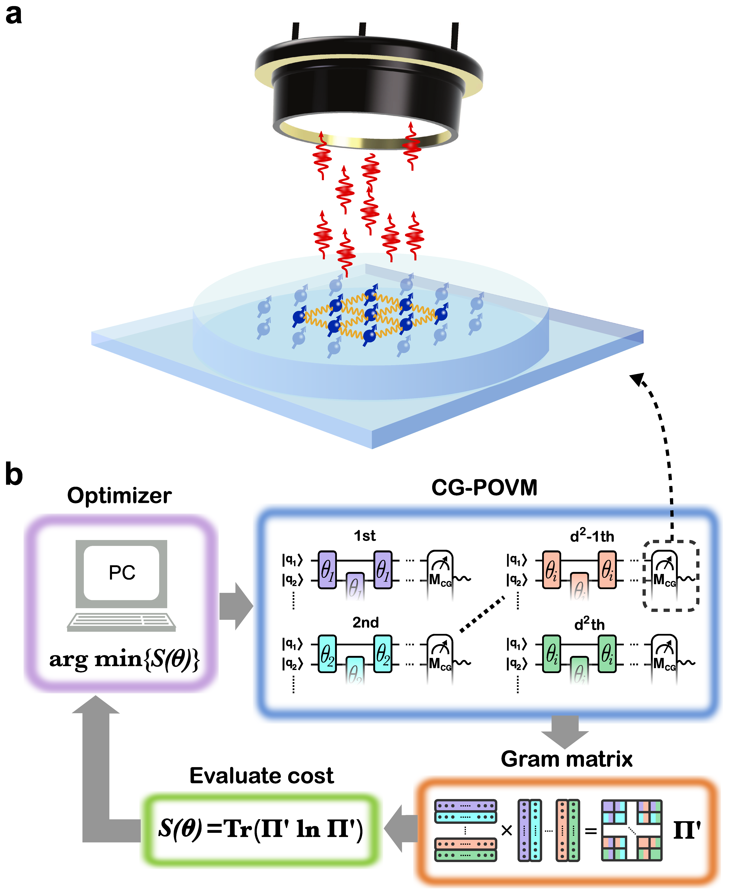
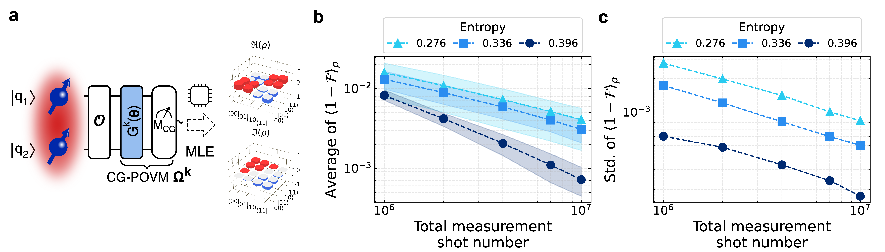
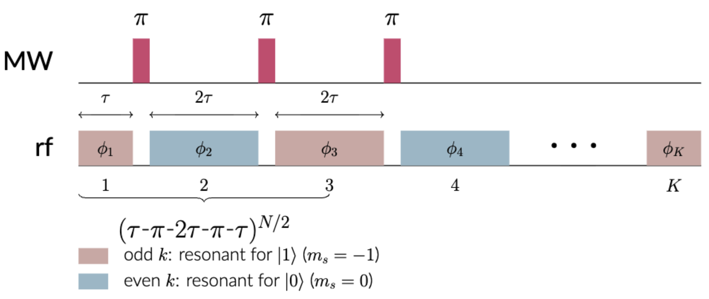
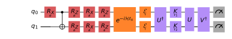

---

title       : KIST Interview
author      : Donghun Jung
# description : This is an example of how to use my themes.
# keywords    falserp, Slides, Themes.
marp        : true
paginate    : true
theme       : KIST

header-includes: 
- \usepackage{braket}
output:
  pdf_document:
    keep_tex: true
style: @import url('https://unpkg.com/tailwindcss@^2/dist/utilities.min.css');

---

<!-- _class: titlepage -->

KIST Interview

 

Donghun Jung

14 Apr 2026

Department of Physics, Sungkyunkwan University
 
Paulee Lab, Center for Quantum Technology, Korea Institute of Science and Technology

---

<!-- backgroundColor: white -->

# Coarse-grained quantum state tomography with optimal POVM construction

$\eta_0$, $\eta_1$:  the probability of **failing** to detect a signal from the $\ket{0}$ and $\ket{1}$ state.
 
$$
\begin{align}
\Pi_{0} &= \eta_{0} \ket{0}\bra{0} + \eta_{1}\ket{1}\bra{1} && \text{no detection} \\
\Pi_{1} &= (1-\eta_{0}) \ket{0}\bra{0} + (1-\eta_{1})\ket{1}\bra{1} && \text{a detection event}
\end{align}
$$
 

Extending this framework to $N$-qubit system, the signal detection probatility becomes:

$$
M_{\text{CG}} = I^{\otimes N} - \Pi_{0}^{\otimes N}
$$
resulting in two positive semidefinite observable operators $\{ M_{\text{CG}}, I^{\otimes N} - M_{\text{CG}} \}$. 

By implementing unitary gates $G^{k} (\hat{\theta})$ via parameterized quantum circuits, an extended set of CG POVM operators, $\Omega^{k} = {G^{k}}^{\dagger}(\hat{\theta})M_{\text{CG}}G^{k}(\hat{\theta})$ can be constructed. 

---

# Coarse-grained quantum state tomography with optimal POVM construction

**Idea**: Uniformly distributed Measurement Operators across Hilbert space.

Uniformness of the set of measurement operators can be represented by von Neumann entropy of Gram matrix
$$
S = -\text{Tr} (\Pi^{\prime} \ln \Pi^{\prime}) = -\sum_{i}^{} \lambda_{i}^{\prime} \ln \lambda_{i}^{\prime}
$$
where Gram matrix is defined as each element is the inner product of the POVM bases $\Pi_{ij} = \text{Tr} \Omega^{i}\Omega^{j}$, and normalized  $\Pi^{\prime} = \Pi / \text{Tr} \Pi$ so that sum of eigenvalues becomes 1. 

To maximize von Neumann entropy $S$, we iteratively update the circuit parameters $\hat{\theta}$. That is, we solved $\arg\max_{\hat{\theta}} S$.

---

# Coarse-grained quantum state tomography with optimal POVM construction

(a) The CG POVM based QST process for a two-qubit system is illustrated, where quantum state tomography is performed after an arbitrary quantum operation $\mathcal{O}$ and subsequent projection basis gates $G^{k}(\theta)$. 
(b) Higher von Neumann entropy of the CG POVM set corresponds to reduced infidelity, demonstrating robustness against the statistical noise. 
(c) CG POVM sets with higher entropy provide more consistent reconstruction results, demonstrating their state-independent performance across a variety of quantum states.

---

# Enhanced electron nuclear control leveraging hyperfine coupling and radio-frequency drive

   

   **Dynamic Decoupling (DD)** sequences, consisting of multi-pulse control on the NV spin, have been developed to achieve entangling gates with selected target nuclear spins while reducing decoherence from the broader spin bath. 

   An additional selective phase-controlled **radio-frequency (rf)** driving on nuclear spins, referred as DDrf gate, enables elaborated control of individual spins.

   

   

   

   

$$
\begin{align}
\mathcal{H} =& \underbrace{\gamma_c B_z I_z^i + A_{||}^i S_z I_z^i + A_{\perp} S_z I_x^i}_{\text{Drift Hamiltonian}} + \underbrace{\frac{1}{\sqrt{2}} \Omega_{\text{MW}} S_x}_{\text{NV electron spin control}} + \underbrace{2\Omega_{\text{rf}}I_x}_{\text{$^{13}$C spin control}}  \\
\rightarrow \mathcal{H} =& \ket{0}\bra{0} \otimes \omega_0 I_z + 
\ket{-1}\bra{-1} \otimes \left( \omega_L I_z -  A_{||}I_z - A_{\perp}I_x  \right) \\
\rightarrow \mathcal{H} =& \ket{0}\bra{0} \otimes H_0 + 
\ket{-1}\bra{-1} \otimes H_1 
\end{align} 
$$

---

# Enhanced magnetic field sensing employing Post-Selection technique

We prepared the following circuit ansatz.

- State Preparation (Red): To prepare an arbitrary two-qubit state, we employ one CNOT gate.

- Sensing (Orange): The system interacts with the (perturbed) magnetic field $\delta B$ during sensing time $t_s$, and the noise channel is embedded. 

- Post-Selection and Measurement (Purple): Unitary operations $U$, $V$ change the post-selection basis, described by Kraus operation, and measurement basis. 

---

<!-- _class: titlepage -->

Thank You!

Questions & Discussion

