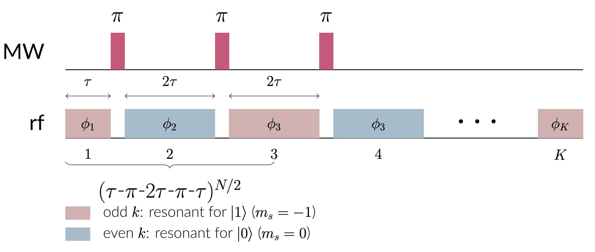
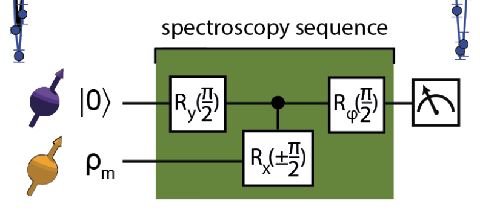
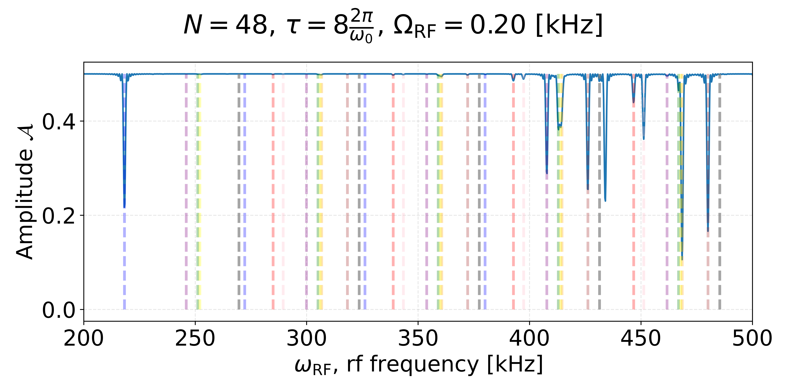
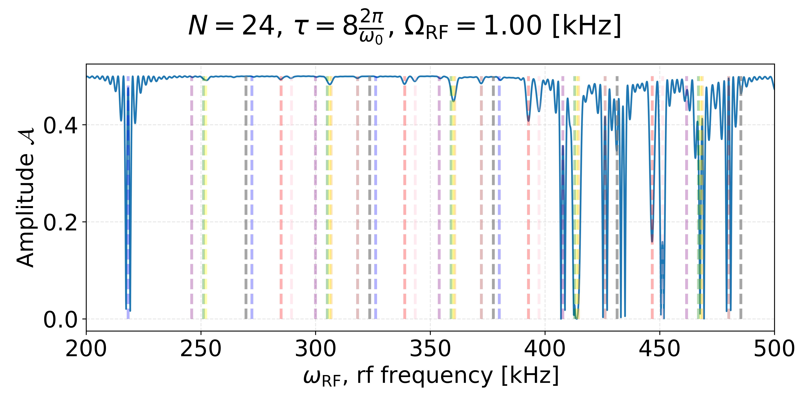
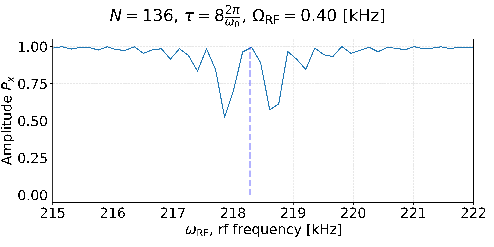
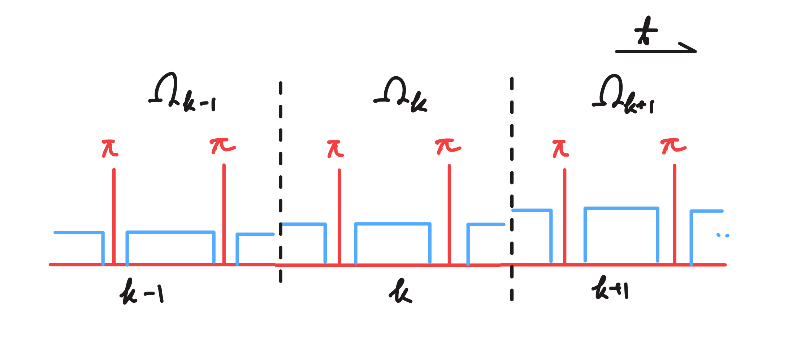
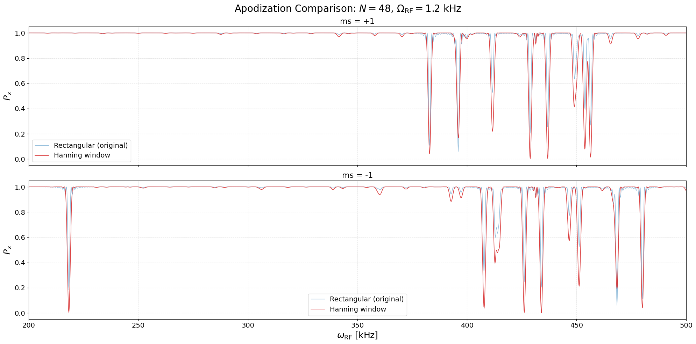

---

title       : Dynamically decoupled radio-frequency(DDrf) Gate
author      : Donghun Jung
marp        : true
paginate    : true
theme       : KIST
math        : mathjax

header-includes:
- \usepackage{braket}
output:
  pdf_document:
    keep_tex: true
style: @import url('https://unpkg.com/tailwindcss@^2/dist/utilities.min.css');

---

<!-- _class: titlepage -->

Dynamically decoupled radio-frequency(DDrf) Gate

Donghun Jung

2026 Apr 28

Department of Physics, Sungkyunkwan University
 
Paulee Lab, Center for Quantum Technology, Korea Institute of Science and Technology

---

<!-- backgroundColor: white -->

# Outline

<!-- TODO(human): Replace these placeholder bullets with your own three-act outline.
     The talk now covers:
       (1) DDrf gate — what it is and how it's calculated
       (2) Side-peak problem — observed phenomenon and analytical explanation
       (3) Suppression — apodized pulses, plus outlook on time-dependent driving
     Pick wording you'd actually say at the start of the talk. -->
1. **DDrf Gate**
   - Hamiltonian engineering & conditional rotation
   - DDrf spectroscopy
2. **Side-Peak Problem**
   - Observation in numerics
   - Detuned-Rabi explanation
3. **Suppression**
   - Apodized pulses & window comparison
   - Outlook: time-dependent $\Omega_{\text{RF}}$ via Magnus expansion

---

# DDrf: Hamiltonian Engineering

DDrf = selective, phase-controlled RF driving of nuclear spins, interleaved with dynamical decoupling on the electron spin.

If the Hamiltonian is **block-diagonal** in the electron basis,
$$
H = \ket{0}\bra{0} \otimes H_0 + \ket{1}\bra{1} \otimes H_1 ,
$$
then sandwiching evolution with an electron $\pi$-pulse swaps the two branches:
$$
\ket{+}\ket{0} \xrightarrow{t_1,\,\pi,\,t_2} \frac{1}{\sqrt{2}}\Big( \ket{0}\otimes \underbrace{e^{-iH_0 t_2}e^{-iH_1 t_1}}_{U_0}\ket{0} + \ket{1}\otimes \underbrace{e^{-iH_1 t_2}e^{-iH_0 t_1}}_{U_1}\ket{0} \Big).
$$
Generally $U_0 \neq U_1$ — a **conditional gate**.

---

# DDrf: Pulse Sequence

---

# DDrf Spectroscopy: NV–${}^{13}$C Hamiltonian

For NV–${}^{13}$C with rf driving:
$$
\begin{align}
H &= \ket{0}\bra{0}\otimes H_0 + \ket{-1}\bra{-1}\otimes H_1 \\
H_0 &= \omega_0 I_z + 2\Omega_{\text{RF}}\cos(\omega_{\text{RF}}t + \phi)\, I_x \\
H_1 &= \omega_1 \tilde{I}_z + 2\Omega_{\text{RF}}\cos\beta \cos(\omega_{\text{RF}}t + \phi)\, \tilde{I}_x + 2\Omega_{\text{RF}}\sin\beta \cos(\omega_{\text{RF}}t + \phi)\, \tilde{I}_z
\end{align}
$$
The $\ket{1}$ branch has a **tilted** nuclear quantization axis (angle $\beta$, with $\sin\beta = A_\perp/\omega_1$). This small tilt is what enables hyperfine-mediated control of nuclei with vanishing $A_\perp$.

---

# DDrf Spectroscopy: Rotating Frame

<!--
Nano Banana prompt for the figure to insert here:

  "Two side-by-side Bloch spheres on a clean white background, scientific
  publication style, no shading clutter. Both spheres share the same dashed
  reference frame (x, y, z axes labeled at the equator and pole).

  LEFT sphere is labeled '|0⟩ branch' above. Its quantization axis is the
  vertical z-axis, drawn as a thick blue arrow from origin to the north pole,
  labeled 'I_z'. A second arrow along +x is labeled 'I_x'. A small caption
  underneath reads 'H_0 ∝ ω_0 I_z'.

  RIGHT sphere is labeled '|1⟩ branch' above. Its quantization axis is tilted
  away from +z toward +x by an angle β (~25°), drawn as a thick red arrow
  labeled '~I_z = cosβ I_z + sinβ I_x'. The angle β is annotated with a small
  arc between +z and the tilted axis. A perpendicular red arrow in the
  z-x plane labeled '~I_x' is also shown. Caption underneath reads
  'H_1 has tilted quantization axis (β = arctan(A_⊥/(ω_0-A_∥)))'.

  Both spheres equal size, aligned horizontally, minimalist line-art style."
-->

Two electron-conditioned rotating frames, $R_s(t) = e^{i\omega_{\text{RF}} t \,\tilde I_z^{(s)}}$, give:
$$
\begin{align}
H_0' &= (\omega_0 - \omega_{\text{RF}})\,I_z + \Omega_{\text{RF}}(\cos\phi\, I_x + \sin\phi\, I_y) \\
H_1' &= (\omega_1 - \omega_{\text{RF}})\,\tilde{I}_z + \Omega_{\text{RF}}\cos\beta\,(\cos\phi\, \tilde I_x + \sin\phi\, \tilde I_y)
\end{align}
$$
At resonance ($\omega_{\text{RF}}=\omega_1$) and approximation to $\omega_0 - \omega_{\text{RF}} \gg \Omega_{\text{RF}}$ and $\beta\to 0$, $H_1'$ is a pure transverse drive, while $H_0^{\prime}$ is pure Z-rotation.

---

# DDrf Spectroscopy: Full Time Evolution

Each MW $\pi$-pulse acts as an **instantaneous frame swap** $\Lambda_{s,\bar s}(t) \equiv R_s(t) R_{\bar s}(t)^\dagger$ between the two rotating frames. The full unitary $U = \sum_s \ket{s}\bra{s}\otimes U_s$ is then a chain of $H_s'$-segments separated by frame swaps:
$$
\begin{align}
U_s = \, & R_s(4N\tau)^\dagger \cdot e^{-iH_s'\tau} \cdot \Lambda_{s,\bar s}((2N{-}1)\tau)\cdot e^{-iH_{\bar s}' 2\tau}\cdot \Lambda_{\bar s, s}((2N{-}3)\tau) \cdot e^{-iH_s'\tau} \cdots \\
& \cdots e^{-iH_s'\tau}\cdot \Lambda_{s,\bar s}(3\tau)\cdot e^{-iH_{\bar s}' 2\tau} \cdot \Lambda_{\bar s, s}(\tau)\cdot e^{-iH_s'\tau}\cdot R_s(0).
\end{align}
$$
Exact under the assumption of negligible MW pulse duration, and **much faster than direct Schrödinger integration** when $\Omega_{\text{RF}}$ is constant — each $e^{-iH_s'\tau}$ is a single matrix exponential of a time-independent Hamiltonian.

---

# DDrf Spectroscopy: Procedure & Results

Sequence: $\pi/2 \rightarrow \text{DDrf}(N,\tau) \rightarrow \pi/2_\phi$, projecting onto $\ket{+}$ ($\phi=\pi/2$).

For $N$ nuclear spins:
$$
P_x = \tfrac{1}{2} + \tfrac{1}{2^{N+1}}\,\Re\,\text{Tr}\,U_0 U_1^\dagger, \qquad \text{Tr}\,U_0 U_1^\dagger = \prod_i \text{Tr}\,U_0^i {U_1^i}^\dagger.
$$
Peaks appear at $\omega_{\text{RF}} = \omega_1$.

---

# DDrf Spectroscopy: Reproduced Taminiau Results

Left: Taminiau et al., *Phys. Rev. X* **9**, 031045 (2019). Right: our numerics — peak positions and amplitudes match.

---

# DDrf: Per-Cell Decomposition

The DDrf sequence is built from identical 4-$\tau$ cells. Each cell is itself block-diagonal:
$$
V^{(k)} = \ket{0}\bra{0}\otimes V_0^{(k)} + \ket{1}\bra{1}\otimes V_1^{(k)},\qquad
U = \sum_{s\in\{0,1\}} \ket{s}\bra{s}\otimes \prod_{k=1}^{N/2} V_s^{(k)}.
$$

---

# DDrf: Telescoping Strategy

A $z$-rotation can be commuted *through* a transverse rotation by shifting its azimuthal angle:
$$
e^{i\alpha I_z}\,(\cos\phi\, I_x + \sin\phi\, I_y)\,e^{-i\alpha I_z} = \cos(\phi-\alpha)\, I_x + \sin(\phi-\alpha)\, I_y .
$$
Applied per cell (Taminiau limit, $\beta=0$, $\omega_{\text{RF}}=\omega_1$):
$$
V_0^{(k)} = e^{-iH_0'\tau}\,e^{-iH_1' 2\tau}\,e^{-iH_0'\tau} \;=\; e^{-i\,2\delta_0\tau\, I_z}\;e^{-i\,2\Omega\tau\,\hat{\phi}_k'\cdot\vec I}.
$$
Each cell splits cleanly into a $z$-piece + a transverse rotation. Choosing $\phi_k$ to align successive transverse axes makes the product over $k$ **telescope** into a single conditional rotation.

---

# Hybrid DDrf: Two Limits and Their Combination

The per-cell picture exposes two distinct mechanisms that both produce conditional rotation:

- **CPMG limit** ($\Omega_{\text{RF}}\to 0$): pure dynamical decoupling. At $\tau \simeq \frac{(2k-1)\pi}{2\omega_0 + A_\parallel}$, the change-of-frame between $R_0$ and $R_1$ alone yields a hyperfine-driven conditional rotation.
- **Taminiau limit** ($\beta\to 0$, $\omega_{\text{RF}}=\omega_1$): pure RF driving. Conditional rotation comes from $\Omega_{\text{RF}}$ alone, independent of $A_\parallel$.

**Hybrid idea.** Choose $\tau$ at the CPMG resonance **and** add RF driving on top. The two mechanisms add coherently:
$$
\theta_{\text{cond}} \approx \underbrace{N\,\theta_{\text{CPMG}}(\tau)}_{\text{frame-swap}} + \underbrace{N\,\Omega_{\text{RF}}\tau}_{\text{RF drive}}
$$

---

# Hybrid DDrf: Taylor Expansion in $\beta$

The hybrid regime sits *between* the two clean limits, but $\beta$ is small. Treat it as a perturbation around the Taminiau limit:
$$
V_s^{(k)} \;\simeq\; \left.V_s^{(k)}\right|_{\beta=0} \;+\; \beta\,\frac{\partial}{\partial\beta}\left.V_s^{(k)}\right|_{\beta=0} \;+\; \mathcal{O}(\beta^2).
$$

**Limit checks** (the reason this approach is trustworthy):
- $\beta \to 0$ — recovers the Taminiau result (slide 10).
- $\Omega \to 0$ — recovers the CPMG mechanism.

**Outcome (qualitative).** The leading $\beta$-correction adds a small $k$-dependent rotation around an axis that mixes $I_z, I_x, I_y$. With an appropriate choice of $\phi_k$ and $\tau$, these corrections **telescope coherently** — the effective rotation angle exceeds bare $\Omega\tau$, realizing the speed-up promised on the previous slide.

(Explicit form is messy and not load-bearing for this talk.)

---

# Side-Peak Problem: Observation

In the Taminiau limit ($\beta\to 0$, $\omega_{\text{RF}}=\omega_1$), telescoping gives
$$
U_s = R_z(N(\omega_L-\omega_1)\tau)\cdot R_\phi(\pm N\Omega_{\text{RF}}\tau).
$$

**[Observation]** When $N\Omega_{\text{RF}}\tau = 2\pi$, $U_0 = U_1$ — the gate becomes **unconditional**, so a flat spectroscopy signal is expected.

The numerics disagree:

---

# Side-Peak Problem: Detuned Rotating Frame

Restore finite detuning $\delta_1 = \omega_1 - \omega_{\text{RF}}$ (assume $\beta=0$ for clarity):
$$
H_1' = \delta_1 I_z + \Omega(\cos\phi I_x + \sin\phi I_y) = \Omega_{\text{eff}}\,\hat n(\phi)\cdot\vec I,
$$
$$
\Omega_{\text{eff}} = \sqrt{\Omega^2+\delta_1^2},\qquad \sin\gamma = \frac{\delta_1}{\Omega_{\text{eff}}},\qquad \hat n(\phi)=(\cos\gamma\cos\phi,\,\cos\gamma\sin\phi,\,\sin\gamma).
$$

Conjugation/telescoping still works because the tilt angle $\gamma$ is invariant under $z$-rotations. Result:
$$
V_s^{\text{tot}} = e^{-iN\delta_0\tau I_z}\,e^{-i\Omega_{\text{eff}}N\tau\,\hat n_s\cdot\vec I},\qquad \hat n_{0,1} = (\pm\cos\gamma,\,0,\,\sin\gamma).
$$

---

# Side-Peak Problem: Detuned Rabi Formula vs. Numerics

$$
\boxed{\;
\frac{1}{2}\,\text{Tr}(U_0 U_1^\dagger) = 1 - \frac{2\Omega^2}{\Omega^2+\delta_1^2}\,\sin^2\!\!\left(\frac{\sqrt{\Omega^2+\delta_1^2}\,N\tau}{2}\right)\;}
$$

The detuned-Rabi formula reproduces both the envelope and the side-lobe period observed numerically:

The "unconditional" prediction was an artifact of $\delta_1 = 0$; finite detuning revives sin² oscillations with period $2\pi/(N\tau)$.

---

# Suppression: Apodized Pulse Idea

Replace constant RF amplitude with a per-cell envelope $\Omega_k = \Omega\, f(k)$, a discrete window function (Hanning, Hamming, Blackman, …):

**Intuition:** the side-lobes are essentially the discrete Fourier transform of a rectangular window. Shaping the window suppresses its sidelobes, exactly the same trick used in classical signal processing.

---

# Suppression: Numerical Result

Apodized envelopes flatten the off-resonant region while preserving the on-resonant peak.

---

# Suppression: Window Comparison

The normalized spectral response factorizes into a window-independent sinc and a window-dependent kernel:
$$
\left|\frac{F(\delta_1)}{F(0)}\right|^2 = \mathrm{sinc}^2(u)\cdot |G(u)|^2,\qquad u = \frac{\delta_1}{2\Omega \bar f}.
$$

| Window | $\bar f$ | FWHM ($u$) | FWHM ($\delta_1$) |
|---|---|---|---|
| Rectangular | 1.00 | 0.89 | $1.77\,\Omega$ |
| Hanning     | 0.50 | 1.44 | $1.44\,\Omega$ |
| Hamming     | 0.54 | 1.30 | $1.41\,\Omega$ |
| Blackman    | 0.42 | 1.68 | $1.41\,\Omega$ |

Hann/Hamming/Blackman trade broader main lobes for dramatically lower side-lobes.

---

# Outlook: Beyond Constant $\Omega_{\text{RF}}$

The full-evolution formalism above **assumes** $\Omega_{\text{RF}}$ is time-independent (compatible with the RWA). With a Gaussian envelope
$$
\Omega_{\text{RF}}(t) = \Omega_0\, e^{-(t-t_k)^2/2\sigma^2},
$$
the per-segment propagator $e^{-iH_{0,1}'\tau}$ is no longer exact. Direct Schrödinger integration takes tens of minutes per frequency point — impractical for spectroscopy sweeps over thousands of $\omega_{\text{RF}}$.

**Approach:** Magnus expansion, valid when $\Omega_{\text{RF}}$ varies slowly relative to $\omega_{\text{RF}}$.

---

# Outlook: Magnus Expansion

For $\partial_t U = -iH(t)U$, write $U = e^{\Omega(t)}$ with $\Omega(t) = \sum_n \Omega_n(t)$ where
$$
\Omega_1 = \int_0^t A_1\, dt_1,\qquad \Omega_2 = \tfrac{1}{2}\!\int\!\!\int [A_1, A_2]\, dt_1 dt_2,\ldots
$$
Computed terms (with $f(t)$ the Gaussian envelope):
$$
\begin{align}
\Omega_1(T) &= -i\Big(\delta_{(0,1)} T\,I_z + c_1(\cos\phi\, I_x + \sin\phi\, I_y)\Big) \\
\Omega_3(T) &= \tfrac{\delta_{(0,1)}^2}{24}\,K_1\,(\cos\phi I_x + \sin\phi I_y) + \tfrac{\delta_{(0,1)}}{24}\,K_2\,I_z \\
\Omega_2 &= \Omega_4 = 0
\end{align}
$$
with $c_1 = \int_0^T f$ and $K_{1,2}$ triple integrals of $f$. Convergence is guaranteed when $\int_0^T \|A(s)\|_2\, ds < \pi$ — likely satisfied here; **simulation pending**.

---

<!-- _class: titlepage -->

Thank You!

Questions & Discussion

