---

title       : Post-Selected Quantum Metrology
author      : Donghun Jung
marp        : true
paginate    : true
theme       : KIST
math        : mathjax

header-includes:
- \usepackage{braket}
output:
  pdf_document:
    keep_tex: true
style: @import url('https://unpkg.com/tailwindcss@^2/dist/utilities.min.css');

---

<!-- _class: titlepage -->

Post-Selected Quantum Metrology

Donghun Jung

2026 May 14

Paulee Lab, Center for Quantum Technology, Korea Institute of Science and Technology

---

<!-- backgroundColor: white -->

# Outline

1. **Post-Selection**
   - 
2. **DDrf**
   - 
3. **Mattermost-Outline**
   - 

---

# Post-Selection: Sensing

<!-- Todo: Add diagram -->

Regardless of the quantity being sensed, it requires interaction between the system and the target. In our NV-center system, we perform quantum sensing of the external magnetic field. Such interaction is captured in the Hamiltonian.
$$
\mathcal{H}_B = \gamma B S_z
$$
where $\gamma$ is the gyromagnetic ratio, related to magnetic sensitivity. Through this interaction term and time evolution, $e^{-i\mathcal{H}}$, the information on the $B$-field is embedded in the state. 
$$
\ket{\psi} \rightarrow e^{-i\mathcal{H}_B} \ket\psi .
$$

---

# Post-Selection: Quantum Fisher Information

In this sense, the quantum Fisher information (QFI) quantifies how rapidly a quantum state, represented by a density matrix, changes with respect to the $B$-field. The faster the change, the greater the sensitivity. 
$$
F_Q = 2\sum_{k,l} \frac{(\lambda_k - \lambda_l)^2}{\lambda_k + \lambda_l} \left| \bra{k}\mathcal{H}_{B}\ket{l}\right|
$$
where $\rho = \sum_k \lambda_k \ket{k}\bra{k}$. 

---

# Post-Selection

In this sense, we hypothesize that adding a post-selection procedure might be advantageous. Intuitively, the information on the $B$-field is encoded in the phase, and through post-selection we may discard unnecessary information to the ancillary qubit (or the other energy level). 

---

# Post-Selection: Analytical Approach for maximum QFI

Last time, I've tried numerical simulation to gain insight on which state and the corresponding Post-selection filter achieve maximum QFI. GH provided a report generated by ChatGPT that provided profound insight to calculate maximum QFI. From that, I reorganized proof and analyzed the solution with Claude Opus 4.7. 

<!-- Todo: Add screen shot -->

---

# Post-Selection: Set-up

Under such set-up, the state evolves:
$$\ket\psi \rightarrow\ket{\psi_0} =  e^{-i H_B \tau}\ket\psi \rightarrow \rho = \mathcal{D}(\rho_0) \rightarrow  \frac{K\rho K^{\dagger}}{\mathrm{Tr}~ K\rho K^{\dagger} }.$$

Without loss of generality, we can write pure state in a computational basis: $$\ket{\psi} = \sum_x a_x \ket{x}, $$where $x$ is computational basis and $\sum_x |a_x |^2 = 1$. 
### 1.2. Time evo
After time-evolution under detuned magnetic field, we have:$$\ket{\psi_0} =  e^{-i H_B \tau}\ket\psi = \sum_x a_x e^{i\theta |x|} \ket{x}.$$ where $|x|$ denotes Hamming weight. Accordingly, its density matrix representation is:$$\rho_0 = \sum_{x,y} a_x \bar{a}_y e^{i\theta (|x| - |y|)} \ket{x}\bra{y}.$$
### 1.3. Phase damping channel
After applying phase damping noise, the off-diagonal elements undergoes damping proportional to $\eta^{d(x,y)}$ where $d(x,y) = |x\oplus y|$ is the Hamming distance. 
$$
\begin{align}
\rho_0 \rightarrow \rho &= \sum_{x,y} a_x \bar{a}_y e^{i\theta (|x| - |y|)} \eta^{d(x,y)} \ket{x}\bra{y} \\
&= \sum_{x,y} e^{i\theta |x|}\left( a_x \right) \left(\eta^{d(x,y)} \ket{x}\bra{y} \right)\left( \bar{a}_y\right) e^{-i\theta|y|} \\
&= U(\theta) D_a C_N D_a^{\dagger} U^\dagger (\theta),
\end{align}
$$
where $D_a = \mathrm{diag} (a_x)$ and $C_N = (I+\eta X)^{\otimes N}$. 

Phase damping kills off-diagonal elements between computational-basis states at different Hamming weights, but preserves populations $|a_x|^2$. Thus $\rho$ has the eigenvalue structure of a mixed state on $\mathrm{supp} \rho \subseteq \mathrm{span} \{|x\rangle:a_x\neq 0\}$, even when $\rho_0$ is rank-1. Hence $\rho^{-1/2}$, used in the operator $M=\rho^{-1/2}\dot\rho\,\rho^{-1/2}$, is well-defined on $\mathrm{supp}\,\rho$ as a pseudoinverse, and the contraction $\|W_j\|_\infty<1$ analysis applies. 
### 1.4. Post-Selection
A $\theta$-independent Kraus operator $K$ (with $K^\dagger K\preceq I$) is applied to $\rho$, producing the success branch

$$

\sigma = \frac{K\rho K^\dagger}{p_s}, \qquad p_s = \mathrm{Tr}\bigl[ K\rho K^\dagger\bigr].

$$
The conditional phase QFI $F^{\mathrm{ps}}_{\theta,Q}=\mathrm{Tr}(\sigma L_\sigma^2)$ is the object we bound and optimize.

---

# Post-Selection: Analytical Approach for maximum QFI, Quick summary

In $N$-qubit system, now we recognize that the phase Quantum Fisher Information (QFI) of the conditionally-accepted state obeys
$$
F^{\mathrm{ps}}_{\theta,Q} \le \frac{N^2 \eta^2}{1-\eta^2}, \qquad \eta=e^{-\tau}, \tau=\left(\tau/T_2\right)^p.
$$
**Strategy**: chaining inequality, analyze saturation condition, it is expected to gain some insight. 
Accordingly, we can furthur analyze when the equality condition holds.
- Which state satisfy equality condition? What are the corresponding filter basis?
- Is there entanglement-related gain? 
- What is post-selection success probability?
- Which state makes success probability maximum?

---

# Generalized eigenvalue problem

Generally, we solve eigenvalue problem like $A\mathbf{x} = \lambda\mathbf{x}$. 
The eigenvalue is derived by solving $\det{A-\lambda I} = 0$.

Generalized eigenvalue problem is introduced as $A\mathbf{x} = \lambda B \mathbf{x}$.
This must not be new to physicsiant, such as vibrating mechanical system. Consider a system of coupled masses and springs, Lagrangian formalism tends to give euqation of motion:
$$
M \ddot{\mathbf{x}} + K\mathbf{x} = 0
$$
With harmonic solution, $\mathrm{x}=\mathrm{x}_0 e^{i\omega t}$,
$$
K\mathrm{x} = \omega^2 M \mathrm{x}.
$$

---

# Post-selection

The post-selected density matrix $\sigma$ is derived as:
$$
\sigma = \frac{K\rho K^\dagger}{p_s}, \quad p_s = \mathrm{Tr} K\rho K^\dagger .
$$
The QFI can be derived by symmetric logarithmic derivative (SLD):
$$
F_Q = \mathrm{Tr} \sigma L^2
$$
where SLD operator $L$ is defined as:
$$
\dot\sigma = \frac{1}{2} \left( \sigma L + L \sigma \right).
$$

However, it is known that calculating SLD directly is challenging.

---

# Post-selection

Let me introduce operator $M = \sigma^{-\frac{1}{2}}\dot\sigma\sigma^{-\frac{1}{2}}$.
$$
M = \sigma^{-\frac{1}{2}} \frac{1}{2}(\sigma L + L \sigma) \sigma^{-\frac{1}{2}}= \frac{1}{2} (\sigma^{\frac{1}{2}}L\sigma^{-\frac{1}{2}} + \sigma^{-\frac{1}{2}}L \sigma^{\frac{1}{2}})
$$

This operator is important since $\mathrm{Tr} ~ \sigma L^2  \leq \mathrm{Tr} ~ \sigma M^2$.

Under eigenbasis of $\sigma$, $\sigma = \sum_i p_k \ket{p_k}\bra{p_k}$. 
Then, 
$L_{ab}=\frac{2 \dot\sigma_{ab}}{p_a + p_b}$
$M_{ab}=\frac{\dot\sigma_{ab}}{\sqrt{p_a p_b}}$.
Then, 
$\mathrm{Tr} ~ \sigma L^2 = \sum_{a,b} l_{ab} = \sum_{a,b} \frac{2 |\dot\sigma_{ab}|^2}{p_a + p_b}$
$\mathrm{Tr} ~ \sigma M^2 = \sum_{a,b} m_{ab} = \sum_{a,b} \frac{|\dot\sigma_{ab}|^2 (p_a + p_b)}{2 p_a  p_b}$
Comparing each term, $\frac{m_{ab}}{l_{ab}}= \frac{(p_a + p_b)^2}{4p_a p_b} \geq 1$.

Saturation condtition is $p_k = p_i$.

---

# Post-seleciton

At here, $\sigma$ lives in the subspace of $\rho$ filtered by $K$. Accordingly, $M$ lives in the same subspace and its maximum operator norm also bound to $M_\rho$. 
Therefore, $\mathrm{Tr} \sigma M^2 \leq \| M_\rho \|_\infty^2$. 

On the other hand, 
$$
M_\rho = \rho^{-\frac{1}{2}}\dot\rho\rho^{-\frac{1}{2}}
$$
and 
$$
\dot\rho = -i [H_B , \rho] = \sum_i -\frac{i}{2} [Z_i , \rho]
$$
$M_\rho = \sum_i \rho^{-\frac{1}{2}}-\frac{i}{2} [Z_i , \rho]\rho^{-\frac{1}{2}} = \sum_i M_i .$
Hence, 
$$
\|M_\rho \| \leq \sum_i \|M_i \|_\infty
$$
equality holds when each partition is symmetrized. 

---

# Post-selection

We can chain inequality, 
$$
F_Q = \mathrm{Tr} \sigma L^2 \leq \mathrm{Tr} \sigma M_\sigma^2 \leq \|M_\rho\|^2 \leq \left(\sum_i \|M_i \|_\infty \right)^2
$$
When all the saturation condition is satisfied at once, QFI is bound 
$$
F_Q \leq N^2 \| M_i \|_\infty^2 .
$$

We see three inequality. First is saturate when $\sigma$ is fully mixed state for subspace. The second one is saturated when optimal filter is selected. The last one is saturated when the whole system is symmetrized. 

Now, lets find such $\|M_i \|$ first.

---

# Post-selection

To derive eigenvalue and eigenvectors of $M$, it is helpful to solve Generalized eigenvalue problem. 
$$
\begin{align}
M\ket{v} = \lambda\ket{v} \\
\rho^{-1/2}\dot\rho_j\rho^{-1/2}\ket{v} = \lambda{v}\\
\dot\rho_j \left(\rho^{-1/2}\ket{v}\right) = \lambda\rho\left(\rho^{-1/2}\ket{v}\right) \\
\dot\rho_j \ket{w} = \lambda\rho\ket{w}
\end{align}
$$
where the last line is generalized eigenvalue problem(GEP). 

---

# Post-selection

It is trivial:
$$
\dot\rho_j = \begin{pmatrix}
0 & -i\eta B_j \\
i \eta B^\dagger_j & 0 
\end{pmatrix}.
$$
Then, the GEP is reduced to
$$
\begin{pmatrix}
0 & -i\eta B_j \\
i \eta B^\dagger_j & 0 
\end{pmatrix}
\begin{pmatrix}
w_1\\
w_2
\end{pmatrix} 
=
\lambda 
\begin{pmatrix}
A_j & \eta B_j \\
\eta B^\dagger_j & D_j 
\end{pmatrix}
\begin{pmatrix}
w_1\\
w_2
\end{pmatrix} 
$$

---

# Post-selection

Applying Schur decomposition, we derive:
$$
\begin{align}
\begin{pmatrix}
0 & -i\eta A_j^{\frac{1}{2}}W_j D_{j}^{\frac{1}{2}} \\
i \eta {D_j^{\frac{1}{2}}}^\dagger W_j^\dagger {A_j^{\frac{1}{2}}}  & 0 
\end{pmatrix}
\begin{pmatrix}
w_1\\
w_2
\end{pmatrix} 
&=
\lambda 
\begin{pmatrix}
A_j & \eta A_j^{\frac{1}{2}}W_j D_{j}^{\frac{1}{2}} \\
\eta {D_j^{\frac{1}{2}}}^\dagger W_j^\dagger {A_j^{\frac{1}{2}}} & D_j 
\end{pmatrix}
\begin{pmatrix}
w_1\\
w_2
\end{pmatrix} \\
\begin{pmatrix}
A_j^{\frac{1}{2}} & 0 \\
0 & D_j^{\frac{1}{2}}
\end{pmatrix}
\begin{pmatrix}
0 & -i\eta W_j \\
i\eta W_j^\dagger & 0
\end{pmatrix}
\begin{pmatrix}
A_j^{\frac{1}{2}} & 0 \\
0 & D_j^{\frac{1}{2}}
\end{pmatrix}
\begin{pmatrix}
w_1\\
w_2
\end{pmatrix}
&= \lambda
\begin{pmatrix}
A_j^{\frac{1}{2}} & 0 \\
0 & D_j^{\frac{1}{2}}
\end{pmatrix}
\begin{pmatrix}
I & \eta W_j \\
\eta W_j^\dagger & I
\end{pmatrix}
\begin{pmatrix}
A_j^{\frac{1}{2}} & 0 \\
0 & D_j^{\frac{1}{2}}
\end{pmatrix}
\begin{pmatrix}
w_1\\
w_2
\end{pmatrix}
\end{align} 
$$

Hence, 
$$
\begin{pmatrix}
0 & -i\eta W_j \\
i\eta W_j^\dagger & 0
\end{pmatrix}
\begin{pmatrix}
\tilde{w}_1\\
\tilde{w}_2
\end{pmatrix}
= \lambda
\begin{pmatrix}
I & \eta W_j \\
\eta W_j^\dagger & I
\end{pmatrix}
\begin{pmatrix}
\tilde{w}_1\\
\tilde{w}_2
\end{pmatrix}
$$

---

# Post-selection

Taking SVD to $W_j = U \Sigma_j V^\dagger$, with singular value $\Sigma = \mathrm{diag}(s_jk)$ , we have: 
$$
\begin{pmatrix}
0 & -i\eta s_{jk} \\
i\eta s_{jk} & 0
\end{pmatrix}
\begin{pmatrix}
\tilde{u}_{jk1}\\
\tilde{u}_{jk2}
\end{pmatrix}
= \lambda_{jk}
\begin{pmatrix}
1 & \eta s_{jk} \\
\eta s_{jk} & 1
\end{pmatrix}
\begin{pmatrix}
\tilde{u}_{jk1}\\
\tilde{u}_{jk2}
\end{pmatrix}
$$

Solving this, 
$$
\det \begin{pmatrix}
-\lambda & - \eta s_{jk} (\lambda + i) \\
\eta s_{jk} (-\lambda + i) & - \lambda
\end{pmatrix} = 0
$$
resulting in, 
$$
\lambda_{jk} = \pm \sqrt\frac{\eta^2 s_{jk}^2}{1-\eta^2 s_{jk}^2}.
$$

---

# Post-selection

The singular value is bound to $0\leq s_{jk} \leq 1$, then, the magnitude of eigenvalue is maximized at $s_{jk}=1$. Therefore,
$$
\|M_j\|_\infty \leq \frac{\eta}{\sqrt{1 - \eta^2}}.
$$

At here, we see one more inequality. This should be satisfied whichever qubit we choose. The value $s_{jk}$ is generally less than 1 for mixed state generally. However, $s_{jk}$ can be satisfied if we make fully symmetric state (symmetric under exchange, bit-flip operation).

Therefore, at saturation condition, 
$$
\|M\|_\infty = \frac{N\eta}{\sqrt{1 - \eta^2}},
$$
accordingly,
$$
F_Q \leq \|M\|_\infty^2 = \frac{N^2 \eta^2}{1 - \eta^2}.
$$

---

# Post-selection

Every pure-state at stage 1, $\ket{\psi_0} = \sum_x a_x\ket{x}$, for all pauli-string $x$ saturates the global bound
$$
F^{\mathrm{ps}}_{\theta,Q} = \frac{N^2 \eta^2}{1-\eta^2}.
$$
The saturating class is open (the condition $|a_x|>0$ is open) and dense (full-support probes are generic) in the projective Hilbert space $\mathbb{CP}^{2^N-1}$. 

---

# Post-selection

As shown above, phase damped state can be written as: $\rho = D_a C_N D_a^\dagger$ with $C_N = (I + \eta X)^{\otimes N}$. $D_a$ is invertible iff $a_x \neq 0$ for all $x$. Let's return to GEP,
$$
\dot\rho_j \ket{w} = \lambda\rho\ket{w}
$$
Then, 
$$
\begin{align}
-i [H_B , D_a C_N D_a^\dagger ] \ket{w} = \lambda D_a C_N D_a^\dagger \ket{w} \\
-i D_a [H_B , C_N]D_a^\dagger \ket{w} = \lambda D_a C_N D_a^\dagger \ket{w}
\end{align}
$$
As $H_B$ and $D_a$ are commutable. And let $\ket{\epsilon} = D_a^\dagger \ket{w}$, we have another GEP, 
$$
-i [H_B , C_N] \ket{\epsilon}= \lambda C_N \ket\epsilon .
$$

---

# Post-selection

Given $C_N = (1+\eta X)^{\otimes N} = C^{\otimes N}$ and $H_B = \sum_i \frac{1}{2} Z_i$, we have $$-\frac{i}{2} \sum_i \left[Z_i , C^{\otimes N}\right] \ket\epsilon = \lambda_i C^{\otimes N} \ket\epsilon .$$For product ansatz $\ket\epsilon = \otimes_i \ket{\epsilon_i}$. Then, each term satisfies a single-qubit GEP. 
$$
-\frac{i}{2}\left[Z , C\right]\ket{\epsilon_i} = \lambda C \ket{\epsilon_i}. 
$$

Then, $\frac{-i}{2}[Z,C] = \eta Y$. It is reduced to 
$$
\begin{pmatrix}
-\lambda & -\eta (\lambda + i) \\
-\eta(\lambda - i) & -\lambda
\end{pmatrix} 
\ket{\epsilon_i} = 0
$$
Then, $\lambda_\pm = \pm\frac{\eta}{\sqrt{1-\eta^2}}$ and $\ket{\epsilon_i^\pm} = \frac{1}{2}(\ket{0} + e^{\pm i\alpha}\ket{1})$ where $\cos\alpha = -\eta$, $\sin\alpha = \sqrt{1-\eta^2}$. Returning to $N$-qubit system, the product of $\ket{\epsilon^\pm}$ is eigenstate whose eigenvalue is $\lambda = \sum_i \lambda_i$. Especially, GEP has $\ket{\epsilon^\pm}^{\otimes N}$ has eigenvalue $\pm\frac{N\eta}{\sqrt{1-\eta^2}}$. 

---

# Post-selection

Going back to $\ket{w}$:
$$\ket{w^\pm} = {D_a^{-1}}^{\dagger}\ket{\epsilon^\pm}$$
then, 
$$\dot\rho \ket{w^\pm} = \pm \frac{N\eta}{\sqrt{1-\eta^2}}\rho\ket{w^\pm}.$$

Therefore, $M=\rho^{-\frac{1}{2}}\dot\rho\rho^{-\frac{1}{2}}$ contains $\pm\frac{N\eta}{\sqrt{1-\eta^2}}$, and  $\|M\|_\infty = \frac{N\eta}{\sqrt{1-\eta^2}}$, resulting in
$$F^{\mathrm{ps}}_{\theta,Q} = \frac{N^2 \eta^2}{1-\eta^2},$$
with filter basis $\ket{w^\pm}$. 

---

# Post-selection

As given above, $\ket{w} = \rho^{-\frac{1}{2}}\ket{v}$, then, we can derive filter basis(denoted as $\ket{\Psi^\pm}$), 
$$\ket{\Psi^\pm} = \ket{v^\pm} = \frac{\rho^{\frac{1}{2}} \ket{w^\pm}}{(1-c^2)^{\frac{N}{2}}}.$$
Each basis is orthogonal to each other, 
$$
\bra{\Psi^+}\ket{\Psi^-} = \frac{\bra{w^+}\rho\ket{w^-}}{(1-c^2)^N} = 0,
$$
inherited from $\rho$-biorthogonality (which is $C_1$-biorthogonality lifted to $N$ qubits).

---

# Post-selection

The filter is a rank-2 projector onto $\mathrm{span}\{|\Psi^+\rangle,|\Psi^-\rangle\}$:
$$
P_\pm \;=\; |\Psi^+\rangle\langle\Psi^+| + |\Psi^-\rangle\langle\Psi^-|.
$$
The matched Kraus operator is
$$
K =\sqrt{\frac{p_s}{2}} P_\pm \rho^{-1/2}.
$$
Apply it to $\rho$:
$$
K\rho K^\dagger \;=\; \frac{p_s}{2}\,P_\pm\rho^{-1/2}\rho\,\rho^{-1/2}P_\pm \;=\; \frac{p_s}{2}\,P_\pm^2 \;=\; \frac{p_s}{2}\,P_\pm.
$$

---

# Post-selection

The accepted state is
$$
\sigma\;=\;\frac{K\rho K^\dagger}{p_s} \;=\; \frac{P_\pm}{2}\;=\;\frac{|\Psi^+\rangle\langle\Psi^+|+|\Psi^-\rangle\langle\Psi^-|}{2}.
$$
The accepted state is the *maximally mixed state on the filter subspace*. This is the structural requirement for QFI saturation.

Such form looks unfamilar. We should implement, 
$$K=\ket{\Psi^+}\bra{w^+} + \ket{\Psi^-}\bra{w^-}.$$

Then this Kraus operation can be implemented by $K = \sqrt{1-\gamma}\ket{00\cdots 0}\bra{00\cdots 0}+\ket{00\cdots 0}\bra{10\cdots 0}$ by applying appropriate unitary operation before and after Post-selection operation with choosing one post-selection strength zero, others are all-one.

---

# Post-selection:

The POVM constraint is $K^\dagger K \preceq I$. 
$$K^\dagger K = \ket{w^+}\bra{w^+} + \ket{w^-}\bra{w^-}={D_a^{-1}}^\dagger \Pi D_a^{-1}$$
where $\Pi = \ket{\epsilon^+}^{\otimes N }\bra{\epsilon^+}^{\otimes N } + \ket{\epsilon^-}^{\otimes N }\bra{\epsilon^-}^{\otimes N }$. Its component form is given as:
$$\Pi_{xy} = \frac{1}{2^{N-1}}\cos(\alpha (|x| - |y|)).$$
Then, $(K^\dagger K)_{xy} = \frac{\Pi_{xy}}{\bar{a}_x a_y}$.

---

# Post-selection

the equation is $\Pi|u\rangle = \mu D_p|u\rangle$, equivalently $D_p^{-1/2}\Pi D_p^{-1/2}|w\rangle = \mu|w\rangle$ with $|w\rangle = D_p^{1/2}|u\rangle$. So we want the eigenvalues of the symmetric operator $D_p^{-1/2}\Pi D_p^{-1/2}$.

In the 2D image of $\Pi$ (basis $\{|v^+\rangle^{\otimes N},|v^-\rangle^{\otimes N}\}$), $\Pi$ acts as the rank-2 identity. The Gram matrix of $\{D_p^{-1/2}|v^\pm\rangle^{\otimes N}\}$ is
$$
G \;=\; \begin{pmatrix}\hat S & \hat T\\ \overline{\hat T} & \hat S\end{pmatrix},
$$
and the eigenvalues of $D_p^{-1/2}\Pi D_p^{-1/2}$ in this basis are the eigenvalues of $G$, namely $\hat S\pm|\hat T|$.

So $\lambda_{\max}(\Xi)=\hat S+|\hat T| = (S+|T|)/2^N$. Therefore
$$
\boxed{\quad p_s^* \;=\; \frac{2(1-c^2)^N}{\lambda_{\max}(\Xi)}\;=\;\frac{2\cdot 2^N(1-c^2)^N}{S+|T|}\;=\;\frac{2^{N+1}(1-c^2)^N}{S+|T|}.\quad}
$$

---

# Post-selection

The optimization is over all pure probe magnitudes $\{|a_x|^2\}_x$ subject to $\sum_x|a_x|^2=1$. The objective $S+|T|$ depends on the magnitudes via
$$
S\;=\;\sum_x \frac{1}{|a_x|^2}, \qquad T\;=\;\sum_x \frac{e^{-2i\beta|x|}}{|a_x|^2}, \qquad \beta\;=\;\pi-\arccos c.
$$
The objective is **invariant under permutations of the $N$ qubits** because both $S$ and the *magnitude* $|T|$ depend on $|a_x|^2$ only through the Hamming weight $|x|$ (the phase factor in $T$ is permutation-invariant). It is also **invariant under bit-flip $x\to\bar x$** because $e^{-2i\beta|\bar x|}=e^{-2i\beta(N-|x|)}=e^{-2i\beta N}e^{2i\beta|x|}$, which conjugates $T$ — a global phase invisible to $|T|$.

These two symmetries are baked into the noise model and the optimization, so by a standard symmetrization argument (averaging any candidate probe over the symmetry group does not increase $S+|T|$, by convexity), **the optimum lies in the permutation-symmetric and bit-flip-symmetric subclass.**

In this subclass, $|a_x|^2$ depends only on $|x|=k$. Parametrize via *Dicke populations* $p_k$, $k=0,1,\ldots,N$:
$$
|a_x|^2 \;=\; \frac{p_k}{\binom{N}{k}} \quad\text{for }|x|=k, \qquad \sum_k p_k \;=\; 1, \qquad p_k\;=\;p_{N-k}.
$$
The corresponding probe state, in Dicke basis $|D_k^N\rangle = \binom{N}{k}^{-1/2}\sum_{|x|=k}|x\rangle$, is
$$
|\psi_0\rangle \;=\; \sum_{k=0}^N q_k\,|D_k^N\rangle, \qquad q_k\;=\;\sqrt{p_k}\;\;(\text{up to phase}).
$$
This collapses the optimization from $2^N$ variables to $\lfloor N/2\rfloor+1$ variables.

---

# DDrf: Hamiltonian Engineering

DDrf = selective, phase-controlled RF driving of nuclear spins, interleaved with dynamical decoupling on the electron spin.

If the Hamiltonian is **block-diagonal** in the electron basis,
$$
H = \ket{0}\bra{0} \otimes H_0 + \ket{1}\bra{1} \otimes H_1 ,
$$
then sandwiching evolution with an electron $\pi$-pulse swaps the two branches:
$$
\ket{+}\ket{0} \xrightarrow{t_1,\,\pi,\,t_2} \frac{1}{\sqrt{2}}\Big( \ket{0}\otimes \underbrace{e^{-iH_0 t_2}e^{-iH_1 t_1}}_{U_0}\ket{0} + \ket{1}\otimes \underbrace{e^{-iH_1 t_2}e^{-iH_0 t_1}}_{U_1}\ket{0} \Big).
$$
Generally $U_0 \neq U_1$ — a **conditional gate**.

---

# DDrf: Pulse Sequence

---

# DDrf Spectroscopy: NV–${}^{13}$C Hamiltonian

For NV–${}^{13}$C with rf driving:
$$
\begin{align}
H &= \ket{0}\bra{0}\otimes H_0 + \ket{-1}\bra{-1}\otimes H_1 \\
H_0 &= \omega_0 I_z + 2\Omega_{\text{RF}}\cos(\omega_{\text{RF}}t + \phi)\, I_x \\
H_1 &= \omega_1 \tilde{I}_z + 2\Omega_{\text{RF}}\cos\beta \cos(\omega_{\text{RF}}t + \phi)\, \tilde{I}_x + 2\Omega_{\text{RF}}\sin\beta \cos(\omega_{\text{RF}}t + \phi)\, \tilde{I}_z
\end{align}
$$
The $\ket{1}$ branch has a **tilted** nuclear quantization axis (angle $\beta$, with $\sin\beta = A_\perp/\omega_1$). This small tilt is what enables hyperfine-mediated control of nuclei with vanishing $A_\perp$.

---

# DDrf Spectroscopy: Rotating Frame

Two electron-conditioned rotating frames, $R_s(t) = e^{i\omega_{\text{RF}} t \,\tilde I_z^{(s)}}$, give:
$$
\begin{align}
H_0' &= (\omega_0 - \omega_{\text{RF}})\,I_z + \Omega_{\text{RF}}(\cos\phi\, I_x + \sin\phi\, I_y) \\
H_1' &= (\omega_1 - \omega_{\text{RF}})\,\tilde{I}_z + \Omega_{\text{RF}}\cos\beta\,(\cos\phi\, \tilde I_x + \sin\phi\, \tilde I_y)
\end{align}
$$
At resonance ($\omega_{\text{RF}}=\omega_1$) and approximation to $\omega_0 - \omega_{\text{RF}} \gg \Omega_{\text{RF}}$ and $\beta\to 0$, $H_1'$ is a pure transverse drive, while $H_0^{\prime}$ is pure Z-rotation.

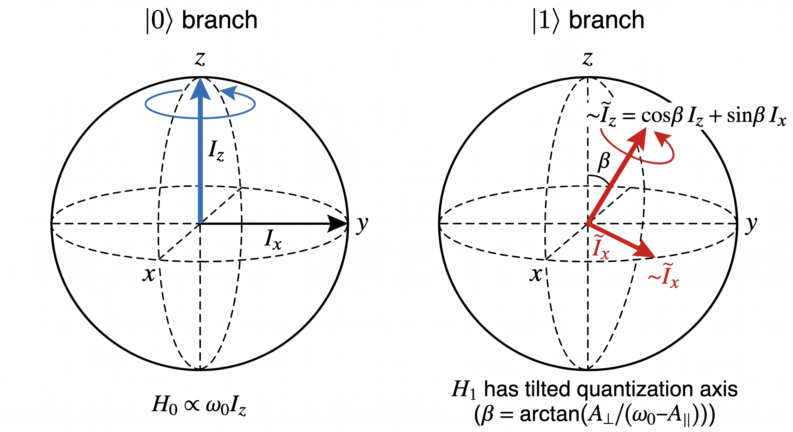

---

# DDrf Spectroscopy: Full Time Evolution

Each MW $\pi$-pulse acts as an **instantaneous frame swap** $\Lambda_{s,\bar s}(t) \equiv R_s(t) R_{\bar s}(t)^\dagger$ between the two rotating frames. The full unitary $U = \sum_s \ket{s}\bra{s}\otimes U_s$ is then a chain of $H_s'$-segments separated by frame swaps:
$$
\begin{align}
U_s = \, & R_s(4N\tau)^\dagger \cdot e^{-iH_s'\tau} \cdot \Lambda_{s,\bar s}((2N{-}1)\tau)\cdot e^{-iH_{\bar s}' 2\tau}\cdot \Lambda_{\bar s, s}((2N{-}3)\tau) \cdot e^{-iH_s'\tau} \cdots \\
& \cdots e^{-iH_s'\tau}\cdot \Lambda_{s,\bar s}(3\tau)\cdot e^{-iH_{\bar s}' 2\tau} \cdot \Lambda_{\bar s, s}(\tau)\cdot e^{-iH_s'\tau}\cdot R_s(0).
\end{align}
$$
Exact under the assumption of negligible MW pulse duration, and **much faster than direct Schrödinger integration** when $\Omega_{\text{RF}}$ is constant — each $e^{-iH_s'\tau}$ is a single matrix exponential of a time-independent Hamiltonian.

---

# DDrf Spectroscopy: Procedure & Results

Sequence: $\pi/2 \rightarrow \text{DDrf}(N,\tau) \rightarrow \pi/2_\phi$, projecting onto $\ket{+}$ ($\phi=\pi/2$).

For $N$ nuclear spins:
$$
P_x = \tfrac{1}{2} + \tfrac{1}{2^{N+1}}\,\Re\,\text{Tr}\,U_0 U_1^\dagger,
$$
$$
\text{Tr}\,U_0 U_1^\dagger = \prod_i \text{Tr}\,U_0^i {U_1^i}^\dagger.
$$
Peaks appear at $\omega_{\text{RF}} = \omega_1$.

---

# DDrf Spectroscopy: Reproduced Taminiau Results

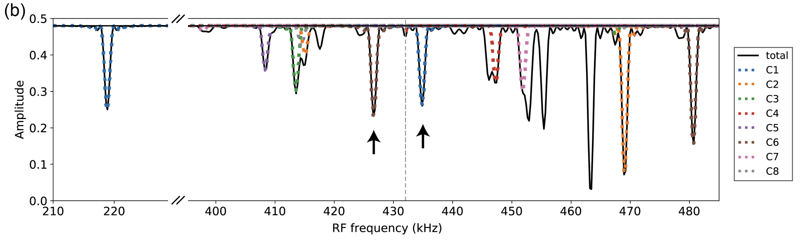
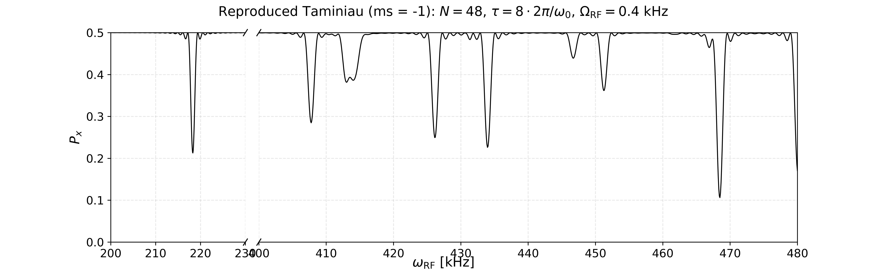

---

# DDrf: Per-Cell Decomposition

The DDrf sequence is built from identical 4-$\tau$ cells. Each cell is itself block-diagonal:
$$
V^{(k)} = \ket{0}\bra{0}\otimes V_0^{(k)} + \ket{1}\bra{1}\otimes V_1^{(k)},\qquad
U = \sum_{s\in\{0,1\}} \ket{s}\bra{s}\otimes \prod_{k=1}^{N/2} V_s^{(k)}.
$$

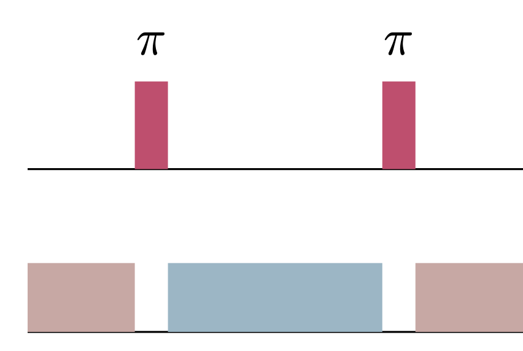

---

# DDrf: Commutation Trick

A $z$-rotation can be commuted through a transverse rotation by shifting its azimuthal angle:
$$
e^{i\alpha I_z}\,(\cos\phi\, I_x + \sin\phi\, I_y)\,e^{-i\alpha I_z} = \cos(\phi-\alpha)\, I_x + \sin(\phi-\alpha)\, I_y .
$$
Applied per cell (Taminiau limit, $\beta=0$, $\omega_{\text{RF}}=\omega_1$):
$$
V_0^{(k)} = e^{-iH_0'\tau}\,e^{-iH_1' 2\tau}\,e^{-iH_0'\tau} \;=\; e^{-i\,2\delta_0\tau\, I_z}\;e^{-i\,2\Omega\tau\,\hat{\phi}_k'\cdot\vec I}.
$$
Each cell splits cleanly into a $z$-piece + a transverse rotation. Choosing $\phi_k$ to align successive transverse axes makes the product over $k$ contracted into a single conditional rotation.

---

# Hybrid DDrf: Two Limits and Their Combination

The per-cell picture exposes two distinct mechanisms that both produce conditional rotation:

- **CPMG limit** ($\Omega_{\text{RF}}\to 0$): pure dynamical decoupling. At $\tau \simeq \frac{(2k-1)\pi}{2\omega_0 + A_\parallel}$, the change-of-frame between $R_0$ and $R_1$ alone yields a hyperfine-driven conditional rotation.
- **Taminiau limit** ($\beta\to 0$, $\omega_{\text{RF}}=\omega_1$): pure RF driving. Conditional rotation comes from $\Omega_{\text{RF}}$ alone, independent of $A_\parallel$.

**Hybrid idea.** Choose $\tau$ at the CPMG resonance and add RF driving on top. The two mechanisms add coherently:
$$
\theta_{\text{cond}} \approx \underbrace{N\,\theta_{\text{CPMG}}(\tau)}_{\text{frame-swap}} + \underbrace{N\,\Omega_{\text{RF}}\tau}_{\text{RF drive}}
$$

---

# Hybrid DDrf: Taylor Expansion in $\beta$

The hybrid regime sits between the two clean limits, but $\beta$ is small. Treat it as a perturbation around the Taminiau limit:
$$
V_s^{(k)} \;\simeq\; \left.V_s^{(k)}\right|_{\beta=0} \;+\; \beta\,\frac{\partial}{\partial\beta}\left.V_s^{(k)}\right|_{\beta=0} \;+\; \mathcal{O}(\beta^2).
$$

**Limit checks** (the reason this approach is trustworthy):
- $\beta \to 0$ — recovers the Taminiau result.
- $\Omega \to 0$ — recovers the CPMG mechanism.

**Outcome (qualitative).** The leading $\beta$-correction adds a small $k$-dependent rotation around an axis that mixes $I_z, I_x, I_y$. With an appropriate choice of $\phi_k$ and $\tau$, these corrections build up — the effective rotation angle exceeds bare $\Omega\tau$, realizing the speed-up promised on the previous slide.

(Explicit form is messy and not load-bearing for this talk.)

---

# Side-Peak Problem: Observation

In the Taminiau limit, we have $U_s = R_z(N(\omega_L-\omega_1)\tau)\cdot R_\phi(\pm N\Omega_{\text{RF}}\tau).$

**[Observation]** When $N\Omega_{\text{RF}}\tau = 2\pi$, $U_0 = U_1$ — the gate becomes **unconditional**, so a flat spectroscopy signal is expected. However, ...

---

# Side-Peak Problem: Detuned Rotating Frame

Restore finite detuning $\delta_1 = \omega_1 - \omega_{\text{RF}}$ (assume $\beta=0$ for clarity):
$$
H_1' = \delta_1 I_z + \Omega(\cos\phi I_x + \sin\phi I_y) = \Omega_{\text{eff}}\,\hat n(\phi)\cdot\vec I,
$$
$$
\Omega_{\text{eff}} = \sqrt{\Omega^2+\delta_1^2},\qquad \sin\gamma = \frac{\delta_1}{\Omega_{\text{eff}}},\qquad \hat n(\phi)=(\cos\gamma\cos\phi,\,\cos\gamma\sin\phi,\,\sin\gamma).
$$

Conjugation still works because the tilt angle $\gamma$ is invariant under $z$-rotations. Result:
$$
V_s^{\text{tot}} = e^{-iN\delta_0\tau I_z}\,e^{-i\Omega_{\text{eff}}N\tau\,\hat n_s\cdot\vec I},\qquad \hat n_{0,1} = (\pm\cos\gamma,\,0,\,\sin\gamma).
$$

---

# Side-Peak Problem: Detuned Rabi Formula vs. Numerics

$$
\boxed{\;
\frac{1}{2}\,\text{Tr}(U_0 U_1^\dagger) = 1 - \frac{2\Omega^2}{\Omega^2+\delta_1^2}\,\sin^2\!\!\left(\frac{\sqrt{\Omega^2+\delta_1^2}\,N\tau}{2}\right)\;}
$$

The detuned-Rabi formula reproduces both the envelope and the side-lobe period:

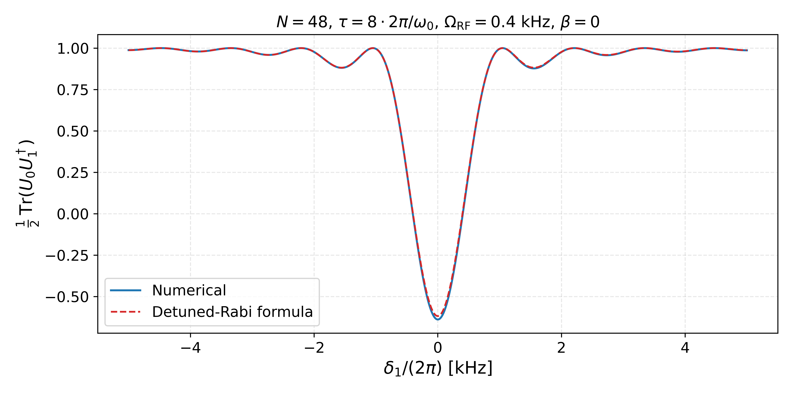

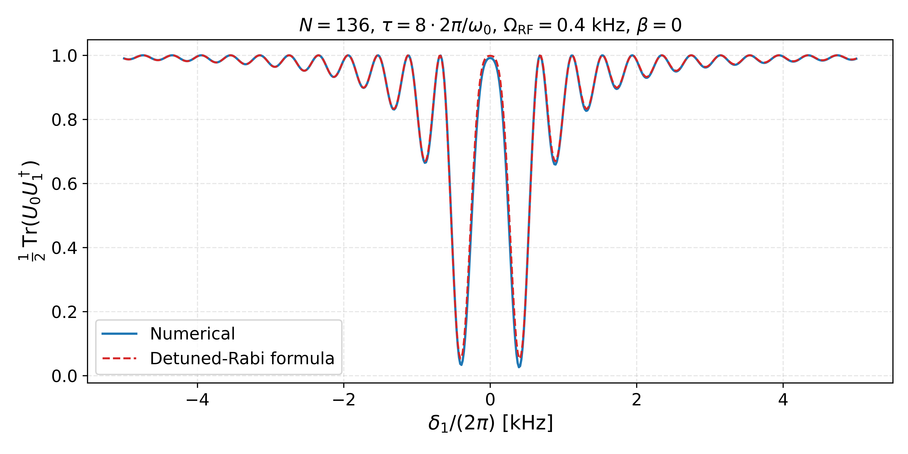

---

# Suppression: Apodized Pulse Idea

Replace constant RF amplitude with a per-cell envelope $\Omega_k = \Omega\, f(k)$, a discrete window function (Hanning, Hamming, Blackman, …):

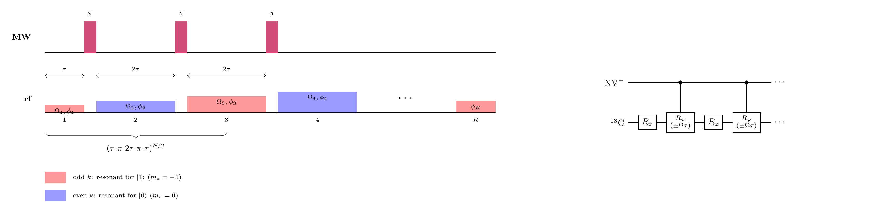

**Intuition:** the side-lobes are essentially the discrete Fourier transform of a rectangular window. Shaping the window suppresses its sidelobes, exactly the same trick used in classical signal processing.

---

# Suppression: Window Catalogue

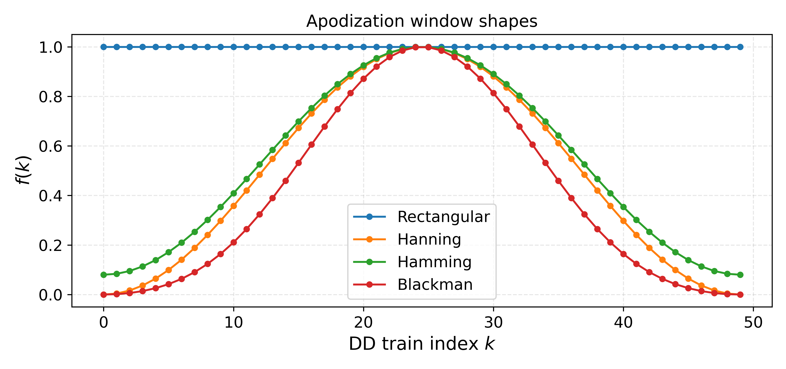

The four windows we'll compare: rectangular (the baseline that produces the side-lobes), and three classical apodization windows from signal processing.

---

# Suppression: Numerical Result

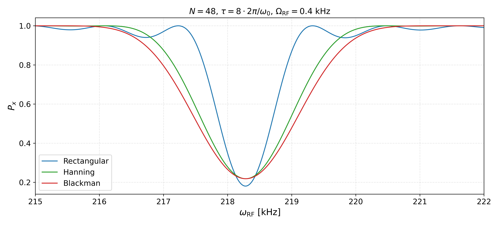

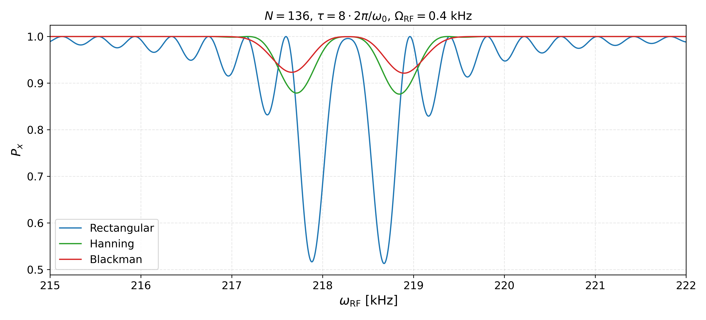

Apodized envelopes flatten the off-resonant region while preserving the on-resonant peak. The effect grows with $N$ (right): rectangular develops a clean side-lobe pair, both apodized windows stay smooth.

---

# Suppression: Window Comparison

The normalized spectral response factorizes into a window-independent `sinc` and a window-dependent kernel:
$$
\left|\frac{F(\delta_1)}{F(0)}\right|^2 = \mathrm{sinc}^2(u)\cdot |G(u)|^2,\qquad u = \frac{\delta_1}{2\Omega \bar f}.
$$

For example, while constant pulse gives :$\left|\frac{F}{F(0)}\right|^2_{\mathrm{rect}} = \mathrm{sinc}^2(u)$.

Blackman apodized pulse, $\left|\frac{F}{F(0)}\right|^2_{\mathrm{Black}} = \mathrm{sinc}^2(u)\cdot\left(\frac{50u^4 - 209u^2 + 84}{21(u^2-1)(u^2 - 4)}\right)^2$ where $u=\frac{\delta_1}{2\Omega\bar{f}}$.

---

# Suppression: Build-up mismatch

The mismatch between consecutive axes is

$$\Delta\gamma_k \equiv \gamma_{k+1} - \gamma_k \approx -\frac{\delta_1}{\Omega}\Delta f_k$$

where $\Delta f_k = f(k+1) - f(k)$. So the non-commutativity enters at order $\delta_1 \cdot \Delta f_k$, which is small when either $\delta_1$ is small or the window varies slowly.

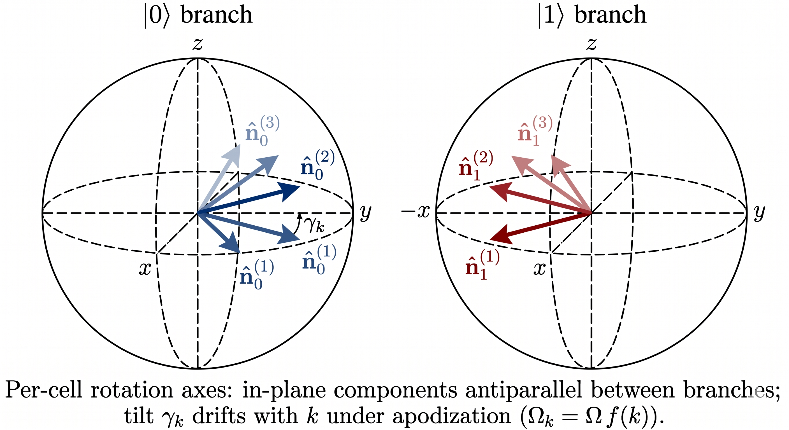

---

# Outlook: Beyond Constant $\Omega_{\text{RF}}$

The full-evolution formalism above assumes $\Omega_{\text{RF}}$ is time-independent (compatible with the RWA). With a Gaussian envelope
$$
\Omega_{\text{RF}}(t) = \Omega_0\, e^{-(t-t_k)^2/2\sigma^2},
$$
the per-segment propagator $e^{-iH_{0,1}'\tau}$ is no longer exact. Direct Schrödinger integration takes tens of minutes per frequency point.

**Approach:** Magnus expansion, valid when $\Omega_{\text{RF}}$ varies slowly relative to $\omega_{\text{RF}}$.

---

# Outlook: Magnus Expansion

For $\partial_t U = -iH(t)U$, write $U = e^{\Omega(t)}$ with $\Omega(t) = \sum_n \Omega_n(t)$ where
$$
\Omega_1 = \int_0^t A_1\, dt_1,\qquad \Omega_2 = \tfrac{1}{2}\!\int\!\!\int [A_1, A_2]\, dt_1 dt_2,\ldots
$$
Computed terms (with $f(t)$ the Gaussian envelope):
$$
\begin{align}
\Omega_1(T) &= -i\Big(\delta_{(0,1)} T\,I_z + c_1(\cos\phi\, I_x + \sin\phi\, I_y)\Big) \\
\Omega_3(T) &= \tfrac{\delta_{(0,1)}^2}{24}\,K_1\,(\cos\phi I_x + \sin\phi I_y) + \tfrac{\delta_{(0,1)}}{24}\,K_2\,I_z \\
\Omega_2 &= \Omega_4 = 0
\end{align}
$$
with $c_1 = \int_0^T f$ and $K_{1,2}$ triple integrals of $f$. Convergence is guaranteed when $\int_0^T \|A(s)\|_2\, ds < \pi$ — likely satisfied here; **simulation pending**.

---

# Outlook: Gaussian Pulse Shaping — Spectroscopy

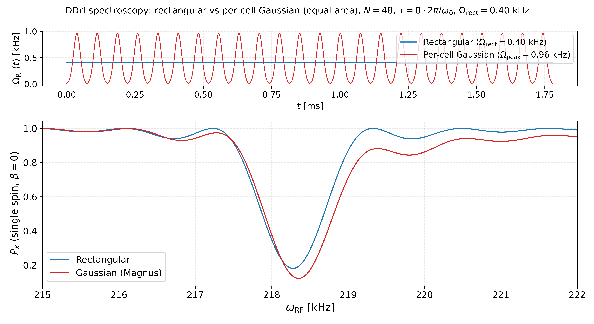

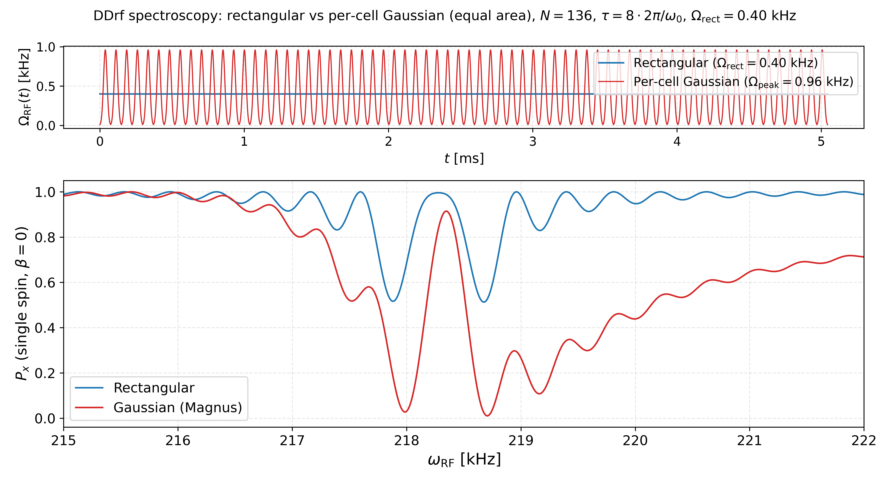

---

# Mattermost-Outline Update

Special Thanks to WD Lee. 

<!-- TODO: Add Screen shot -->

---

# Required Feature

- [x] Mattermost: Private Channel
- [?] Send alert from Outline changes to Mattermost
- [ ] Code/PPT update
- [ ] Cool paper channel update to Outline update
- [?] 장비 directory/Diamond sample
- [x] 비상연락망

---

# Outline - Mattermost Channel: Cool paper update

<!-- TODO: Add Screenshot -->

---

# Outline - Mattermost Channel: Alert when Outline has update

<!-- TODO: Add Screenshot -->

- New document has been added. 
- Comment has been added. 
- Document has been modified. 
- Alert is sent if and only if *collection* has the corresponding Mattermost Channel. 

---

# Dataview Feature on Outline

<!-- TODO: Add Screenshot -->

- Notion-like dataview (but require SQL-like imbedding)
- Table, Kanban, Calendar, timeline view are supported. 

---

<!-- _class: titlepage -->

Thank You!

Questions & Discussion

