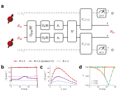

# Results The figure for the paper

<figure class="figure">

*The two-sensor composite: **(a)** the scheme, **(b)** conditional QFI versus $\theta$, **(c)** conditional QFI versus sensing time, **(d)** the filter's accepted-axis entanglement. Panel walk-through on the next four slides.*

</figure>
