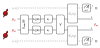

# Scheme Panel (a): the two-sensor post-selection circuit

<figure class="figure">

</figure>

- $U_{\mathrm{prep}}(\theta)$ prepares the two-sensor probe; $U_s(B)$ writes the field phase $\phi = \gamma_e B\, t_s$ into each sensor while the dephasing channel $\varepsilon_\tau$ shrinks the coherence to $\eta = e^{-t_s/T_2}$.
- $V$ is the trainable **conjugator**, the only place the two sensors meet; $\mathcal{C}_\phi(\gamma_i)$ couples sensor $i$ to its $\ket{+1}$ level with post-selection strength $\gamma_i$ (weak up to projective). In the numerics each qutrit is a sensing qubit plus one meter qubit.
- Reading out $s/{+}1$ heralds the run: $f$ outcomes are discarded, and the doubly successful branch is the effective Kraus operator $K = D_{\gamma_1\gamma_2} V$; we maximize the conditional QFI of $\rho_{\mathrm{ps}}$ per accepted event over $\{V, \gamma_1, \gamma_2, t_s\}$.
