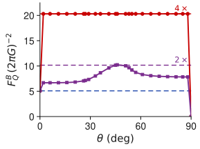

# Results Panel (b): collective $4\times$, product additive

- The **collective filter** (red) reaches a flat plateau $F_Q^B = 20.31$ in the figure's units at every interior $\theta$: exactly $4\times$ the single-sensor optimum $5.08$ (blue), which is the $N^2$ value at $N=2$.
- The best **product filter** (violet) is *additive*: its conditional QFI is the sum of the two single-sensor contributions. It touches its $2\times$ ceiling only at the symmetric point $\theta = 45°$ and stays below elsewhere.
- The plateau is $\theta$-independent, and in further numerics an optimized collective filter reaches the same $4\times$ from **separable** initial states: the filter itself supplies the entanglement. So initial-state entanglement is **not a prerequisite** for the maximal enhancement.

<figure class="figure">

*Conditional QFI versus the initial-state angle $\theta$ at the optimal sensing time. Dashed lines mark $1\times$, $2\times$, $4\times$ the single-sensor optimum; at the edges $\theta = 0, 90°$ the probe family degenerates and the QFI collapses.*

</figure>

