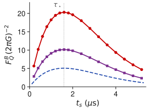

# Results Panel (c): the optimal post-selection time

- Sweeping the sensing time gives an **interior optimum** $t_s = \tau_\star \approx 0.797\, T_2 \approx 1.59\ \mu\mathrm{s}$ (here $T_2 = 2\ \mu\mathrm{s}$): waiting longer accumulates more phase, $\phi = \gamma_e B\, t_s$, but costs coherence, $\eta = e^{-t_s/T_2}$, and $\tau_\star$ balances the two.
- The signal-domain QFI behaves as $F_Q^B \propto (\gamma_e t_s)^2\, \eta^2/(1-\eta^2)$ at the matched filter, which peaks where $1-\eta^2 = t_s/T_2$; this is why the phase-QFI versus signal-QFI distinction matters in the paper.
- All three curves peak at the **same** $\tau_\star$, and the product-filter curve is exactly half the collective one at every $t_s$: the $4\times$ separation is **pointwise in time**, not a fine-tuned coincidence of the operating point.

<figure class="figure">

*Conditional QFI versus sensing time $t_s$, filter re-optimized at each point; the dotted line marks $\tau_\star$.*

</figure>

