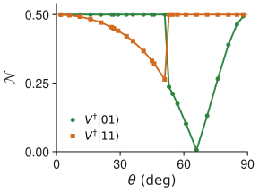

# Results Panel (d): the optimal filter is intrinsically two-qubit

- At each $\theta$ the conjugator $V$ is taken **from the structure-free optimizer itself** (no ansatz), and we compute the entanglement of the two accepted filter axes $V^\dagger\ket{01}$ and $V^\dagger\ket{11}$.
- **At least one accepted axis is a Bell state** ($\mathcal{N} = 1/2$) at every interior $\theta$. The two ports swap roles at $\theta \approx 52.4°$, and the other axis becomes a product state exactly once, at $\cot\theta = \eta$ ($\theta \approx 65.7°$), while the plateau holds.
- So the success effect $E_s = K_{\mathrm{coll}}^\dagger K_{\mathrm{coll}}$ never factorizes: the optimal filter asks a genuinely **joint question**, and implementing it requires a two-qubit entangling operation; two CNOTs suffice (the $1 \to 2$ isometry form of $V$, 11 parameters).
- The product class of panel (b) is exactly this plot's $\mathcal{N} = 0$ class, and it is the additive one.

<figure class="figure">

*Negativity $\mathcal{N}$ of the optimized filter's accepted axes versus $\theta$; the horizontal line is the Bell value $1/2$.*

</figure>

