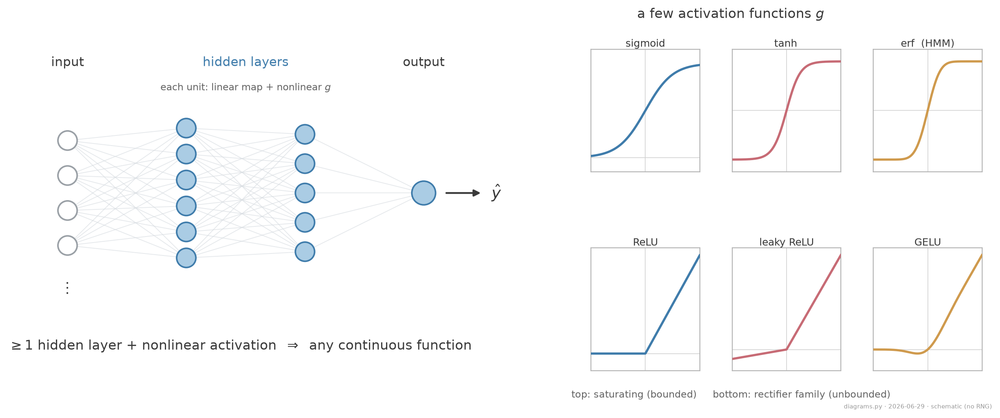
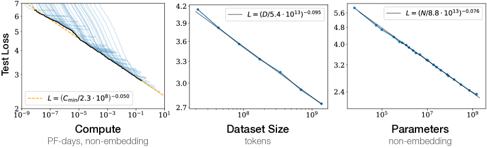
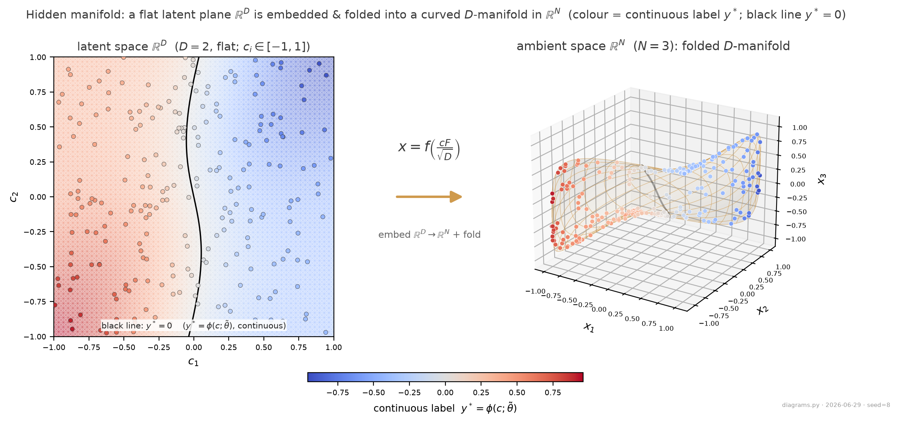

# Intro Neural networks won data science

- **Malleable and scalable.** Stacking and widening layers lets the *same* architecture fit vision, language, and control.
- **One universal building block.** A layer is $x \mapsto g(Wx)$: a linear map followed by a pointwise nonlinearity.
- **Mature tooling.** Autodiff frameworks (**PyTorch**, **TensorFlow**) made training networks the default in data science and modern AI.

<figure class="figure">

<figcaption>Schematic feed-forward net (layers 4-6-5-1, illustrative): each layer is a linear map followed by a pointwise activation.</figcaption>
</figure>

---

# Intro Why they work, in principle

**Universal Approximation Theorem.** A feed-forward network with

- at least one hidden layer,
- enough hidden units, and
- a nonlinear activation $g$ (sigmoid, $\tanh$, ReLU),

can approximate any continuous function on a compact subset of $\mathbb{R}^n$ to arbitrary accuracy.

Training also works in practice: given a well-posed dataset and a convex surrogate loss (squared error or cross-entropy), SGD reliably finds a good fit.

**The open question.** Existence and trainability tell us *that* a network can fit, not *how* it learns or *why* it generalizes.

---

# Intro We do not understand the behavior

- For small models, trial-and-error was enough: tune width and hyperparameters by hand.
- As models became large and expensive, that approach stopped scaling, which motivated a "physics for AI": treat the network as a many-body system and look for laws.
- A leading example is **LLM scaling laws**: the test loss falls as a power law in compute, dataset size, and model size, a regularity we can measure but not yet derive. (Kaplan et al. 2020)

<figure class="figure">

<figcaption>Kaplan et al. 2020, Fig. 1: test loss falls as a power law in compute, dataset size, and parameter count (WebText2 language models; their published figure).</figcaption>
</figure>

---

# Intro This paper: statistical physics of the dynamics

- Statistical physics usually describes stationary states through a few **order parameters**, macroscopic summaries of a many-body system.
- This paper instead tracks order parameters **and their time evolution**: equations of motion for learning.
- Here "time" is training progress (the number of samples seen). The claim is that a few macroscopic overlaps evolve by **closed ODEs** that can be written down and integrated.

---

# Intro Why this is possible: solvable data

- Real data such as images is natural and, in ML benchmarks, deliberately decorrelated, which makes the learning dynamics analytically opaque.
- The hidden manifold model replaces this with data that has a controlled statistical structure (the **Gaussian Equivalence Property**, GEP), which makes the dynamics solvable.
- The data is synthetic, but it lets us follow exactly what happens during training, and in principle in more complex models.

<figure class="figure">

<figcaption>A flat latent plane folded into a curved manifold; colour = continuous label y*. Illustration: latent D=2 to ambient N=3, teacher M=3, inputs bounded to [-1,1], seed 8.</figcaption>
</figure>

---

# Intro Why I care: quantum machine learning

- Our **DQML** project has no native dataset and no large quantum hardware, so we emulate small circuits on classical GPUs.
- A frequent claim for QML is that it needs far fewer parameters than classical models.
- The benchmark study **"Better than classical?"** (Bowles, Ahmed & Schuld 2024) questions this claim:

**Findings.** Out-of-the-box **classical models outperform all 12 quantum models** across 160 benchmark datasets, and **removing entanglement rarely changes the result**, so "quantumness" may not be the deciding factor. The tasks are easy binary classification, and the quantum models often reproduce classical ones.

- We need data and analyses that identify where quantum methods actually help. An analytic handle of the HMM type is one such tool.
