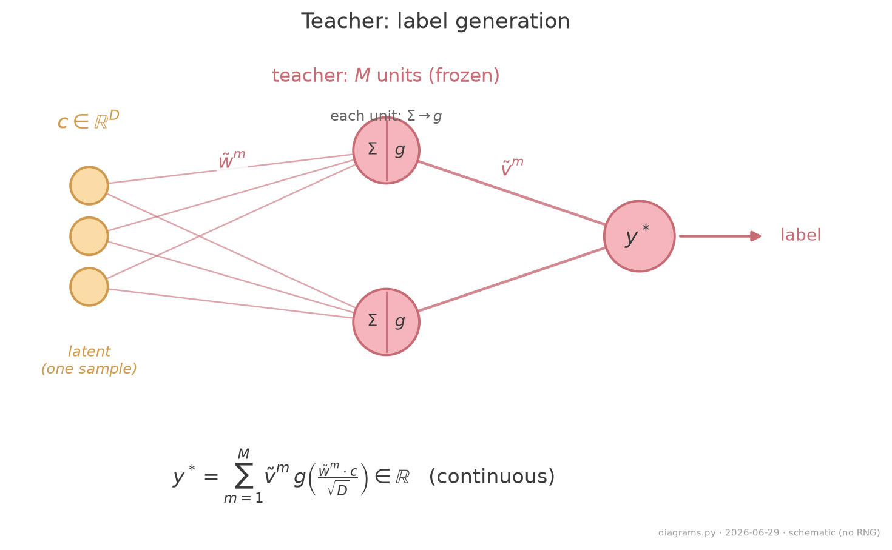
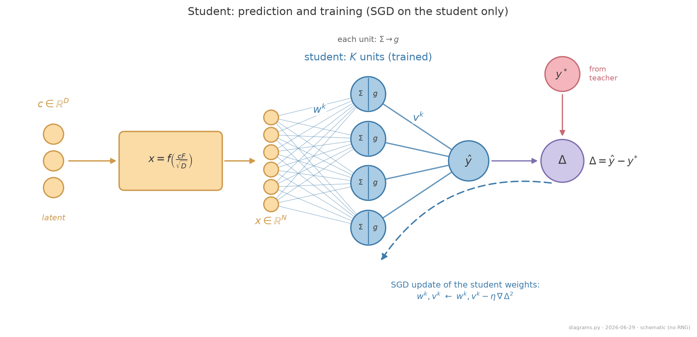
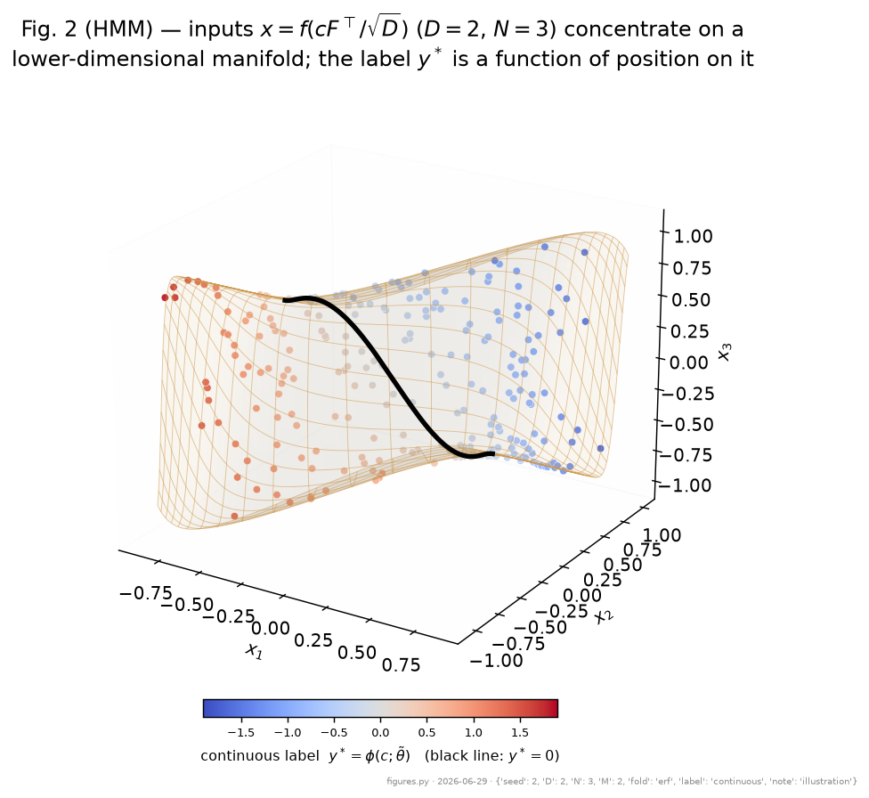
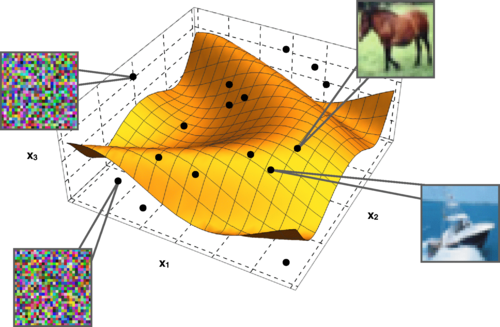

# Model Structured data from a generator

- A generative model maps low-dimensional latent noise to high-dimensional, realistic-looking data, as a GAN generator does. The HMM uses the simplest such map, a single nonlinear transformation, with a **teacher** that assigns the labels.
- This is a **teacher-student** setup: the teacher fixes the ground-truth labels, and the student is trained to match them. The two need not be the same size.

<figure class="figure">

<figcaption>Teacher (frozen): maps the latent c to the continuous label y*. Schematic; M=2 units drawn.</figcaption>
</figure>

<figure class="figure">

<figcaption>Student (trained): maps the folded input x to a prediction; the prediction error (prediction minus target) drives SGD on the student only. Schematic; K=4 units drawn.</figcaption>
</figure>

---

# Model The hidden manifold

- Latent coordinates $c$ of dimension $D$, drawn i.i.d. Gaussian.
- These are folded into a high-dimensional ambient space ($N \gg D$) through a fixed feature matrix $F$ and a pointwise nonlinearity $f$:

$$ x = f\!\left(\frac{cF}{\sqrt D}\right) \in \mathbb{R}^{N}. $$

- The labels depend only on $c$ through the teacher. The student sees only $x$, so it must recover the manifold structure. In this sense the manifold is hidden.

<figure class="figure">

<figcaption>Folded inputs concentrate on a 2D sheet in 3D space; colour = teacher label. Illustration: latent D=2, ambient N=3, teacher M=2, seed 2 (the real target is continuous).</figcaption>
</figure>

---

# Model Why this is close to real data

- **Manifold hypothesis.** Realistic data (CIFAR-10, MNIST) does not fill its pixel space; it concentrates on a low-dimensional manifold.
- A few features, for example **PCA** components, already separate the classes.
- The HMM is a minimal instance of this picture: recognizable images lie on the surface, and off-manifold points are noise.

<figure class="figure">

<figcaption>Goldt et al. Fig. 1 (conceptual illustration): recognizable CIFAR images lie on the manifold; off-surface points are random noise.</figcaption>
</figure>

