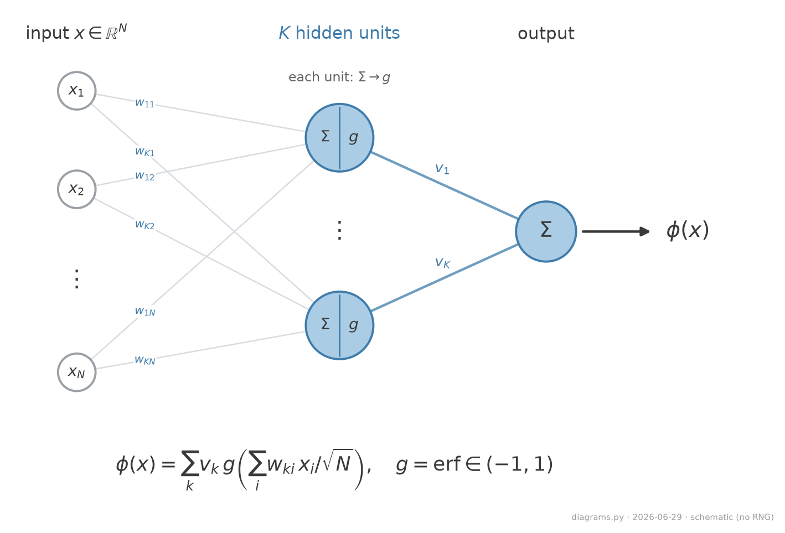

# Setup Two-layer student, online SGD

**Student** ($K$ hidden units):

$$ \phi(x) = \sum_{k=1}^{K} v_k\, g\!\left(\frac{w_k\cdot x}{\sqrt N}\right). $$

- A **teacher** ($M$ units) on the latent $c$ sets the target $y^{*}$; the student is trained by one-pass **online SGD** (rate $\eta$), with $\alpha=P/N$ and $\delta=D/N$ held fixed.
- Bounded hidden units ($g=\mathrm{erf}\in(-1,1)$), but a **linear readout**, so the output is an *unbounded continuous real number*: the task is **regression** (MSE), not classification.

<figure class="figure">

<figcaption>The two-layer (soft-committee) student: each unit applies the activation to a weighted sum, and a linear readout combines them. Schematic; K=2 units, N=3 inputs drawn.</figcaption>
</figure>

---

# Setup The learning step (online SGD)

The student learns **one sample at a time**. At step $\mu$:

1. Draw a **fresh** pair $(x_\mu, y^{*}_\mu)$, with the label $y^{*}_\mu=\phi(c_\mu;\tilde\theta)$ set by the teacher.
2. Predict $\hat y=\phi(x_\mu;\theta)$ and measure the error $\Delta_\mu=\hat y-y^{*}_\mu$.
3. Take one gradient step on the squared error $\tfrac12\Delta_\mu^2$ (learning rate $\eta$):

$$ \theta_{\mu+1}=\theta_\mu-\eta\,\nabla_\theta\,\tfrac12\Delta_\mu^2, \qquad \theta=(W,v). $$

- **One pass:** each sample is used once, then discarded, so the weights stay independent of the next sample. (We write this step out weight-by-weight later, to turn it into the equations of motion.)
- We grade the student by the **test (generalization) error** on unseen data, $\epsilon_g=\tfrac12\,\mathbb{E}[(\hat y-y^{*})^2]$, not the training loss.
- This generalizes the classic **teacher-student** setup (i.i.d. Gaussian inputs); the HMM keeps that solvability but adds the manifold structure real data has.
