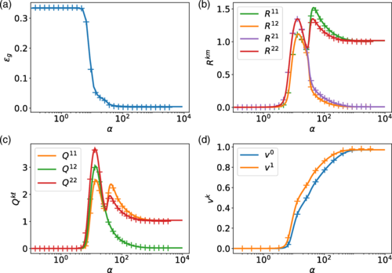
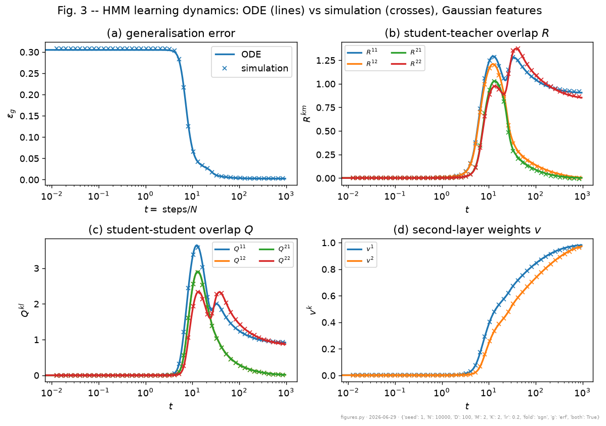

# Theory From weight updates to equations of motion

Every equation of motion descends from the **SGD updates** of the weights (one fresh sample per step):

$$ (w^k_i)_{\mu+1}-(w^k_i)_\mu=-\frac{\eta}{\sqrt N}\,v^k\,\Delta\,g'(\lambda^k)\,f(u_i), \qquad v^k_{\mu+1}-v^k_\mu=-\frac{\eta}{N}\,\Delta\,g(\lambda^k), $$

with the prediction error $\Delta=\sum_j v^j g(\lambda^j)-\sum_m\tilde v^m\tilde g(\nu^m)$.

The test error sees the data **only through the local fields**, so by the GEP it collapses to a function of the order parameters alone:

$$ \epsilon_g=\tfrac12\,\mathbb{E}\big[(\phi(x;\theta)-y^{*})^2\big] =\tfrac12\,\mathbb{E}\Big[\big(\textstyle\sum_k v^k g(\lambda^k)-\sum_m\tilde v^m\tilde g(\nu^m)\big)^2\Big] \;\xrightarrow{\,N,D\to\infty\,}\;\epsilon_g\big(Q,R,T,v,\tilde v\big). $$

So we recast each weight update as the induced change in $Q,R,T$. Because a fresh sample is independent of the current weights, the per-step change **self-averages**; in the limit it becomes a deterministic ODE in the time $t=\mu/N$. (We set $a=\langle f\rangle=0$, so $Q=(c-b^2)W+b^2\Sigma$.)

---

# Theory Equations of motion (1): direct overlaps

The dynamics are driven by Gaussian averages over the jointly-Gaussian fields (indices $j,k,\ell$ run over student units, $m,n$ over teacher units; $g_a$ is the activation of the third unit):

$$ I_2(k,j)=\mathbb{E}[g(\lambda^k)g(\lambda^j)], \quad I_3(k,j,a)=\mathbb{E}[g'(\lambda^k)\,\lambda^j\, g_a], \quad I_4(k,\ell,j,\iota)=\mathbb{E}[g'(\lambda^k)g'(\lambda^\ell)g(\lambda^j)g(\lambda^\iota)]. $$

**Second-layer weights** $v^k$:
$$ \frac{dv^k}{dt} = \eta\Big[\sum_n \tilde v_n\, I_2(k,n) - \sum_j v^j\, I_2(k,j)\Big]. $$

**Ambient student-student overlap** $W^{k\ell}=\tfrac1N\sum_i w^k_i w^\ell_i$:
$$ \frac{dW^{k\ell}}{dt} = -\eta v^k\!\Big(\sum_j v^j I_3(k,\ell,j) - \sum_n \tilde v^n I_3(k,\ell,n)\Big) - \eta v^\ell\!\Big(\sum_j v^j I_3(\ell,k,j) - \sum_n \tilde v^n I_3(\ell,k,n)\Big) $$
$$ +\, c\,\eta^2 v^k v^\ell\Big(\sum_{j,\iota} v^j v^\iota I_4(k,\ell,j,\iota) - 2\sum_{j,m} v^j \tilde v^m I_4(k,\ell,j,m) + \sum_{n,m} \tilde v^n \tilde v^m I_4(k,\ell,n,m)\Big). $$

---

# Theory Equations of motion (2): spectral densities

The remaining overlaps become densities over the spectrum of $\Omega=\tfrac1N FF^\top$ (eigenvalues $\rho$), with $d(\rho)=(c-b^2)\delta+b^2\rho$ and $R^{km}=b\!\int\! d\rho\,p_\Omega(\rho)\,r^{km}(\rho,t)$:

$$ \frac{\partial r^{km}}{\partial t} = -\frac{\eta}{\delta}\,v^k\Bigg[\, d(\rho)\,r^{km}\!\sum_{j\neq k} v^j\frac{Q^{jj}I_3(k,k,j)-Q^{kj}I_3(k,j,j)}{Q^{jj}Q^{kk}-(Q^{kj})^2} \;+\; d(\rho)\!\sum_{j\neq k} v^j r^{jm}\frac{Q^{kk}I_3(k,j,j)-Q^{kj}I_3(k,k,j)}{Q^{jj}Q^{kk}-(Q^{kj})^2} $$

$$ +\;\frac{v^k\,d(\rho)\,r^{km}}{Q^{kk}}\,I_3(k,k,k) \;-\; d(\rho)\,r^{km}\!\sum_n \tilde v^n\frac{T^{nn}I_3(k,k,n)-R^{kn}I_3(k,n,n)}{Q^{kk}T^{nn}-(R^{kn})^2} \;-\; b\rho\!\sum_n \tilde v^n \tilde T^{nm}\frac{Q^{kk}I_3(k,n,n)-R^{kn}I_3(k,k,n)}{Q^{kk}T^{nn}-(R^{kn})^2}\,\Bigg]. $$

The latent overlap $\Sigma^{k\ell}=\!\int\! d\rho\,p_\Omega(\rho)\,\sigma^{k\ell}(\rho,t)$ obeys a structurally identical equation. Together with $Q^{k\ell}=(c-b^2)W^{k\ell}+b^2\Sigma^{k\ell}$ and the $v^k$, $W^{k\ell}$ equations above, the system is closed (no free parameters beyond $a,b,c,\eta,\delta$).

---

# Theory Closing the equations, and the test error

Three steps make the system finite and explicit:

1. **Eigenbasis.** Projecting onto the eigenvectors of $\Omega=\tfrac1N FF^\top$ replaces an infinite hierarchy of order parameters with densities over the eigenvalues $\rho$ (Marchenko-Pastur for Gaussian $F$).
2. **Densities.** The overlaps become $r^{km}(\rho,t)$ and $\sigma^{k\ell}(\rho,t)$, integrated against the spectrum.
3. **Gaussian integrals.** $I_2, I_3, I_4$ have closed forms (arcsin, arctan) for erf activations.

Integrating the system and substituting back gives the closed-form generalization error:

$$ \epsilon_g = \frac1\pi\sum_{k,\ell} v^k v^\ell \arcsin\frac{Q^{k\ell}}{\sqrt{1+Q^{kk}}\sqrt{1+Q^{\ell\ell}}} \;-\; \sum_{k,n} v^k\tilde v^n \frac{R^{kn}}{\sqrt{2\pi}\sqrt{1+Q^{kk}}} \;+\; (\text{teacher term}). $$

---

# Result The learning curve

- Online dynamics versus $\alpha = P/N$ (which plays the role of training time): the order parameters and $\epsilon_g$ trace three phases.
- A plateau, then **specialization** (each student unit locks onto a teacher unit), then an asymptote.
- The **ODE prediction** (lines) sits on top of the finite-size **simulation** (crosses), with no fitting.

<figure class="figure">

<figcaption>Goldt et al. Fig. 3: test error and order parameters vs. time t=steps/N; theory (lines) vs. simulation (crosses). N=10,000, D=100, K=M=2, rate 0.2, sign folding / erf activation.</figcaption>
</figure>

---

# Result Reproduction, from scratch

- A from-scratch **PyTorch** port of both the simulator and the ODE integrator.
- It tracks a single simulation to $\max|\Delta\epsilon_g| \approx 9\times10^{-4}$ across the whole trajectory, reproducing the paper's central claim.
- The small residual is only the difference between Python and C++ random number generation, not a modeling gap; it is cross-checked against the authors' C++.

<figure class="figure">

<figcaption>Our PyTorch reproduction at the same settings: ODE (lines) vs. one simulation (crosses), agreeing to about 1e-3. N=10,000, D=100, K=M=2, rate 0.2, sign/erf, seed 1.</figcaption>
</figure>

