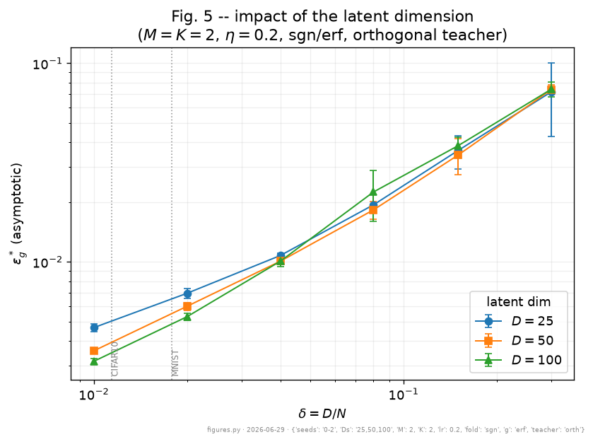
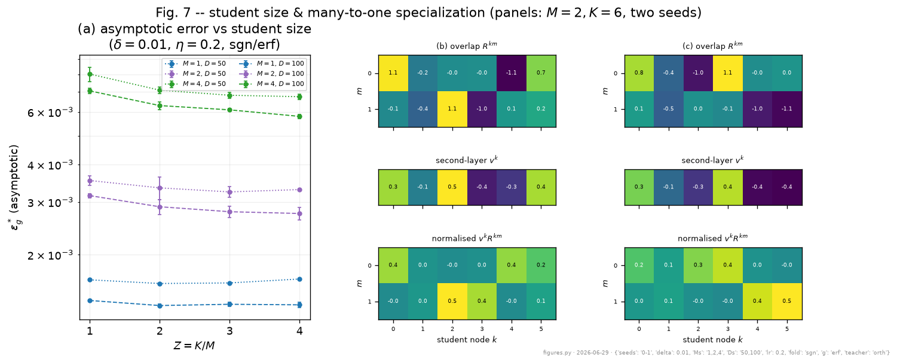
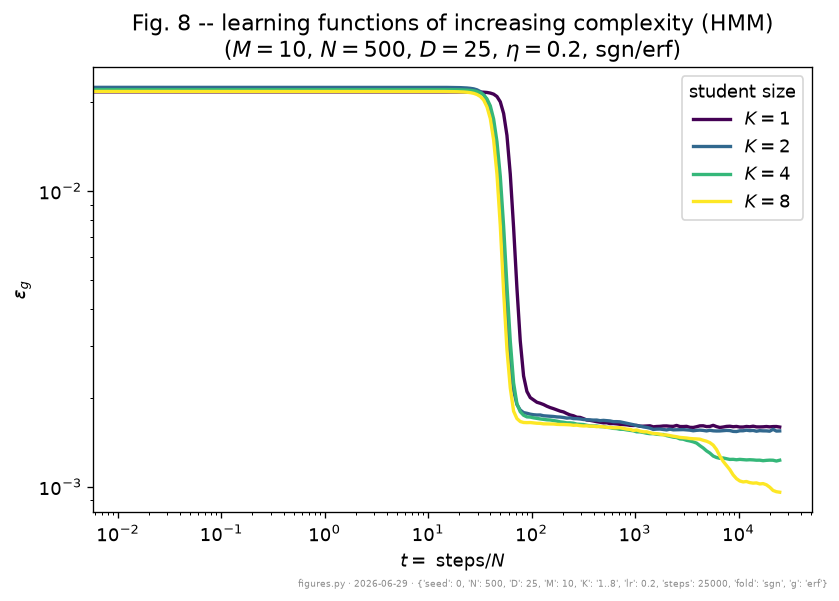

# Result Structure helps generalization

- Asymptotic error $\epsilon_g^{*}$ versus $\delta = D/N$, the intrinsic-dimension ratio (log-log axes).
- A lower intrinsic dimension gives better generalization: a more sharply folded, lower-dimensional manifold is easier to learn.
- Real datasets sit at small $\delta$; the markers indicate MNIST and CIFAR for context.

<figure class="figure">

<figcaption>Asymptotic test error vs. the dimension ratio D/N: a smaller latent dimension generalizes better. K=M=2, rate 0.2, sign/erf, orthogonalized teacher; D=25/50/100, mean over 3 seeds.</figcaption>
</figure>

---

# Result Specialization and model size

Larger students specialize many-to-one, and as complexity grows they separate to lower error.

<figure class="figure">

<figcaption>Asymptotic error vs. student size K/M (teachers M=1,2,4; D=50,100; D/N=0.01, rate 0.2, sign/erf): student units specialize many-to-one, and gains saturate.</figcaption>
</figure>

<figure class="figure">

<figcaption>Learning curves for growing student size K=1..8 (teacher M=10, N=500, D=25, rate 0.2, sign/erf): wider students break away later, fitting functions of increasing complexity.</figcaption>
</figure>

