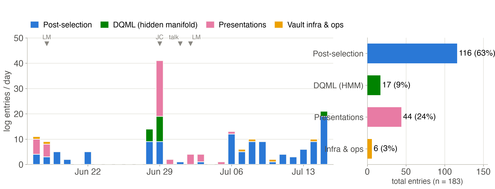

# Review Where the time went

<figure class="figure">

*Research-log entries per day, June 17 to July 15 (183 entries on 22 active days), classified by project. Markers: LM = lab meeting, JC = journal club, talk = the July 1 self-introduction. Entry counts are a proxy for time, not hours.*

</figure>

- **Post-selection took 63 %** and ran almost every active day; **presentations (24 %)** cluster right before each talk date.
- **DQML (9 %)** came in two bursts, late June and July 15; **DDrf never appears** (advisory work leaves no vault trace).
