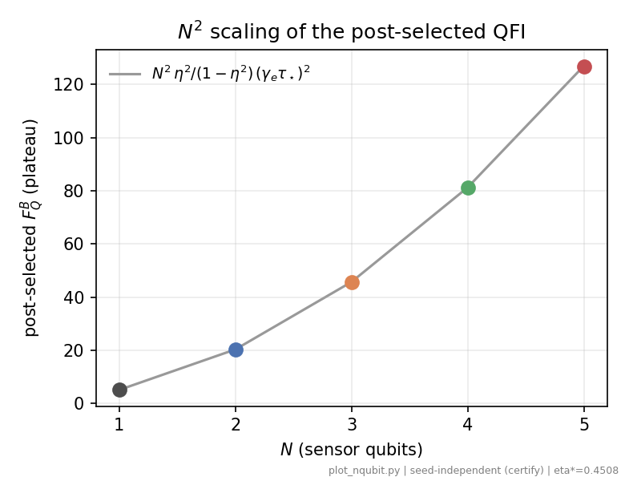
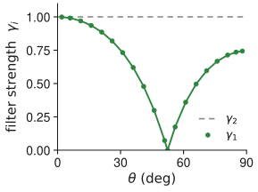
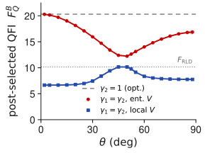
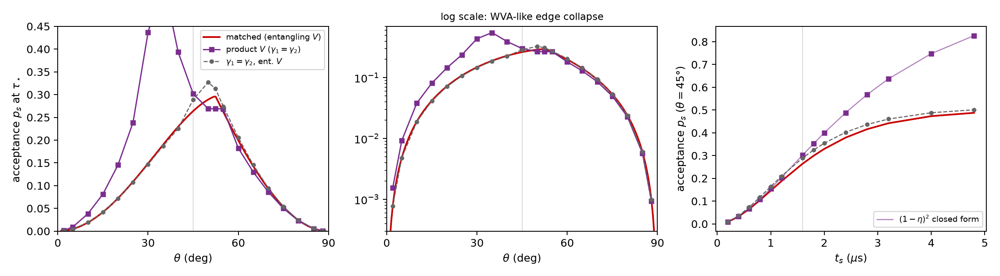

<!-- _class: section -->
<!-- _paginate: false -->

A

# Backup

Extra material for questions

---

# Backup Beyond two sensors: the $N^2$ scaling

- The collective construction generalizes: at $N = 3, 4, 5$ sensors a continuation search certifies the plateau $F_Q^B = 45.70,\ 81.24,\ 126.90$, that is $9\times,\ 16\times,\ 25\times$ the single-sensor optimum.
- This matches the bound $F_Q^B = N^2 \eta^2/(1-\eta^2)\,(\gamma_e \tau_\star)^2$: Heisenberg scaling in the sensor number, per accepted event, surviving dephasing.
- A free global search fails into a wrong basin from $N = 3$ on, which is why the certification needs warm starts; this scaling result is the core of the planned follow-up letter.

<figure class="figure">

*Certified plateau versus sensor number $N$; the line is $N^2\eta^2/(1-\eta^2)\,(\gamma_e\tau_\star)^2$.*

</figure>

---

# Backup The optimal strengths, and what constraints cost

*Matched filter: $\gamma_2 = 1$ always (one projective meter), while $\gamma_1 = 2\chi/(1+\chi)$ tracks the probe and touches $0$ at $\theta \approx 52.4°$.*

*Forcing equal strengths $\gamma_1 = \gamma_2$: with an entangling $V$ (red) the QFI dips to about $60\,\%$ of the plateau near $\theta = 50°$; with a local $V$ (blue) it caps at the additive rung $F_{\mathrm{RLD}} = 10.15$.*

The asymmetry $\gamma_2 = 1 \neq \gamma_1$ is not cosmetic: one meter interrogates sharply while the other is tuned to the probe, and constraining them equal costs real QFI.

---

# Backup The price: acceptance probability

<figure class="figure">

*Acceptance probability $p_s$ for the three filter classes: versus $\theta$ at $\tau_\star$ (left, and log scale, middle) and versus $t_s$ at $\theta = 45°$ (right).*

</figure>

- The matched (collective) filter accepts at most about $0.30$ of runs, near $\theta \approx 52°$, and its acceptance collapses toward the edges; the ceiling is $p_s \le (1-\eta^2)/N$ when the QFI plateau is attained.
- The product filter buys its smaller QFI with much higher acceptance at small $\theta$ (a weak-value-amplification-like trade, log panel); the paper states the per-accepted-event result and prices the yield separately.
