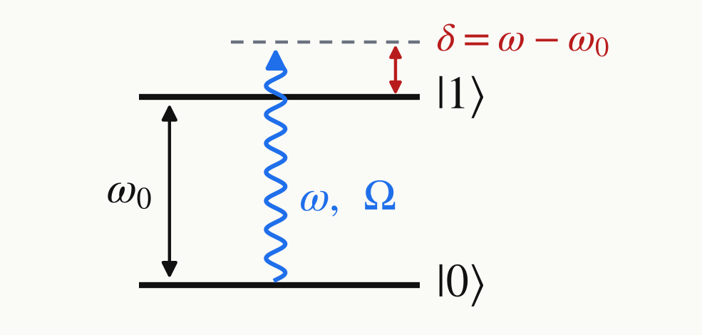

<!-- _class: tight -->

# Intro Examples

So, prepare $\ket{0}$, apply a pulse $U$, and read $P(0)$.

Take one spin-1 transition as the qubit. In the rotating frame, after the rotating-wave approximation and with the drive phase along $y$, the Hamiltonian is constant:

$$
H=\frac{\delta}{2}\,Z+\frac{\Omega}{2}\,Y .
$$

The detuning $\delta$ is where the field enters and $\Omega=\gamma B_1$ is the drive strength.

<figure class="figure">

</figure>

The exponent is written in the Pauli basis, so the time evolution is a rotation and both of its parts are read off the coefficients:

$$
U=e^{-iHt}=\exp\!\Big(\!-\tfrac{i}{2}\Omega_R t\;\hat n\cdot\vec\sigma\Big),\quad
\hat n=\frac{(0,\Omega,\delta)}{\Omega_R}.
$$

The **axis** is the coefficient vector, the **angle** is its length
$\Omega_R=\sqrt{\Omega^2+\delta^2}$ times the time. Drive off means precession about $z$.

