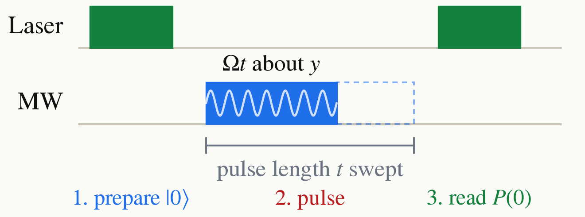

<!-- _class: tight -->

<!-- TODO (speaker to confirm): confirm the read-out convention. These slides plot $P(0)$, the population of $\ket{0}$, which rises with fluorescence; the thesis plots normalised fluorescence contrast, so its minima are the $\pi$ pulses just as they are here. -->

# Intro Rabi: calibrating the rotation angle

Set the pulse on resonance, $\delta=0$, so $H=\frac{\Omega}{2}Y$ and the pulse is a rotation about $y$ by the angle $\Omega t$:

$$
\begin{aligned}
P(0)&=\big|\bra{0}e^{-i\Omega Y t/2}\ket{0}\big|^{2}\\
&=\cos^{2}\!\Big(\frac{\Omega t}{2}\Big).
\end{aligned}
$$

Sweep the pulse length and the fluorescence oscillates at $\Omega$.

<figure class="figure">

</figure>

<figure class="figure">

<video src="media/seq-rabi.mp4" poster="media/seq-rabi.png" width="700" controls autoplay loop muted playsinline preload="none"></video>

</figure>

