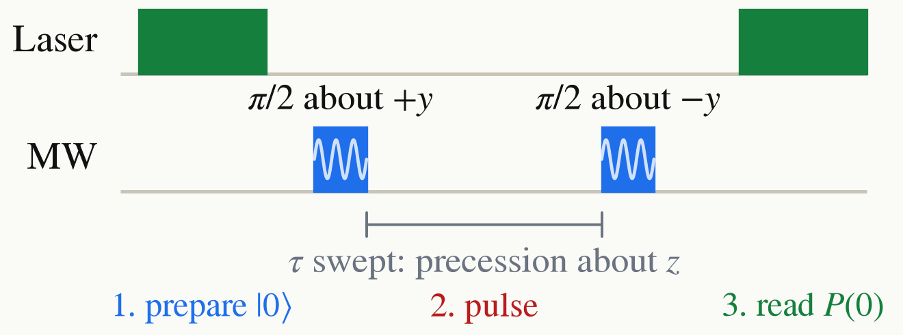

<!-- _class: tight -->

<!-- TODO (speaker to confirm): confirm the phase convention of the second pulse. Written here with the first $\pi/2$ about $+y$ and the second about $-y$, which gives $P(0)=\tfrac12(1+\cos\delta\tau)$; with both pulses about $+y$ the fringe is inverted, $P(0)=\tfrac12(1-\cos\delta\tau)$. The thesis runs both and subtracts them to reject common-mode noise. -->

# Intro Ramsey

A $\pi/2$ pulse about the $y$ axis gives the $\ket{+}$ state. Then, with the drive off, $\Omega=0$, only $H=\frac{\delta}{2}Z$ acts, so the state precesses about $z$ by $\delta\tau$. Finally apply a second $\pi/2$ pulse, about $-y$; the resulting population depends on that phase:

$$
P(0)=\tfrac{1}{2}\Big[1+\cos(\delta\tau)\Big].
$$

The frequency is the detuning itself. A field shift moves $\delta$, and the fringe counts it.

<figure class="figure">

</figure>

<figure class="figure">

<video src="media/seq-ramsey.mp4" poster="media/seq-ramsey.png" width="700" controls autoplay loop muted playsinline preload="none"></video>

</figure>

