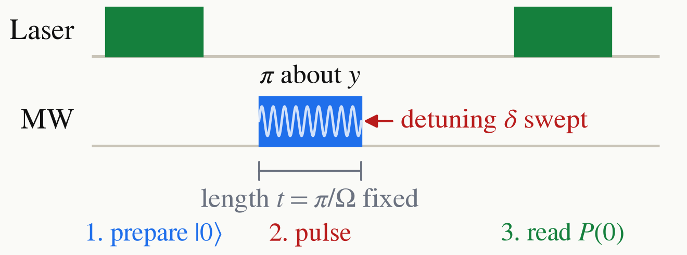

<!-- _class: tight -->

<!-- EDIT-FORWARD: this is pulsed ODMR, one fixed $\pi$ pulse per point. The thesis measures continuous-wave ESR, laser and microwaves on together, whose lineshape is a Lorentzian rather than the sinc-like curve of this slide; say which one the lab runs. -->

# Intro ODMR

Fix the pulse at the calibrated length $t=\pi/\Omega$ and sweep the carrier instead. So on resonance, $\delta=0$, we have $\Omega t=\pi$, a $\pi$ pulse. Off resonance, the rotation axis $\hat n=(0,\Omega,\delta)/\Omega_R$ tilts toward $z$ and the rotation is faster:

$$
P(0)=1-\frac{\Omega^{2}}{\Omega^{2}+\delta^{2}}\,
\sin^{2}\!\Big(\frac{\Omega_R t}{2}\Big).
$$

The resulting signal is approximately a sinc function.

<figure class="figure">

*One fixed $\pi$ pulse, the detuning $\delta$ swept.*

</figure>

<figure class="figure">

<video src="media/seq-odmr.mp4" poster="media/seq-odmr.png" width="640" controls autoplay loop muted playsinline preload="none"></video>

*The axis tilts as $\delta$ is stepped across $[-4\Omega,4\Omega]$, and one $\pi$ pulse per step draws out the dip and its side lobes.*

</figure>

