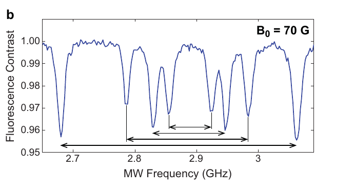
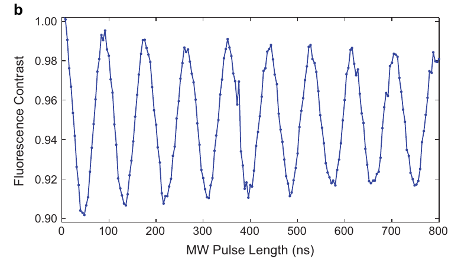
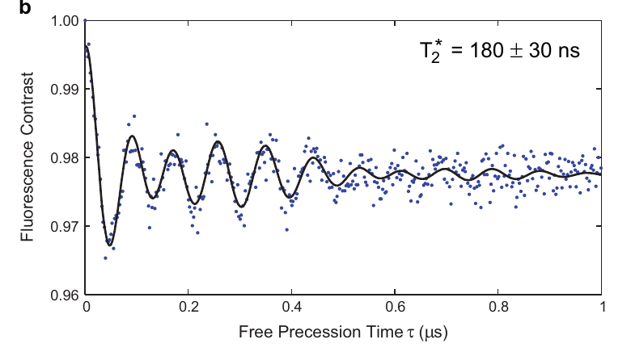

# Intro Results

<figure class="figure">

*ODMR*

</figure>

<figure class="figure">

*Rabi*

</figure>

<figure class="figure">

*Ramsey*

</figure>

Measured on an NV ensemble (Pham thesis, Ch. 1, Figs. 1.4, 1.5, 1.7). Two things remain to discuss. One is how the response is lost as time goes on, and the other is the source of the response.
