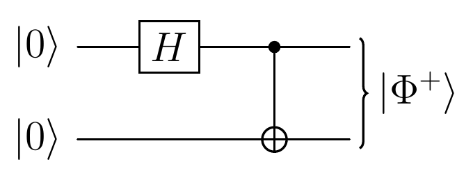

<!-- _class: dense -->

# Intro Entanglement

We start from a product state, $\ket{\psi_0}=\ket{0}\ket{0}$. A Hadamard acts on the first qubit and leaves the second one alone,

$$
(H\otimes I)\,\ket{00}=\tfrac{1}{\sqrt{2}}\big(\ket{0}+\ket{1}\big)\ket{0}.
$$

The CNOT is **conditional**: it flips the second qubit only when the first one is $\ket{1}$. It gives the maximally entangled Bell state

$$
\ket{\Phi^{+}}=\tfrac{1}{\sqrt{2}}\big(\ket{00}+\ket{11}\big).
$$

<figure class="figure">

</figure>

Any product state can be written as $(a\ket{0}+b\ket{1})\otimes(c\ket{0}+d\ket{1})$, which would need $ad=bc=0$ together with $ac=bd\neq0$. No product of two kets reproduces the Bell state.

