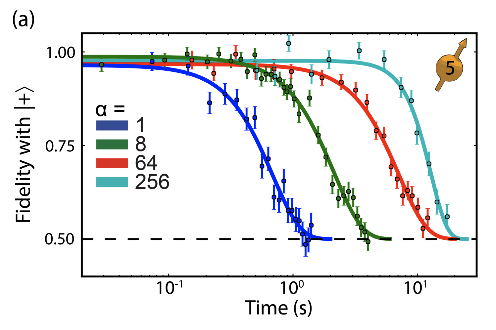

<!-- _class: tight -->

<!-- EDIT-FORWARD: confirm the source of the figure and what alpha counts (Bradley et al. 2019?) -->

# Intro The decay has a name: $T_2^{*}$

The shrinking radius of the last slide is exactly what a Ramsey experiment measures. The free-precession signal fades within a time $T_2^{*}$, set by the static spread of local fields: each nucleus shifts the electron's precession frequency by its own hyperfine coupling, and the many shifted precessions dephase when we add them up,

$$
M(t)\simeq e^{-(t/T_2^{*})^{2}} .
$$

At room temperature $T_2^{*}\approx 180\,\mathrm{ns}$ for a single NV and $\approx 500\,\mathrm{ns}$ for an ensemble, capped by the $1.1\%$ natural abundance of $^{13}\mathrm{C}$ (Pham thesis, Ch. 1).

<figure class="figure">

*A measured version of the same decay: the fidelity of one spin with $\ket{+}$, which falls to the $0.5$ floor as the Bloch radius shrinks to zero. The bare curve $\alpha=1$ decays first, like the $T_2^{*}$ above; the longer ones are the same spin under the dynamical decoupling of the next slides. The time axis is logarithmic, and its scale is that spin's own.*

</figure>

