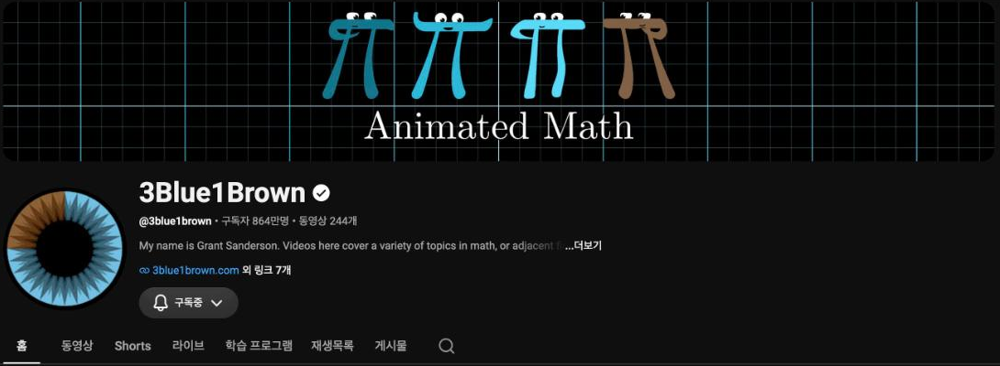
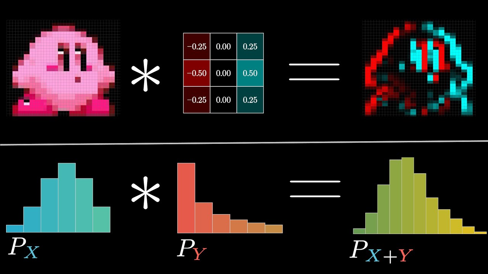
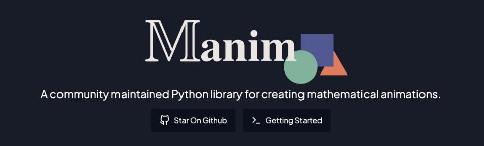

<!-- _class: tight -->

# Intro Credits: this chapter follows 3Blue1Brown

Everything in this chapter is told the way Grant Sanderson tells it in *But what is a convolution?* on the 3Blue1Brown channel, and the dice and polynomial clips are cut from his published source code (MIT licence). The Bloch-sphere and QSP clips of the other chapters were made with the community edition of Manim, the animation engine written for that channel.

<figure class="figure">

*The 3Blue1Brown channel, youtube.com/@3blue1brown.*

</figure>

<figure class="figure">

*"But what is a convolution?" (2022), youtu.be/KuXjwB4LzSA.*

</figure>

<figure class="figure">

*Manim Community Edition, manim.community.*

</figure>

