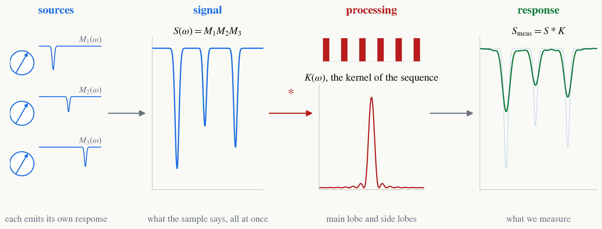

<!-- _class: tight -->

# Intro The response is already convolved

The **sources** are the spins in the sample. They respond to their own **signal** and to our input, the **processing** we chose, and we call the output the **response**, the spectrum for example. I would like to argue that the response is already convolved.

$$
S_{\rm meas}(\omega)\;=\;\int d\omega'\; S(\omega')\,K(\omega-\omega') \;\equiv\; \big[S*K\big](\omega).
$$

<figure class="figure">

</figure>
