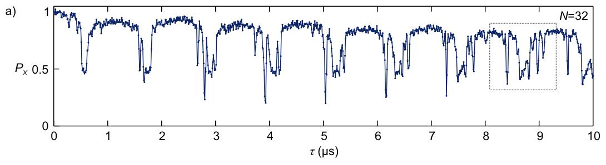

<!-- _class: tight -->

# Method Dynamical decoupling: many nuclear spins

Prepare the electron in $\ket{+}$, run a dynamical decoupling sequence, and read it out at the azimuth $\varphi$. Here $V_0$ and $V_1$ are the propagators the **nuclear** spin experiences with the electron in $\ket{0}$ and in $\ket{1}$.

$$
P(\varphi)=\tfrac12+\tfrac12|M|\cos(\varphi-\arg M),
\qquad
M=\tfrac12\operatorname{Tr}\,V_0V_1^{\dagger}
$$

For several nuclei that do not interact with each other, the trace factorizes.

$$
M=\prod\nolimits_j M_j,\qquad M_j=\tfrac12\operatorname{Tr}\,V_0^{(j)}V_1^{(j)\dagger}
$$

The several combs multiply, so the plotted $P_x=\tfrac12(1+M)$ is exactly this **pointwise product**. 

<figure class="figure">

*Taminiau et al., PRL **109**, 137602 (2012), Fig. 2(a): $P_x$ against the interpulse delay $\tau$, $N=32$ pulses, $B_0=401$ G.*

</figure>

<!-- TODO (speaker to confirm): the figure is at w:800 with the page font at 20 px, which is what the
     data panel and the two equations cost together. If you want more prose back (the
     chapter-1 remark that this M is the same M, or the per-nucleus dip discussion), say
     so and the figure goes down to w:700. -->
