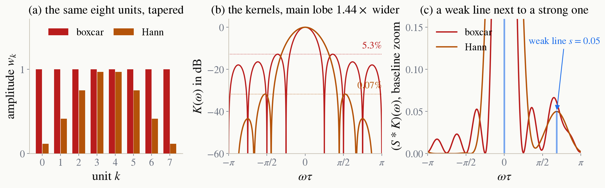

<!-- _class: tight -->

# Strategy Apodization

The side lobes come from the sharp edges of the boxcar. If we try $w_k=\sin^{2}\!\big(\pi(k+1)/(N+1)\big)$, a Hann window, the kernel becomes smooth, which gives lobes that fall away fast. For $N=8$ the largest drops from $5.3\%$ to $0.07\%$ of the peak. 

<figure class="figure">

</figure>
