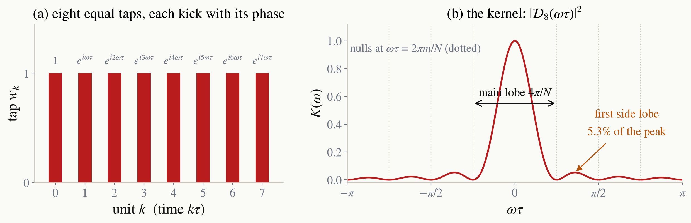

<!-- _class: tight -->

# Method Where the kernel comes from: the taps of the sequence

A sequence is $N$ equal units of length $\tau$. Unit $k$ gives the system one small kick of amplitude $w_k$, the **tap**, a pulse area or an RF amplitude. Between the kicks the system precesses at the swept variable $\omega$, so the kick of unit $k$ arrives with the phase $e^{ik\omega\tau}$. To first order the kicks add, and the total amplitude is the Fourier series of the tap list, the polynomial of the dice slides with $z=e^{i\omega\tau}$:

$$
A(\omega)=\sum_{k=0}^{N-1} w_k\,e^{ik\omega\tau},
\qquad
K(\omega)=\frac{|A(\omega)|^{2}}{|A(0)|^{2}} .
$$

$K$ is the **kernel**, or filter function: the transfer of the sequence at an offset $\omega$ from a line. Equal taps sum as a geometric series, $\sum_k e^{ik\theta}=e^{i(N-1)\theta/2}\sin(N\theta/2)/\sin(\theta/2)$, so $K=|\mathcal{D}_N(\omega\tau)|^{2}$ is the Dirichlet kernel.

<figure class="figure">

*Eight equal taps and their kernel: a main lobe of width $4\pi/N$ that narrows with more units, and side lobes at $5\%$ whatever $N$ is.*

</figure>
