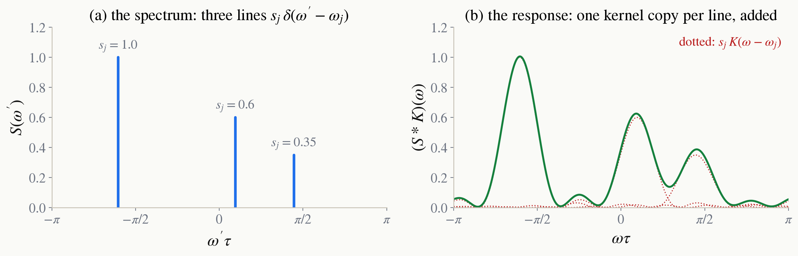

<!-- _class: tight -->

# Method One kernel copy per line

The sample answers at its own frequencies. So write its spectrum as a set of lines, one per source, at the position $\omega_j$ with the strength $s_j$, which for a nucleus is its coupling:

$$
S(\omega')=\sum_j s_j\,\delta(\omega'-\omega_j)
\quad\Longrightarrow\quad
S_{\rm meas}(\omega)=\int d\omega'\,S(\omega')\,K(\omega-\omega')=\sum_j s_j\,K(\omega-\omega_j).
$$

Each line sees the kernel only at its own offset $\omega-\omega_j$. So the measured curve is a copy of $K$ placed on every line, scaled by $s_j$, and added. This is the convolution of the chapter opener, and it says what we can and cannot see. No line is sharper than the main lobe, and the side lobes of a strong line spill onto its neighbours.

<figure class="figure">

*Three lines read through the eight-tap kernel. The response is the sum of the three dotted copies; the ripples between the lines are side lobes, not sources.*

</figure>
