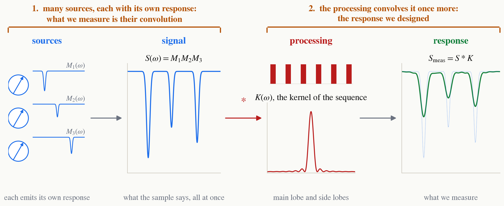

<!-- _class: tight -->

# Method Two things are convolved

<figure class="figure">

</figure>

**1. The sources.** Many spins each emit their own response $M_j(\omega)$. The signal is their product $S=\prod_j M_j$, which is a convolution of their coefficient lists, so what we measure is already a convolved signal.

**2. The processing.** The sequence we run is a kernel $K(\omega)$, so the read-out is the convolution $S*K$ once more. This one we design. Its coefficients are our pulses, so it can exclude what we do not want, or make the response we intended.

