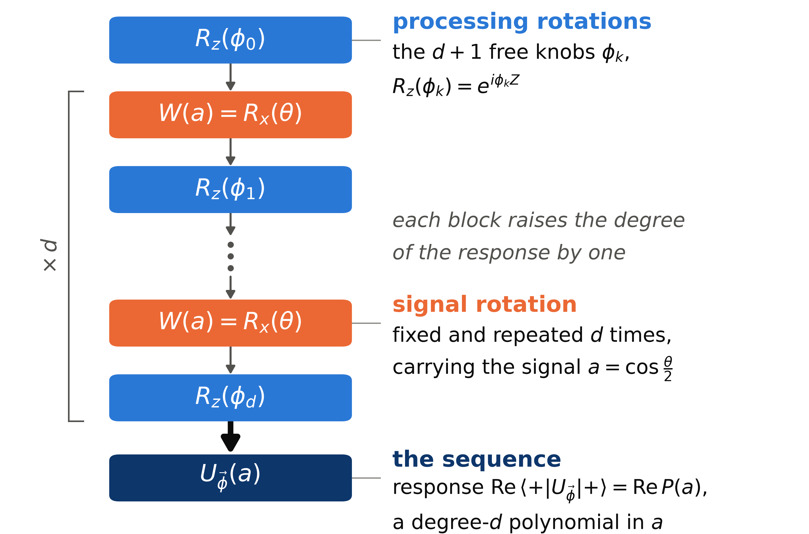

<!-- _class: dense -->

<!-- TODO (speaker to confirm): the reused ladder figure is drawn in the textbook W_x convention while the text is in the physical (detuning-as-signal) convention; redraw it in the physical convention if the aside feels like a detour. -->

# Method The sequence

Given

$$
H=\frac{\delta}{2}\,Z+\frac{\Omega}{2}\,Y ,
$$

when the drive is off, the only surviving term is the detuning. So a wait of length $\tau$ is a precession about the $z$ axis,
$$
W(\delta)=R_z(\delta\tau)=\begin{pmatrix} z^{-1/2} & 0\\ 0 & z^{1/2}\end{pmatrix},
\qquad z=e^{i\delta\tau}.
$$
This is the **signal**: the detuning $\delta$ is what the system hands us. The microwave pulses $G_k$ are the **processing**, chosen freely through their area $\beta_k$ and carrier phase $\varphi_k$. With $d$ equal waits and $d+1$ pulses,
$$
U(\delta)=G_d\,W(\delta)\,G_{d-1}\cdots W(\delta)\,G_0 .
$$

<figure class="figure">

*The textbook ladder of [1] puts the signal in an $x$-rotation $W_x(a)$. It is the same sequence in a rotated basis, with $a=\cos(\delta\tau/2)$.*

</figure>

