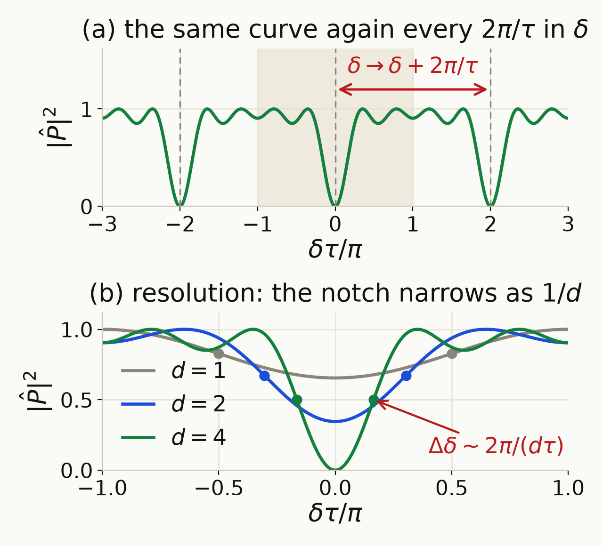

<!-- _class: tight -->

<!-- TODO (speaker to confirm): page 42 of the first draft is now two slides, 34-response.md (the
     series and its autocorrelation, with the d = 1 Ramsey case) and this one (the two
     consequences plus the figure). The figure is optional: drop it and fold these two
     paragraphs back onto 34 if the section runs long. -->

# Method Period and resolution

**Periodicity.** The response depends on the detuning only through $z=e^{i\delta\tau}$, and $z$ returns to itself when $\delta\tau$ advances by $2\pi$. So the measured curve repeats with the period $2\pi/\tau$ in $\delta$. The wait is a **sampling interval**: choosing $\tau$ chooses where the lines of the spectrum land on the circle, and two lines a multiple of $2\pi/\tau$ apart are aliased onto the same point and can never be told apart.

**Resolution.** The highest harmonic on the list is $e^{\pm id\,\delta\tau/2}$, so the fastest the curve can vary is set by $d\tau$, and the narrowest feature it can carry is
$$
\Delta\delta\sim\frac{2\pi}{d\tau}=\frac{2\pi}{T} .
$$
The total sequence time $T=d\tau$ is a **record length**. This is the statement chapter 2 made with the Dirichlet kernel: a record of finite length convolves every line with the transform of its window. **Resolution is bought with sequence length.**

<figure class="figure">

*Top: the $d=4$ curve over three periods, one period shaded. Bottom: the notch at $d=1,2,4$. Fig. by `fig_response.py`.*

</figure>

