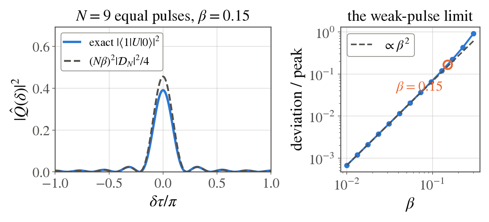

<!-- _class: tight -->

# Method Weak pulses

**Why this limit:** weak pulses make the response linear in their amplitudes, so the sequence is exactly a classical filter and chapter 2 applies word for word.

Expand each pulse to first order, $G_k\simeq I-\tfrac{i}{2}\beta_k(\cos\varphi_k X+\sin\varphi_k Y)$, and keep the terms with one pulse in them. Each wait left of pulse $k$ contributes $e^{+i\delta\tau/2}$ and each wait to its right $e^{-i\delta\tau/2}$, so
$$
\hat Q(\delta)\simeq-\frac{i}{2}\sum_{k=0}^{d}\beta_k e^{i\varphi_k}\,e^{i\left(\frac{d}{2}-k\right)\delta\tau}.
$$
The coefficient $q_k$ **is** the complex amplitude $\beta_ke^{i\varphi_k}$, so the knobs on the bench are the coefficient list. Equal pulses are the all-ones boxcar of length $N=d+1$, and its transform is the Dirichlet kernel,
$$
|\hat Q(\delta)|^{2}=\frac{(N\beta)^{2}}{4}\,\big|\mathcal{D}_N(\delta\tau)\big|^{2},
\quad
\mathcal{D}_N(\theta)=\frac{\sin(N\theta/2)}{N\sin(\theta/2)},
$$

<figure class="figure">

*$N=9$ equal pulses of area $\beta=0.15$: the exact product (solid) against the formula above (dashed). The peak differs by $17\%$ here and falls as $\beta^{2}$. Fig. by `fig_qsp_design.py`.*

</figure>

