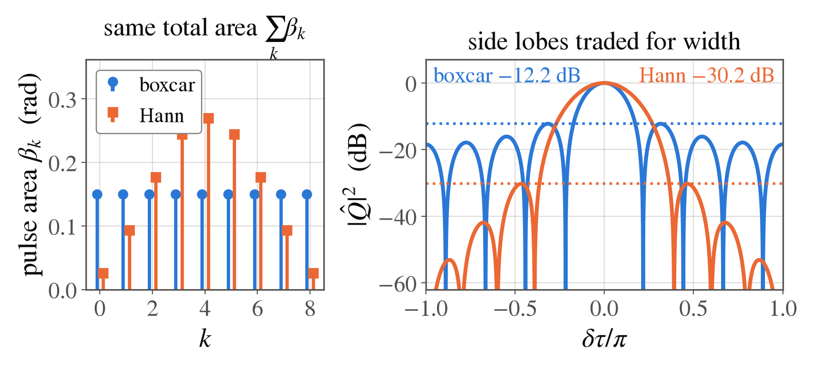

<!-- _class: tight -->

<!-- EDIT-FORWARD: the DDrf panel is reused from the meeting of 2026-04-28 through the
     2026-08-18 deck. I read its axes as the RF sweep against the surviving population
     $P_x$, with $N=48$ cells of amplitude $\Omega_k=\Omega f(k)$, so that $1-P_x$ is the
     transfer. Confirm that reading, and say whether the $N=136$ panel should sit next
     to it as the resolution-versus-length statement. -->

# Results Apodization in our data

<figure class="figure">

*Nine pulses with the same total area $\sum_k\beta_k=1.35$, hence the same transfer on resonance. A Hann envelope pushes the largest side lobe from $-12.2$ dB down to $-30.2$ dB, a factor of $63$ in transferred population, and pays for it with a main lobe $1.46$ times wider. Both curves are exact products, which is why the boxcar lobe sits $0.7$ dB above the $-12.9$ dB of the first-order window.*

</figure>

<figure class="figure">

*The same trade in our own DDrf data. The taps are the amplitudes $\Omega_k=\Omega f(k)$ of the $N=48$ RF cells, the swept variable is the RF frequency $\omega_{\mathrm{RF}}$, and $P_x$ is the surviving population, so $1-P_x$ is the transfer that plays the role of $|\hat Q|^{2}$. A rectangular envelope leaves ripples of a few percent beside the line; Hanning and Blackman remove them and widen the dip. (source: lab meeting 2026-04-28)*

</figure>

Shaping the $\beta_k$ is apodization, so in this limit QSP **is** classical window design. At large pulse areas the linear map from the amplitudes to the taps is replaced by the exact matrix convolution we started from, and that is where QSP goes further.
