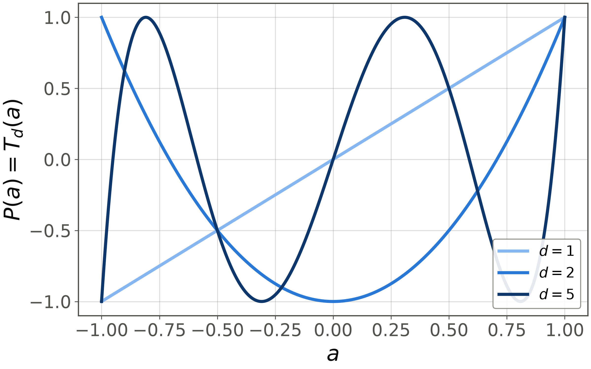

<!-- _class: tight -->

# Method Reachable polynomials

Switch every pulse off. The sequence is bare free precession, $U=W(\delta)^{d}$, whose coefficient list has a single nonzero entry, so its response is one pure harmonic,
$$
\langle 0|U|0\rangle=e^{-id\delta\tau/2},\qquad
\mathrm{Re}\,\langle 0|U|0\rangle=\cos (dx)=T_d(a),
$$
with $a=\cos x$ and $x=\delta\tau/2$. In the textbook labelling this is the trivial-phase case of [1], $P=T_d(a)$ and $Q=U_{d-1}(a)$, Chebyshev of the first and second kind, and the unitarity condition is just $T_d^{2}+(1-a^{2})U_{d-1}^{2}=\cos^{2}(dx)+\sin^{2}(dx)=1$. **Chebyshev polynomials are the pure harmonics of the wait**, and the pulses turn one harmonic into a designed sum of them.

<figure class="figure">

*$P(a)=T_d(a)$ at trivial phases, $d=1,2,5$. From our evaluator.*

</figure>

At $a=\pm1$ the wait is trivial, so the sequence collapses to one fixed rotation and $|P(\pm1)|=1$ is forced. A target such as $\tfrac12\,\mathrm{sign}(a)$ is then unreachable as $P$ itself. Reading only the real part cures it, since $\mathrm{Im}\,P$ can absorb the unit-modulus burden. **$\mathrm{Re}\,P$ may then be any real polynomial with parity $d \bmod 2$ and $|\mathrm{Re}\,P|\le1$** [1].

