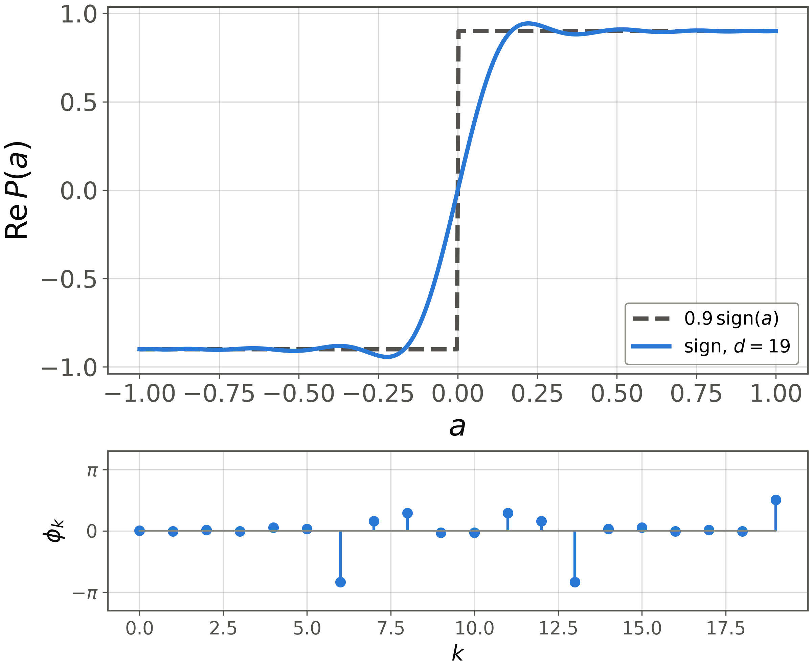
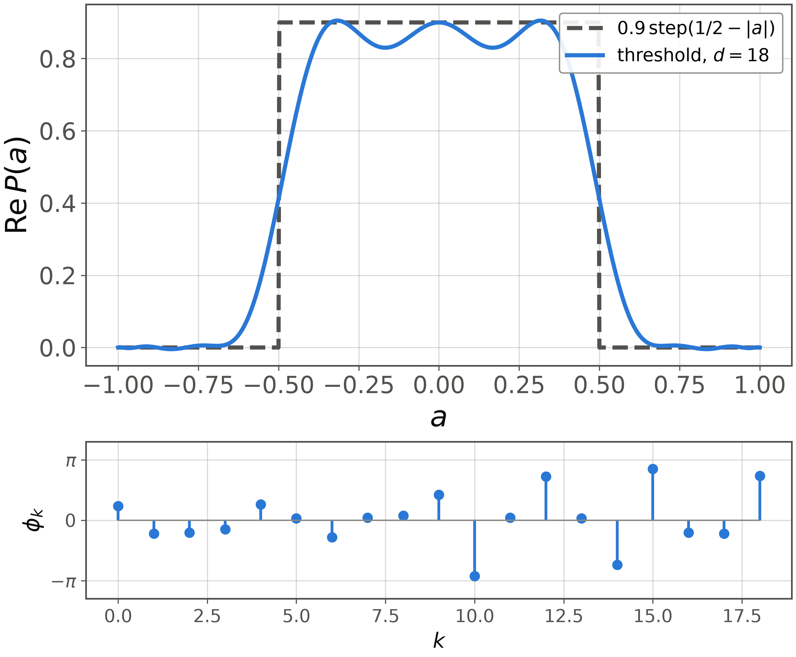

# Method Choosing the polynomial is choosing the algorithm

<figure class="figure">

*Sign function at $d=19$, the decision primitive behind amplitude amplification and search.*

</figure>

<figure class="figure">

*Threshold function at $d=18$, a band-pass response used for eigenvalue thresholding and eigenstate filtering.*

</figure>

The lower panel of each figure is the phase list, which is the entire program. Appendix D of [1] gives lists for $\cos$, $\sin$, $1/a$ and $e^{-\beta a}$ as well.
