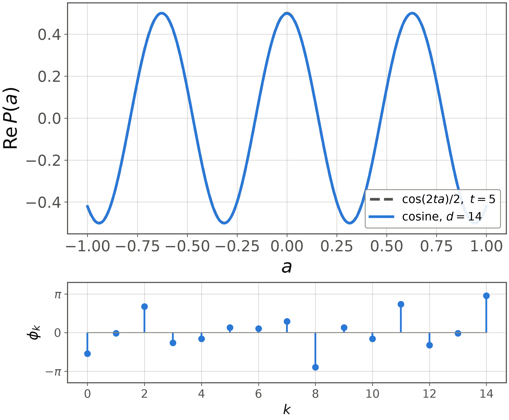
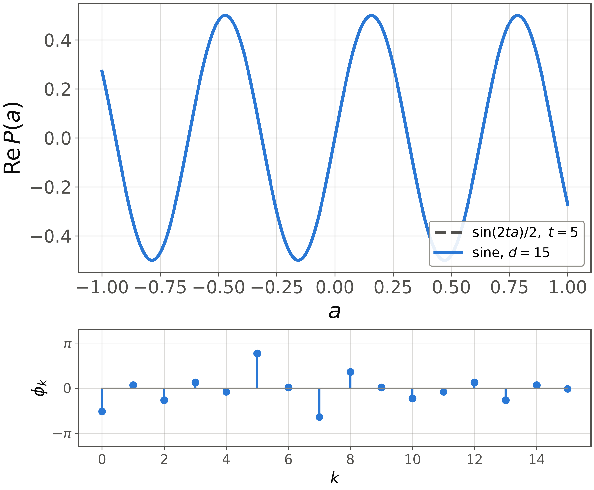

# Method Cosine and sine

<figure class="figure">

*Cosine response at $t=5$, $d=14$, from the phase list of [1, App. D4].*

</figure>

<figure class="figure">

*Sine response at $t=5$, $d=15$, from the phase list of [1, App. D4].*

</figure>

Hamiltonian simulation uses the pair through $e^{-i\mathcal{H}t}=\cos(\mathcal{H}t)-i\sin(\mathcal{H}t)$. So these two angle lists are the entire program, and the degree grows linearly with the simulated time $t$.
