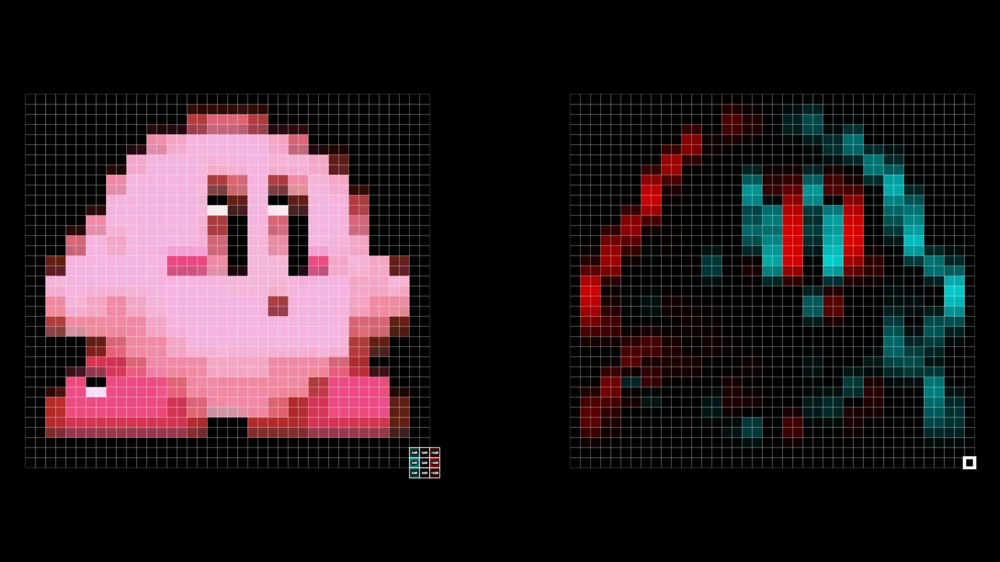
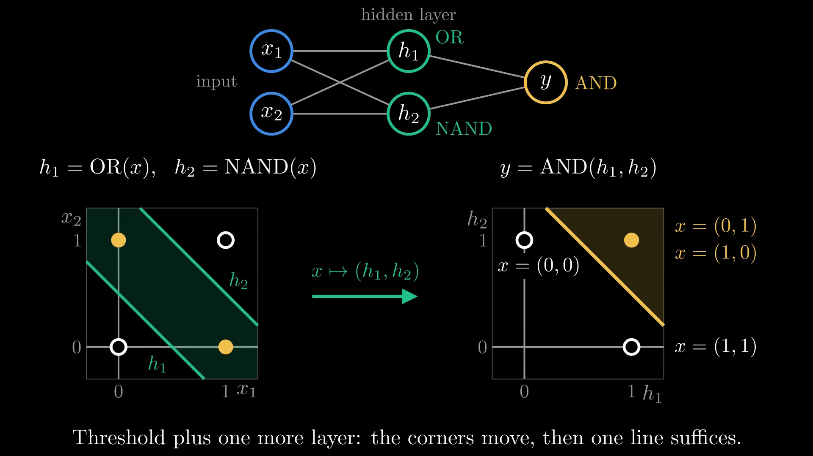
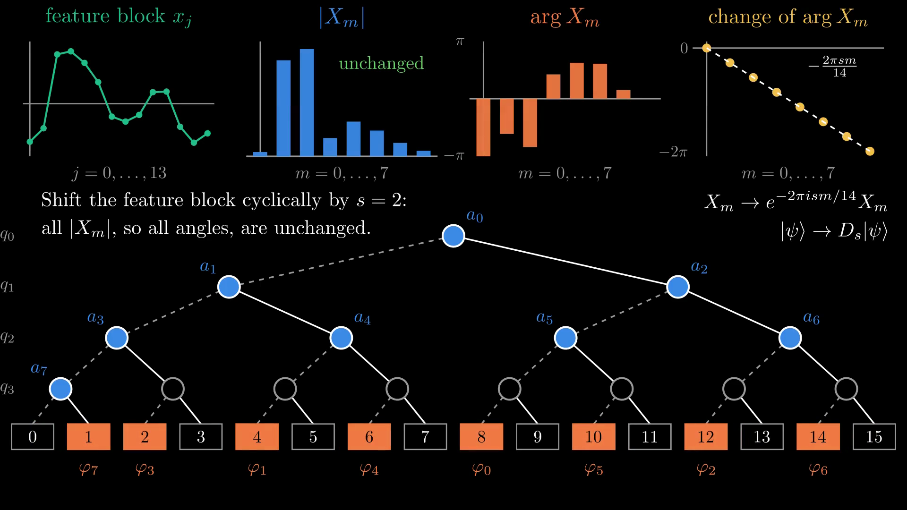
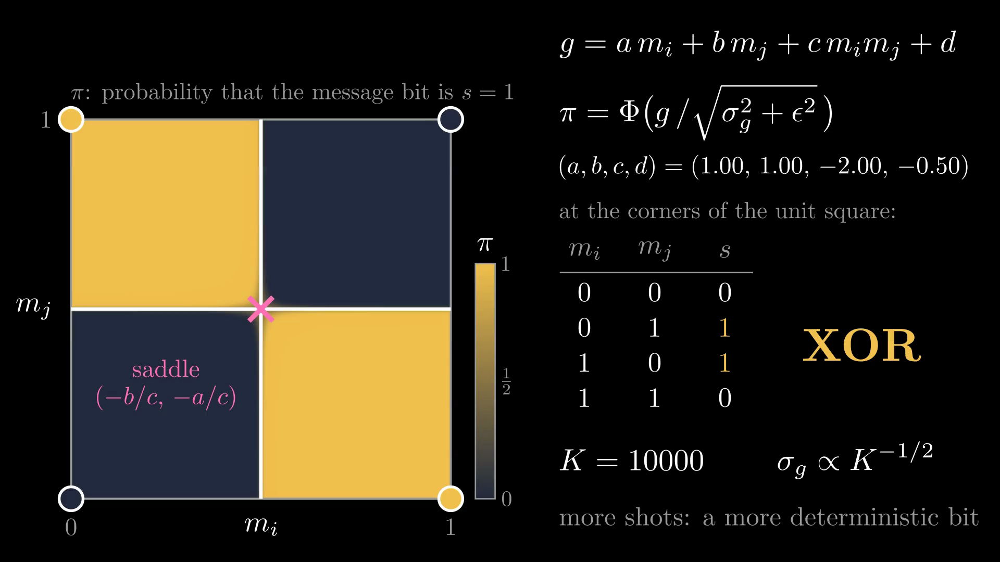

# Shout-out to Manim

<figure class="figure">

<video src="media/manim-banner.mp4" poster="media/manim-banner.png" width="500" controls autoplay loop muted playsinline preload="none"></video>

</figure>

The animations in this talk were made with **Manim**.

- **ManimGL** 1.7.2 by Grant Sanderson (3Blue1Brown): his own convolution scenes, on Kirby
- **Manim Community Edition** v0.21.0: all other clips

Convolution scenes: github.com/3b1b/videos (CC BY-NC-SA 4.0). Manim: github.com/3b1b/manim, github.com/ManimCommunity/manim (MIT).

<!-- 2026-09-29 (speaker: "bring shout-out to Manim to initial page. (I mean before outline page.)"): moved from 85-manim.md (just before the references, "Thank you!" framing) to 00a-manim.md, right after the title and before the outline; reworded as an opening acknowledgement ("The animations in this talk were made with Manim"). Clip, credits, licences and poster strip unchanged; the ManimGL bullet now comes first so that "all other clips" reads naturally. -->
<!-- src: versions queried on 2026-09-29 from the installed packages: manim 0.21.0 in 3. wiki/code/env-manim/.venv (importlib.metadata and `manim --version`: "Manim Community v0.21.0"); manimgl 1.7.2 in 3. wiki/code/conv-intro-animations/.venv-mac (importlib.metadata; package author "Grant Sanderson", licence MIT). The manim CE package metadata lists "The Manim Community Developers, Grant '3Blue1Brown' Sanderson" as authors, licence MIT. Licence of the scene code: the README of github.com/3b1b/videos (local clone ~/.cache/3b1b-videos, commit ae2b911, 2026-09-15) says the Manim library is MIT but "the contents of this repository are available under the Creative Commons Attribution-NonCommercial-ShareAlike 4.0 International License" (LICENSE.txt is CC BY-NC-SA 4.0); conv-intro-animations/README.md (line 11), its render.py docstring (line 5), REFS-cnn.md (item 2) and 16-conv-image.md's src comment were corrected to CC BY-NC-SA 4.0 on 2026-09-29 (checked 07:34). Clips: 17 clips on the other slides as of 2026-09-29, after round 3 (the illustrative poe-readout clip was restored on 49-readout.md at the speaker's request; before that 16, rechecked 07:34; grep of media/*.mp4 in the visible text of the numbered slides; unchanged after 56-shuffle.md and 57-quantum-channel.md were removed, since neither had a clip; 17 until round 3, when 49-readout.md replaced the illustrative poe-readout clip by the trained model's per-signal readout); image-conv-kirby and sobel-kirby render 3Blue1Brown's _2022/convolutions/discrete.py with ManimGL (3. wiki/code/conv-intro-animations, "260929 cuts"), the other 15 are Manim Community scenes in 3. wiki/code/lm-260929-animations (render.py --list); the slide does not count them, so it stays correct if clips change. Banner clip: scenes_manim.py ManimShoutout (Manim CE's built-in ManimBanner: create, expand), whose _verify() checks the versions and the licence quoted here. Strip = the posters of sobel-kirby (16-conv-image.md), xor-hidden (14-xor.md), fourier-embed-gates (43-fourier.md; switched from the older fourier-embed poster at integration on 2026-09-29, when 43-fourier.md began playing the fourier-embed-gates clip, scenes_embed_gates.py), link-rule (48-link.md); all four clips are in the deck (checked 2026-09-29). -->
<!-- Speaker note: before we start, a shout-out: every animation you will see was made with Manim. Manim was written by Grant Sanderson for the 3Blue1Brown videos; the Community Edition is the community-maintained fork. The two convolution clips are his own scene code from the video, run through a small compatibility wrapper, on Kirby instead of his cat (the Sobel clip also holds the finished output for 2.5 s). The matplotlib figures are not Manim. -->
