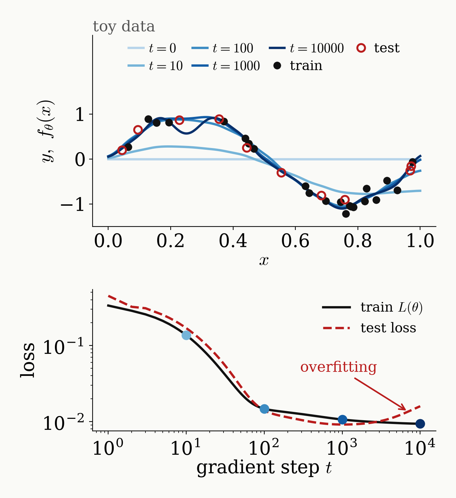

<!-- _class: tight -->

# Intro What is machine learning?

**Model.** A function $f_\theta$ with trainable parameters $\theta$.

**Loss** on $M$ training examples $(x_i,y_i)$:

$$L(\theta)=\frac{1}{M}\sum_{i=1}^{M}\big(f_\theta(x_i)-y_i\big)^2$$

**Training.** Gradient descent with step size $\eta$:

$$\theta\;\leftarrow\;\theta-\eta\,\nabla_\theta L(\theta)$$

**Success** is judged on unseen (test) data.

<figure class="figure">

</figure>

