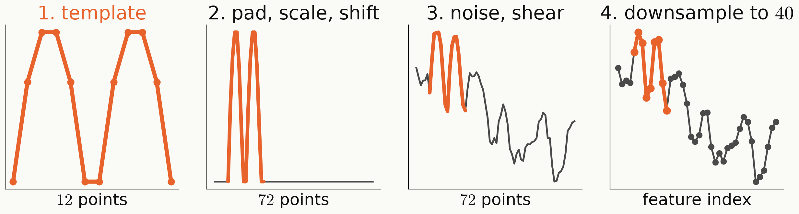

<!-- _class: tight -->

# Method MNIST-1D: a digit written as $40$ numbers

- Each signal: one of ten $12$-point templates, randomly transformed to $40$ features.
- The shift puts the digit anywhere: the label lives in the shape of a local stroke.
- Standard set: all $10$ digits, $4000$ training and $1000$ test signals.

<figure class="figure">

</figure>

Greydanus and Kobak, ICML 2024 (arXiv:2011.14439).

