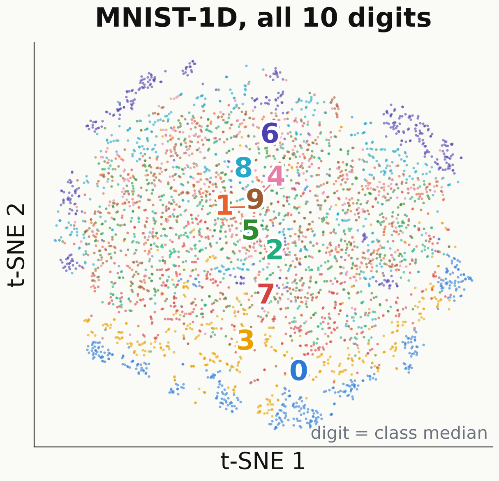
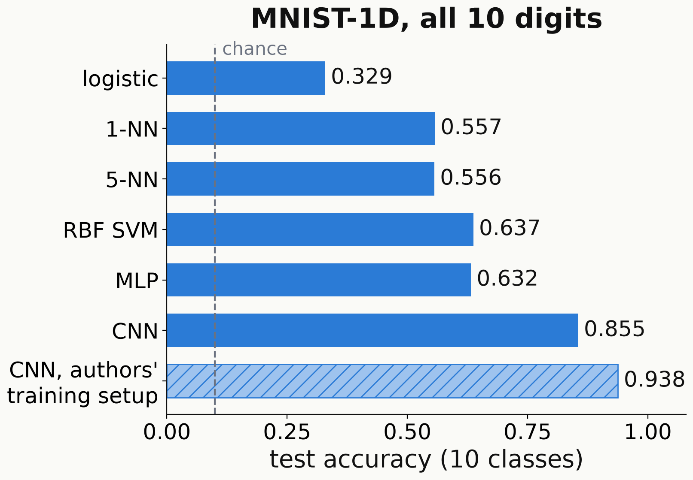

<!-- _class: tight -->

# Method Why it is hard: no clusters, only local structure

- All $10$ digits, raw features: no clusters (silhouette $-0.039$); two principal components hold $35.7\%$ of the variance.
- Test accuracy, $10$ digits: Gaussian-kernel (RBF) SVM $0.637$, MLP $0.632$, CNN $0.855$ ($0.938$, authors' setup).
- The CNN wins by locality: small filters, reused at every position.

<figure class="figure">

</figure>

<figure class="figure">

</figure>

