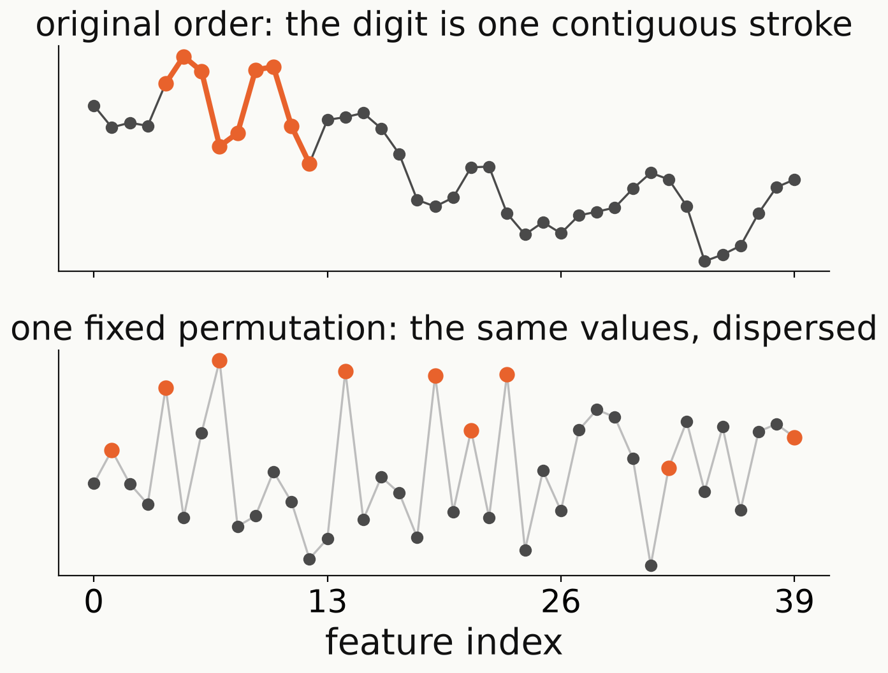
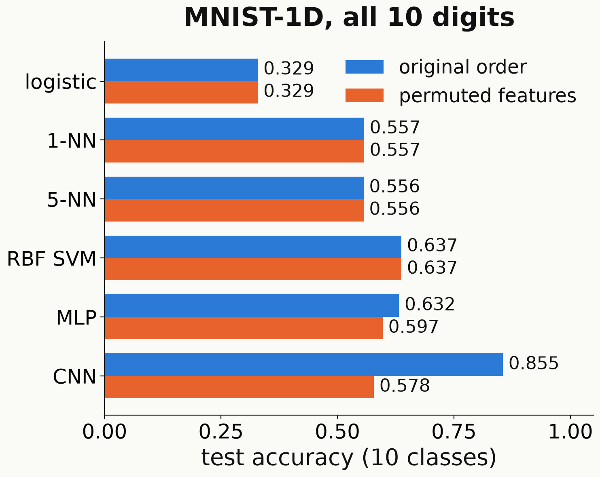

<!-- _class: tight -->

# Method The feature-permutation test: the value of the locality prior

<!-- src: mnist1d-eda.md §4.6 (ten classes; one fixed permutation, default_rng(42), identical training on both arms: CNN 0.855 -> 0.578, drop 0.277) -->

- One fixed random permutation of the $40$ features ("shuffled MNIST-1D"); every model retrained.
- Logistic regression, $k$-nearest neighbours, RBF SVM unchanged: distances and inner products are preserved.
- On all $10$ digits the CNN falls from $0.855$ to $0.578$: its **locality prior** is worth $0.277$.

<figure class="figure">

</figure>

<figure class="figure">

</figure>

<!-- Speaker note: Greydanus and Kobak call this shuffled MNIST-1D (the name in quotes on the slide). The left figure is test signal 1 (a digit 3) before and after the permutation. The MLP is invariant only in distribution; its drop of 0.035 is from one seed. The 0.277 drop is the value of the locality prior, the question we later ask of the quantum model. All numbers here are ten-class. -->
<!-- Figures: fig_data.py (fig_shuffle_example, fig_shuffle; the latter titled "MNIST-1D, all 10 digits" since 2026-09-29). _verify() checks that 1-NN gives 0.557 on both arms (exact invariance). The paper reports the same collapse, CNN 94 to 56 (papers/@greydanus2020scaling.md §3); our reproduction with the authors' code gives 93.8 to 59.2 (mnist1d-repro.md §3). -->
