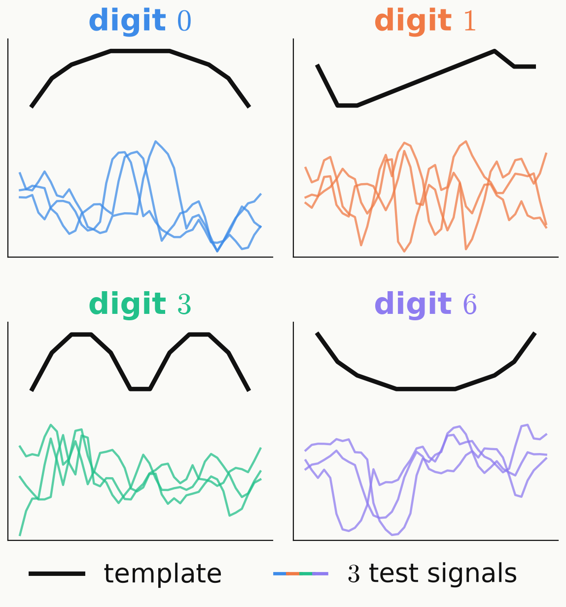

<!-- _class: tight -->

# Method Our task: four digits, three feature blocks

<!-- src: all numbers on this slide are FOUR-class (digits 0, 1, 3, 6; 411 test signals). dqml-physics-results.md §0.1 (split, windows = feature blocks, classical reference values: best classifier on all 40 features 0.978, tuned RBF SVM 0.964, best additive per-window model 0.971 contiguous / 0.891 permuted); log.md [2026-09-25] "dqml.phys built and verified" (tuned SVM 0.964, best joint model 0.978; source ~/DQML/analysis/phys-classical/) -->
<!-- src (model of the 0.978 row, added 2026-09-29 after the speaker asked "What is Best classical model?"): dqml-physics-results.md §0.1 as updated 2026-09-29 (log.md [2026-09-29] simulate | DQML — per-signal product-of-experts readout ... + classical-model provenance; source phys-classical/README.md, table "All 40 features"): kernel logistic regression with a translation-aware kernel, a sum of RBF kernels over the 40 cyclic width-5 sub-windows of the signal, C = 300, g = 2; test accuracy 0.978 (cross-entropy 0.060); chosen by the minimum validation cross-entropy over 2330 candidate models of all 40 features (logistic regression, RBF support-vector machines, kernel logistic regression with plain and translation-aware kernels). A width-10 kernel reaches 0.985 accuracy "but with a higher cross-entropy (0.070)" (§0.1, which says neither on which split the 0.985 is measured, presumably test like the 0.978, nor whether 0.060 / 0.070 are validation or test values), so it was not selected. The slide says "shift-aware" (= the vault's "translation-aware") and "chosen on validation data among 2330 models"; the cross-entropy criterion stays off the slide (speaker: no cross-entropy metrics). The vault does not spell out the kernel formula (whether sub-windows at the same position or all pairs of positions are compared), so none is shown. -->
<!-- 2026-09-29 (speaker, second review): the D_add column ("excess cross-entropy", 0.021 / 0.224 nats, §0.1) was removed; the slide now shows accuracies only. -->

<figure class="figure">

</figure>

- Digits $0, 1, 3, 6$ only: $1325$ training, $264$ validation, $411$ test signals.
- Each QPU encodes a block $x_b$ of $14$ features, contiguous or permuted.
- Additive model $\log P(c\,|\,x)=\sum_b f_b(c,x_b)-\log Z(x)$: the classical product of experts.

| classical model, **4 digits** | test accuracy |
|---|---|
| kernel logistic regression, all $40$ features shift-aware kernel (sum of RBF kernels over cyclic width-5 sub-windows), chosen on validation data among $2330$ models | $0.978$ |
| tuned RBF SVM, all $40$ features | $0.964$ |
| additive, contiguous blocks | $0.971$ |
| additive, permuted features | $0.891$ |

<!-- Speaker note: here x_b is the feature block of QPU b, f_b a per-block score and Z(x) the normalisation. With contiguous blocks the additive model almost matches the best model on all 40 features (0.971 vs 0.978, 0.7 points); with permuted features it loses 8.7 points (0.891), accuracy that is only available from feature combinations across blocks, which communication would have to carry. The "best joint model" (the name used on the Doubt 1 slide and in GLOSSARY.md) is this kernel logistic regression: its kernel is a sum of RBF kernels over the 40 cyclic sub-windows of 5 neighbouring features (the results page calls it translation-aware; "shift-aware" on the slides); it was chosen on validation data among 2330 classical models (logistic regression, RBF SVMs, kernel logistic regression with plain and shift-aware kernels). If asked: a width-10 variant reaches 0.985 accuracy (§0.1) but was not the validation choice; quoting it would mean choosing on test data. These are four-class numbers; the ten-class numbers of the MNIST-1D slides (RBF SVM 0.637) are a different, harder task. -->
<!-- Resolved 2026-09-29 (was an EDIT-FORWARD: "the vault does not record which model family gave 0.978, how it was selected, or the SVM's hyperparameter grid"): §0.1 now names the model and its selection (validation data, 2330 candidates; see the src comment above), and the row "best joint model tried" now names it. Still not in the vault: the RBF SVM's hyperparameter grid. Deck-wide short label elsewhere: "kernel logistic regression (shift-aware)". -->
<!-- Figure: fig_data.py (fig_classes), load_mnist1d() 4-class filter, three test signals per class under each template, legend "template / 3 test signals" (test-signal handle drawn in the four class colours) replaces the caption removed 2026-09-29; _verify() checks 1325 + 264 = 1589 training and 411 test signals. -->
