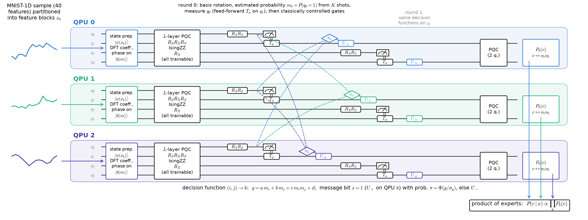

<!-- _class: tight -->

# Method The whole model on one page

<figure class="figure">

</figure>

- $3$ QPUs $\times$ $n=4$ qubits, $14$ features each, $L=8$ trainable layers
- Two rounds: each QPU measures one qubit mid-circuit and receives one message bit (dashed: classical only).
