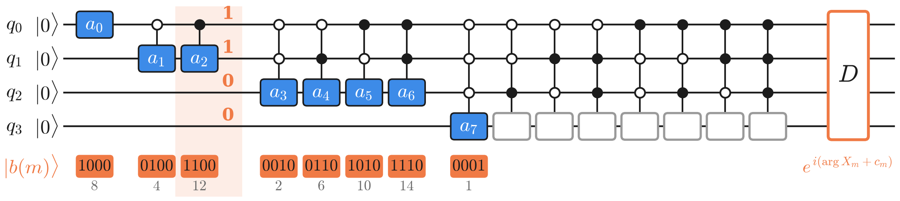

<!-- _class: tight -->

# Method The Fourier (DFT) encoding

<figure class="figure">

<video src="media/fourier-embed-gates.mp4" poster="media/fourier-embed-gates.png" width="500" controls autoplay loop muted playsinline preload="none"></video>

</figure>

$$X_m=\sum_{j=0}^{13}x_j\,e^{-2\pi i jm/14},\quad m=0,\dots,7$$

- **Uniformly controlled** $R_y$: **blue** $a_m=\mathrm{clip}(s_m|X_m|+\beta_m,0,\pi)$; grey: trainable constants
- **Orange** $|b(m)\rangle$: $a_m$'s control values, then $1$, then all $0$; $D$ adds the phase
- Cyclic shift $s$: $X_m\to e^{-2\pi i sm/14}X_m$, one fixed diagonal $D_s$

<!-- Speaker note: the tree in the clip is a circuit (binary-tree state preparation, Moettoenen et al.). Every circle is one R_y rotation of its qubit (depth k = qubit q_{k-1}), controlled by the path above it (open dot = control on 0, filled = control on 1); R_y(theta)|0> = cos(theta/2)|0> + sin(theta/2)|1>, so a 0-branch multiplies by cos and a 1-branch by sin. Level k is one uniformly controlled R_y with 2^{k-1} angles, drawn expanded into its 2^{k-1} controlled gates: 1 + 2 + 4 + 8 = 15 angles. Blue: the 8 angles set by the data, a_m on the root (mode 0), the two depth-2 nodes (modes 1, 2), the four depth-3 nodes (modes 3 to 6) and the first depth-4 node (mode 7); s_m (scale) and beta_m (offset) are trainable. Grey (hollow circles in the clip, grey boxes in the circuit): the other 7 depth-4 angles, trainable constants. Orange: b(m) is read down a_m's column: the control values, then 1 on its target qubit (the sin branch a_m opens), then 0 on every later qubit. Example b(2) = 1100: control q_0 = 1, target q_1 = 1, then 0, 0. It is the only basis state whose path takes a_m's 1-branch and no 1-branch below it, and its amplitude is A_m sin(a_m/2), where A_m (the other half-angle cosines and sines on the path) does not depend on a_m. The diagonal gate D = diag(e^{i phi_x}) then puts phi_{b(m)} = arg X_m + c_m on those 8 states (c_m a trainable offset) and trainable constant phases on the other 7 (3, 5, ..., 15, the states the hollow gates open); phi_0 = 0. The simulator of the runs writes this state vector in closed form rather than applying gates; the circuit prepares exactly the same state. |X_m| says how much of frequency m is present, arg X_m where the feature sits. A cyclic shift keeps every |X_m| (every angle) and moves the phases on a ramp, so the state changes by one fixed diagonal unitary D_s. The identity holds per block only, and the R_X layers do not commute with D_s, so the circuit must still learn the invariance. The clip shows QPU 1's feature block of test signal 1 (a digit 3). -->
<!-- src: X_m definition, m = 0..7, a_m = clip(s_m|X_m| + beta_m, 0, pi) (offset written beta_m, not b_m, to avoid a clash with the basis state b(m) and the QPU index b), node assignment (root mode 0; depth 2 modes 1-2; depth 3 modes 3-6; first depth-4 node mode 7), phi_m = arg X_m + c_m on b(m), "all remaining angles and phases are trainable constants": dqml-physics-results.md §2.1. "The linear scale and offset of each feature are trainable": §0.2 step 1. b(t) = bits (p, 1, 0, ..., 0) = (2p+1) 2^{n-k}, one-to-one onto basis states 1..15; b(m) = 8, 4, 12, 2, 6, 10, 14, 1: §2.2 and its table. Amplitude of |b(m)> = A_m sin(a_m/2) e^{i phi_m}, A_m a product of cosines and sines along the path and cosines below it: §2.3 (the vault does not state a sign for A_m; it is >= 0 when the constant angles lie in [0, pi], as in _verify()). Colours (blue node = a mode's angle, hollow = trainable constant angle, orange = |b(m)>): §2 Fig. 3 caption (d). -->
<!-- src: gate realisation: "The state preparation is simulated as the state vector itself, not as gates (a gate realisation would use uniformly controlled R_y rotations level by level plus a diagonal phase gate)": dqml-physics-results.md Fig. 2 caption (§0.2). Uniformly controlled rotations, 2^{k-1} angles at level k, 2^n - 1 in total, 2^n - 1 phases with phi_0 = 0, Moettoenen et al. construction: dqml-quantum-design.md §2.2. Qubit 0 = most significant bit: dqml-quantum-stage.md §1. Per QPU 7 constant angles + 7 constant phases, 8 scales, 8 + 8 offsets (beta_m, c_m) is consistent with the Fig. 2 caption counts for the whole model (42 constant angles and phases, 24 scales, 48 encoder offsets = 3 QPUs x 14, 8, 16); the split is our reading, not stated in the vault. -->
<!-- src: shift identity X_m -> e^{-2 pi i s m/14} X_m, magnitudes invariant, fixed diagonal unitary: dqml-physics-results.md §2.3 last bullet; dqml-quantum-design.md §2.3.1 (motivation: MNIST-1D places the digit template at a random circular shift, Greydanus and Kobak §"Constructing the dataset"). Per-window symmetry, R_X layers do not commute with D_s: dqml-quantum-design.md §2.3.1 "What it does and does not do". -->
<!-- src: circuit figure media/embed-circuit.png from 3. wiki/code/lm-260929-animations/fig_embed_circuit.py (2026-09-29; schematic, no trained values; clip colours blue #3D8BE8, orange #F07A45, hollow #9A9A9A). Its _verify() builds the 16-dim state gate by gate (15 controlled R_y as 16x16 matrices, then D) and checks: 1 + 2 + 4 + 8 = 15 gates, 8 blue, hollow = depth-4 nodes 1-7; the column rule b = control bits + 1 + 0s = phase_slot(m) = 8, 4, 12, 2, 6, 10, 14, 1; node -> state one-to-one onto 1..15, constant phases on 3, 5, ..., 15; the circuit equals the closed form tree_state for 20 random angle/phase sets and equals the clip's encode_window() state of its window; psi_{b(m)} = A_m sin(a_m/2) e^{i(arg X_m + c_m)} with A_m unchanged when a_m changes (random offsets, constant angles drawn in (0, pi), where A_m >= 0); arg rho_{b(m),0} = arg X_m + c_m; the shifted window gives D_s psi. -->
<!-- src: clip fourier-embed-gates from 3. wiki/code/lm-260929-animations/scenes_embed_gates.py (FourierEmbedGates, 2026-09-29): scenes_embed.py's FourierEmbed (clip fourier-embed; on no slide since 2026-09-29, when 00a-manim.md's strip switched to the fourier-embed-gates poster; media/fourier-embed.mp4/.png moved to _removed/media/ at integration, re-render with render.py scenes_embed.py FourierEmbed) with the tree caption "Binary-tree state preparation: R_y(theta) on each qubit, controlled by the path above" (standard name per GLOSSARY.md; re-rendered 2026-09-29, poster frame 0.96 unchanged), the phase caption "path to a_m, then its 1-branch, then 0-branches, via a diagonal gate D", and mode 2's root-to-leaf path (bits 1, 1, 0, 0, then |1100>) highlighted in place of mode 1's; real window x_test[1][14:28], data and shift s = 2 unchanged. Its _verify() runs scenes_embed._verify() (DFT, |X| invariance, phase ramp, node assignment, b(m), psi(shifted) = D_s psi) and checks the path rule for every mode. No trained angle values are shown (the illustrative scale is dqml_style.default_scale). -->
<!-- EDIT-FORWARD: the identity is exact for a cyclic shift of the 14-feature window. The data augmentation and the dataset shift the whole 40-feature signal, so a feature can leave one window and enter the next; the symmetry is per window (dqml-quantum-design.md §2.3.1, "What it does and does not do"). Also: an equivariant state is not an invariant model; the R_X layers of the brick-wall do not commute with D_s, so the circuit must still learn the invariance. -->
<!-- EDIT-FORWARD: dqml-physics-results.md §2.2 says the amplitude of b(t) "contains no other data-dependent sine factor"; that holds for factors below node t, but a path above can contain the sine of an ancestor's data angle (e.g. psi_{1100} contains sin(a_0/2) sin(a_2/2)). The slide avoids the phrase; A_m (independent of a_m) is what matters. -->
