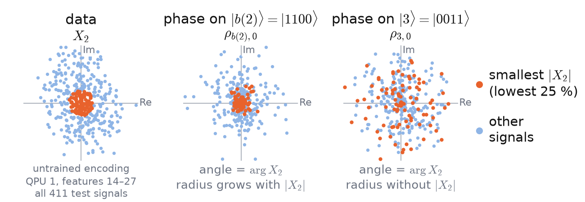

<!-- _class: tight -->

# Method Why the choice of phase-carrying basis state matters

- One copy: $P=\mathrm{Tr}[E\rho]$ is linear in $\rho_{xy}=\psi_x\psi_y^*$
  $$\rho_{b(m),0}=C_0A_m\sin(a_m/2)\,e^{i(\arg X_m+c_m)}$$

$C_0=\psi_{0000}=\prod_{k=0,1,3,7}\cos(a_k/2)\ge0$
$|\psi_{b(m)}|=A_m\sin(a_m/2)$, $A_m\ge0$:
the other $\cos$, $\sin$ factors on its path, free of $a_m$

- **Phase on $|b(m)\rangle$:** a rescaled copy of $X_m$
- **Phase on $|m{+}1\rangle$:** same angle, radius without $|X_m|$

No communication, phase on $|m{+}1\rangle\to|b(m)\rangle$:
test accuracy $0.738\to0.865$ (4 digits, seeds 0–2)

<figure class="figure">

</figure>
