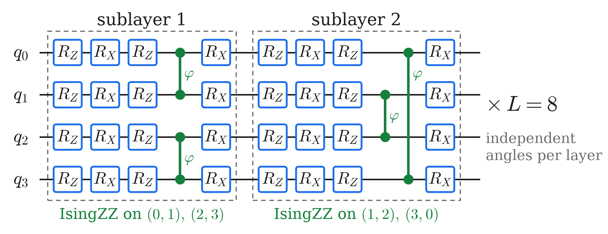

<!-- _class: tight -->

# Method The "convolution" is a parametrised quantum circuit

<!-- src: dqml-physics-results.md §0.2 item 2 (L = 8 brick-wall layers; half-layer = R_Z R_X R_Z on every qubit, IsingZZ on (0,1),(2,3) in the first and (1,2),(3,0) in the second half-layer, R_X on every qubit; all angles trainable, no other gates). IsingZZ(phi) = exp(-i phi Z x Z / 2): footnote of Fig. 2 (projects/dqml/figs/dqml-physics-results-circuit.png). 288 angles: Fig. 2 panel label "repeated x 8 with its own angles (288 parameters)", recomputed as 8 x 36 in fig_circuit.py _verify(). 434 parameters per QPU: Fig. 2 caption (§0.2). Figure: 3. wiki/code/lm-260929-animations/fig_circuit.py -> media/pqc-layer.png (schematic, no data). -->
<!-- EDIT-FORWARD: "neighbouring qubits are coupled first, and the causal light cone grows with depth" is the slide's reading of the brick-wall structure; the wiki states the gate layout but not this interpretation. It is now a speaker note only. -->
<!-- Speaker note: one of the L = 8 brick-wall layers of a QPU. A sublayer applies R_Z R_X R_Z to every qubit, IsingZZ to neighbouring pairs, and R_X to every qubit; no other gates. IsingZZ gives a basis state the phase e^{-i phi/2} when the two qubits agree and e^{+i phi/2} when they differ. Called a convolution because the same gate pattern acts on every neighbouring pair of the ring (0,1,2,3): neighbouring qubits are coupled first, and the causal light cone grows with depth. (Former caption: "One of the L=8 brick-wall layers of a QPU. The 8 layers hold 8x36=288 of the 434 trainable parameters of a QPU.") -->

<figure class="figure">

</figure>

- $\mathrm{IsingZZ}(\varphi)=e^{-i\varphi\,Z\otimes Z/2}$: the only entangling gate
- All angles trainable: $8\times36=288$ of the $434$ parameters of a QPU
- Same gate pattern on every neighbouring pair, angles not shared (unlike a CNN kernel or the translation-invariant QCNN layer)

Hardware-efficient ansatz: Kandala et al., Nature 549, 242 (2017).

