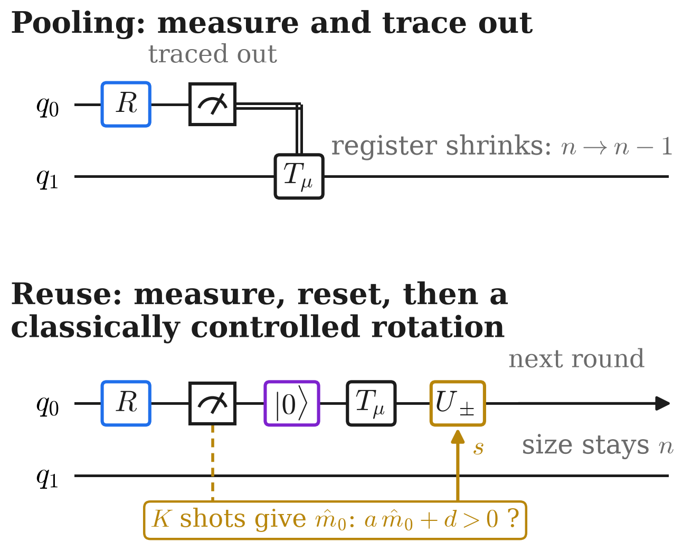

<!-- _class: tight -->

# Strategy Qubit reuse: reset the measured qubit instead of tracing it out

<!-- src: dqml-physics-results.md §9 (the human's idea): step-by-step description, the "own" test a m_i + d > 0, the linearity argument, the difference table (own - no test; two QPUs - own; original 2 / 4 rounds, revised 2 rounds), "more rounds reduce accuracy in every version (two QPUs, 8 - 2 rounds: -8.5 +- 2.9)" (row "original, 8 rounds": tested with the phase on |m+1> only), and "The runs in detail" (3 QPUs x 4 qubits, contiguous windows, 5-layer brick-wall per round, seeds 0-2 original / 0-4 revised). Differences carry +- the Welch standard error (§0.3). Figure: 3. wiki/code/lm-260929-animations/fig_circuit.py -> media/reuse-schematic.png (schematic). -->
<!-- EDIT-FORWARD: the reuse runs of §9 differ from the reference model: a 5-layer brick-wall in every round, measured qubit 0 or 1 alternating, readout on qubits 2 and 3. The slide says so in the source line; decide whether to say it aloud. -->
<!-- EDIT-FORWARD: §9 also reports that with the revised encoding the "own" bits are used (randomising them costs 0.25 nats) while the net gain is 0.02 nats; not on the slide, available if asked. -->
<!-- Speaker note: the register keeps its size, so the number of rounds R is free. Single-copy measurement statistics are linear in rho; a threshold of an estimated probability is nonlinear in rho and needs many copies, so local classical control gives one QPU a nonlinearity that no single-copy circuit has. The reset qubit gets a classically controlled rotation U_±: local classical control from the QPU's own K-shot estimate m_0, or control from two QPUs' estimates (CC; the message bit then acts on the reset qubits of both source QPUs). With the phase on |b(m)> the gain is within noise: the encoded state already gives single-copy measurements what the threshold provided. Eight rounds hurt every version tested (phase on |m+1>; two-QPU control, R = 8 against R = 2: -8.5 ± 2.9 points). Table: test-accuracy differences in percentage points, n = 4, contiguous feature blocks, a 5-layer circuit per round; ± is the Welch standard error over 3 (phase on |m+1>) or 5 (phase on |b(m)>) seeds. (Former caption: "The reset qubit gets a classically controlled rotation U_±: local classical control from the QPU's own K-shot estimate m_0, or control from two QPUs' estimates (CC; the message bit then acts on the reset qubits of both source QPUs).") -->

<figure class="figure">

</figure>

- Size stays $n$, so the number of rounds $R$ is free
- A threshold on the QPU's own $\hat m_0$ needs many copies: a nonlinearity no single-copy circuit has

| phase on, $R$ | local − no control | two-QPU (CC) − local |
|---|---|---|
| $\lvert m{+}1\rangle$, $2$ | $+2.6\pm2.7$ | $+9.7\pm3.0$ |
| $\lvert m{+}1\rangle$, $4$ | $+9.7\pm4.7$ | $+6.5\pm4.8$ |
| $\lvert b(m)\rangle$, $2$ | $+0.1\pm1.0$ | $+1.7\pm1.0$ |

- Phase on $\lvert b(m)\rangle$: gain within noise

Test-accuracy differences (percentage points), 4 digits, $n=4$, contiguous blocks, $5$-layer circuit per round; $\pm$ Welch standard error, $3$ or $5$ seeds.

<!-- 2026-09-29 integration: visible task label "4 classes" -> "4 digits" (speaker's standing style: label accuracies with the task, "4 digits"). -->
