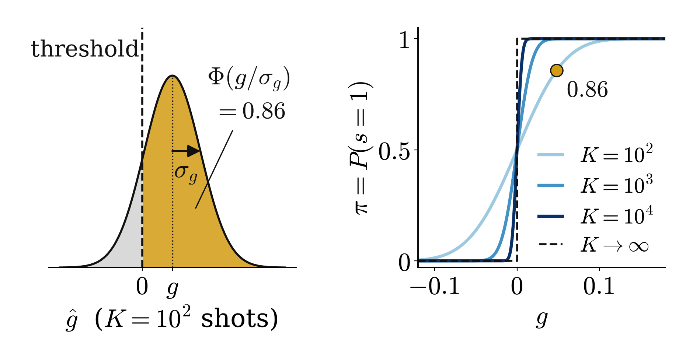

<!-- _class: tight -->

# Method The decision function: a stochastic threshold (probit)

$$g=a\,m_i+b\,m_j+c\,m_im_j+d$$

$$P(s{=}1)=\pi=\Phi\Big(g\big/\sqrt{\sigma_g^2+\epsilon^2}\Big)$$

<figure class="figure">

</figure>

<figure class="figure">

<video src="media/link-rule.mp4" poster="media/link-rule.png" width="580" controls autoplay loop muted playsinline preload="none"></video>

</figure>

- $m_i,m_j$: outcome-$1$ probabilities from $K$ shots; shot noise $\sigma_g\propto K^{-1/2}$
- $\Phi$: standard normal CDF; $s=1$ applies $U_+$, else $U_-$
- Corners $\{0,1\}^2$: the sign of $g$ is a Boolean function (AND, OR, XOR)

